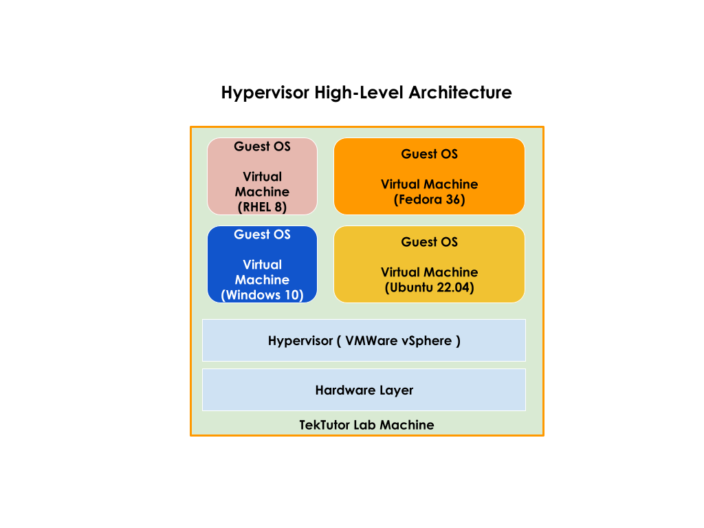
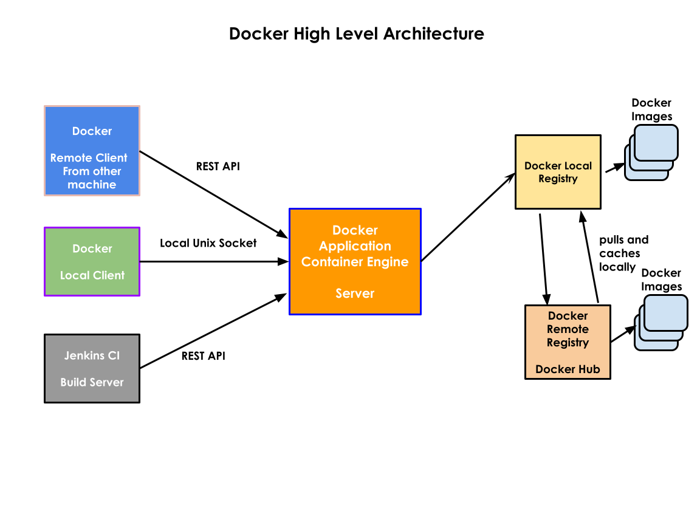

# Day 1

# Containerization

## Hypervisor
- general terminolgy used to refer the Virtualization Software
- heavy-weight virtualization technology
  - because each Virtual Machine requires dedicated hardware resources
     - CPU Cores
     - RAM
     - Storage (HDD)
- Virtualization
  - you can run many Operating Systems side by side on the same machine
  - i.e may OS can be active
  - Type 1 Virtualization
      - Servers & Workstations
      - This can be installed directory on bare-metal server without need for Operating System
  - Type 2 Virtualization
      - Laptops, Desktops and Workstations can use Type 2
      - This requires some Operating System as Host OS ( Windows, Unix, Mac, Linux )
      - Hypervisor can only be installed on top of some OS
      
  - VMWARE
     - VMWare Workstation ( Unix, Linux and Windows ) - Type 2 Virtualization Product
     - VMWare Fusion ( Mac OS-X ) - Type 2 Virtualization Product
     - VMWare Player ( Windows ) - Type 2 Virtualization Product - Free
     - VMWare vSphere/VCenter - Type 1 Virtualization Product ( Server Grade )
  - Oracle
     - VirtualBox ( Free )
  - RedHat
     - KVM ( opensource )
  - Microsoft
     - Hyper-V
  - Parallels ( Commercial - Mac OS-X )
- Benefits
  - Server consolidation

## Medium Blog - Most commonly used docker commands
<pre>
https://medium.com/@jegan_50867/docker-commands-ba19387383b4
</pre>


## Container Technology
- lightweight virtualization technology
  - because they don't require dedicated hardware resources
  - container running in the same Operating System technically share the H/W resources available on underlying OS
- application virtualization technology
- containers are application process not an Operating System
- containers run in their own namespace
- containers are originally a Linux Technology
- Linux Kernel
  - suppport two features
  - 1. Namespace ( Isolation of containers are supported )
  - 2. Control Groups ( CGroup) - should be apply hardware upper limit quota restrictions to containers

- Containers
  - has IP address
  - has file system
  - has Network Stack ( OSI Layers )
  - has Software defined Network Card (NIC)

## Container Runtimes
- runc Container runtime is used Docker Engine


## Container Image Building Tools
- buildah
- Skopio


## Container Engine
- it is user-friendly Container software that make use of container runtime and other tools to manage container images
- used by end-users like us
- it offers easy to use user-friendly commands
- examples
  1. Podman is a Container Engine
  2. Docker is also a Container Engine

## Docker Overview
- is a Container Engine
- Docker comes two flavours
  1. Docker Community Edition - Docker CE ( OpenSource )
  2. Docker Enterprise Edition - Docker EE ( Licensed Software )

## Docker Alternates
- LXC
- Containerd
- Podman

## Container Orchestration Platforms/Tools
- Docker SWARM
   - manages containerized applications that use Docker Container Engine
- Kubernetes
   - manages containerized application that supports any container runtime that implements CNI(Container Network Interface)
   - Google
   - Opensource
   - CLI
   - Web Dashboard - limited in functionality - not enterprise grade ( in-secured )
- RedHat OpenShift
   - developed on top of Google Kubernetes with many additional features
   - manages containerized application that supports CRI-O Container Runtime (Podman - Container Engine )
   - is RedHat's distribution of Kubernetes
   - CLI and Web-interface
 
- they many containerized applications
- High Availability of your applications are guaranteed
- inbuilt-monitoring features
- scale up/down your application instances depending on demand
- rolling update
   - upgrading your live application from one version to other without any down time

## Hypervisor High Level Architecture


## Docker High Level Architecture


## Docker Commands

### Finding details about your docker installation
```
docker info
```

Expected output
<pre>
jegan@dell-precision-7670:~$ <b>docker info</b>
Client:
 Context:    default
 Debug Mode: false
 Plugins:
  app: Docker App (Docker Inc., v0.9.1-beta3)
  buildx: Docker Buildx (Docker Inc., v0.8.2-docker)
  compose: Docker Compose (Docker Inc., v2.6.0)
  scan: Docker Scan (Docker Inc., v0.17.0)

Server:
 Containers: 3
  Running: 3
  Paused: 0
  Stopped: 0
 Images: 24
 Server Version: 20.10.17
 Storage Driver: overlay2
  Backing Filesystem: extfs
  Supports d_type: true
  Native Overlay Diff: true
  userxattr: false
 Logging Driver: json-file
 Cgroup Driver: cgroupfs
 Cgroup Version: 1
 Plugins:
  Volume: local
  Network: bridge host ipvlan macvlan null overlay
  Log: awslogs fluentd gcplogs gelf journald json-file local logentries splunk syslog
 Swarm: inactive
 Runtimes: runc io.containerd.runc.v2 io.containerd.runtime.v1.linux
 Default Runtime: runc
 Init Binary: docker-init
 containerd version: 10c12954828e7c7c9b6e0ea9b0c02b01407d3ae1
 runc version: v1.1.2-0-ga916309
 init version: de40ad0
 Security Options:
  apparmor
  seccomp
   Profile: default
 Kernel Version: 5.14.0-1046-oem
 Operating System: Ubuntu 20.04.4 LTS
 OSType: linux
 Architecture: x86_64
 CPUs: 24
 Total Memory: 62.5GiB
 Name: dell-precision-7670
 ID: QVBR:HPEI:FOHH:UC3T:GJLO:63XP:Y6HJ:FUYM:X2XW:7IXK:SX3V:Y4NR
 Docker Root Dir: /var/lib/docker
 Debug Mode: false
 Registry: https://index.docker.io/v1/
 Labels:
 Experimental: false
 Insecure Registries:
  127.0.0.0/8
 Live Restore Enabled: false
</pre>

### Listing Docker Image from the Local Docker Registry
```
docker images
```

### Download mysql image
```
docker pull mysql:latest
```

Expected output
<pre>
jegan@dell-precision-7670:~$ docker pull mysql:latest
latest: Pulling from library/mysql
32c1bf40aba1: Pull complete 
3ac22f3a638d: Pull complete 
b1e7273ed05e: Pull complete 
20be45a0c6ab: Pull complete 
410a229693ff: Pull complete 
1ce71e3a9b88: Pull complete 
c93c823af05b: Pull complete 
c6752c4d09c7: Pull complete 
d7f2cfe3efcb: Pull complete 
916f32cb0394: Pull complete 
0d62a5f9a14f: Pull complete 
Digest: sha256:ce2ae3bd3e9f001435c4671cf073d1d5ae55d138b16927268474fc54ba09ed79
Status: Downloaded newer image for mysql:latest
docker.io/library/mysql:latest
</pre>


### Docker Image inspect
```
jegan@dell-precision-7670:~$ <b>docker image inspect mysql:latest</b>
```

Expected output
<pre>
jegan@dell-precision-7670:~$ <b>docker image inspect mysql:latest</b>
[
    {
        "Id": "sha256:7b94cda7ffc7c59b01668e63f48e0f4ee3d16b427cc0b846193b65db671e9fa2",
        "RepoTags": [
            "mysql:latest"
        ],
        "RepoDigests": [
            "mysql@sha256:ce2ae3bd3e9f001435c4671cf073d1d5ae55d138b16927268474fc54ba09ed79"
        ],
        "Parent": "",
        "Comment": "",
        "Created": "2022-08-04T01:26:12.412321537Z",
        "Container": "06aa065e5833ed2db46adef57d922bf876630ebad5b36499c2d41f2a859a2f2b",
        "ContainerConfig": {
            "Hostname": "06aa065e5833",
            "Domainname": "",
            "User": "",
            "AttachStdin": false,
            "AttachStdout": false,
            "AttachStderr": false,
            "ExposedPorts": {
                "3306/tcp": {},
                "33060/tcp": {}
            },
            "Tty": false,
            "OpenStdin": false,
            "StdinOnce": false,
            "Env": [
                "PATH=/usr/local/sbin:/usr/local/bin:/usr/sbin:/usr/bin:/sbin:/bin",
                "GOSU_VERSION=1.14",
                "MYSQL_MAJOR=8.0",
                "MYSQL_VERSION=8.0.30-1.el8",
                "MYSQL_SHELL_VERSION=8.0.30-1.el8"
            ],
            "Cmd": [
                "/bin/sh",
                "-c",
                "#(nop) ",
                "CMD [\"mysqld\"]"
            ],
            "Image": "sha256:4185be6baa43f58474725b6ffb5f1f6ed7e99a1fa99cc0bfd4ee830e3fc3d9aa",
            "Volumes": {
                "/var/lib/mysql": {}
            },
            "WorkingDir": "",
            "Entrypoint": [
                "docker-entrypoint.sh"
            ],
            "OnBuild": null,
            "Labels": {}
        },
        "DockerVersion": "20.10.12",
        "Author": "",
        "Config": {
            "Hostname": "",
            "Domainname": "",
            "User": "",
            "AttachStdin": false,
            "AttachStdout": false,
            "AttachStderr": false,
            "ExposedPorts": {
                "3306/tcp": {},
                "33060/tcp": {}
            },
            "Tty": false,
            "OpenStdin": false,
            "StdinOnce": false,
            "Env": [
                "PATH=/usr/local/sbin:/usr/local/bin:/usr/sbin:/usr/bin:/sbin:/bin",
                "GOSU_VERSION=1.14",
                "MYSQL_MAJOR=8.0",
                "MYSQL_VERSION=8.0.30-1.el8",
                "MYSQL_SHELL_VERSION=8.0.30-1.el8"
            ],
            "Cmd": [
                "mysqld"
            ],
            "Image": "sha256:4185be6baa43f58474725b6ffb5f1f6ed7e99a1fa99cc0bfd4ee830e3fc3d9aa",
            "Volumes": {
                "/var/lib/mysql": {}
            },
            "WorkingDir": "",
            "Entrypoint": [
                "docker-entrypoint.sh"
            ],
            "OnBuild": null,
            "Labels": null
        },
        "Architecture": "amd64",
        "Os": "linux",
        "Size": 445901586,
        "VirtualSize": 445901586,
        "GraphDriver": {
            "Data": {
                "LowerDir": "/var/lib/docker/overlay2/bb081b2eb6cc77ccc60bef1ca9ddac91645de67967cfced8e3a39168cffc9e03/diff:/var/lib/docker/overlay2/1dceef8fad3fae52aa33d94b2fd4c25d5a91cf14fd5bc343f8cd99fff9719034/diff:/var/lib/docker/overlay2/b5882a2e1e7531249e24e1125ba743cf5138e8859a7a4cff0780f53cc3bf72d7/diff:/var/lib/docker/overlay2/fb9f62f3761e8c945a0a9d1a8dfcf4ce486dbfb9fa67dfe913e36dd2aa42d67f/diff:/var/lib/docker/overlay2/b5567dff06ce54f97e2257258161ee73e2bda03ab0eb226d7e66cb06160f43a0/diff:/var/lib/docker/overlay2/9a8e0aa9c8f6101f1c5ae1e633e43d9d872647817a3319189c3fd91c06bffc12/diff:/var/lib/docker/overlay2/e122f798ae0f714e9c49e2f2e891125af7c85375059ccc07fd770aa9a9f91be9/diff:/var/lib/docker/overlay2/fc77880d13878818b1fb4bdcce8bb7eebffa620e8664cf3896afeda779ee42a4/diff:/var/lib/docker/overlay2/7415c2da12a1f8d29a00fffc1b41a29a69f4d34e211bd926dc48859d19f0cfba/diff:/var/lib/docker/overlay2/9bceb8a69d472e6f80e554b20f7facb59b8fcfda71cba071fc8fdcc1aed85b44/diff",
                "MergedDir": "/var/lib/docker/overlay2/a61aa68b2c09e95bc72fa940107a143ff68cd43e77df9878269944ad1575b345/merged",
                "UpperDir": "/var/lib/docker/overlay2/a61aa68b2c09e95bc72fa940107a143ff68cd43e77df9878269944ad1575b345/diff",
                "WorkDir": "/var/lib/docker/overlay2/a61aa68b2c09e95bc72fa940107a143ff68cd43e77df9878269944ad1575b345/work"
            },
            "Name": "overlay2"
        },
        "RootFS": {
            "Type": "layers",
            "Layers": [
                "sha256:cf4db719a36940c70d724cd9eaa2fccaf1f0174ba863ebb40f428eaf13da76cc",
                "sha256:727f87cfc4aa2010d7576783a7a5f639f5bbd866219e1e919bb6bed6ce65c43b",
                "sha256:23caed4272c6e7903e9a8d53d8b4b9df7caed8ee8fb0e69bbf8e5d4bae125aa1",
                "sha256:e909c98952f3ccf508fee1882e044dff330f75e4610410d3c3c0b946ec7e5e4a",
                "sha256:05a0857d35134cf4003357cf7191e67e663fea8a3ad1d3734414508a493ebf31",
                "sha256:3a84339241ba3150f0b6324d4431fa182707c8ae31e5e60c3e2f112ac669c888",
                "sha256:6fab872104e6b09e75652b07884d190388d27d66272cc78f8957debcad5f7335",
                "sha256:052d59c7ab867eb6c17153c2d0a64cbff1b66bc7bf6452da7a58434d9c71dd6c",
                "sha256:e8f119e9974013b4c47a4cef1bef29749d751e3eb92d46726a88cb8b4cf9e4e2",
                "sha256:c6b70a293f9b3f727669e5aeba8c7b16c43caebbb0058f6068e8b1ff543dfaef",
                "sha256:4df68c319ca5e844e67ceba086417d33f5428b5f3163e9894f96d942e5febe60"
            ]
        },
        "Metadata": {
            "LastTagTime": "0001-01-01T00:00:00Z"
        }
    }
]
</pre>

### Creating your first container
```
docker run hello-world:latest
```

Expected output
<pre>
jegan@dell-precision-7670:~$ <b>docker run hello-world:latest</b>
Unable to find image 'hello-world:latest' locally
latest: Pulling from library/hello-world
2db29710123e: Pull complete 
Digest: sha256:53f1bbee2f52c39e41682ee1d388285290c5c8a76cc92b42687eecf38e0af3f0
Status: Downloaded newer image for hello-world:latest

Hello from Docker!
This message shows that your installation appears to be working correctly.

To generate this message, Docker took the following steps:
 1. The Docker client contacted the Docker daemon.
 2. The Docker daemon pulled the "hello-world" image from the Docker Hub.
    (amd64)
 3. The Docker daemon created a new container from that image which runs the
    executable that produces the output you are currently reading.
 4. The Docker daemon streamed that output to the Docker client, which sent it
    to your terminal.

To try something more ambitious, you can run an Ubuntu container with:
 $ docker run -it ubuntu bash

Share images, automate workflows, and more with a free Docker ID:
 https://hub.docker.com/

For more examples and ideas, visit:
 https://docs.docker.com/get-started/
</pre>

## Listing the currently running containers
```
docker ps
```

## Listing all the containers 
```
docker ps -a
```

Expected output
<pre>
jegan@dell-precision-7670:~$ <b>docker ps -a</b>
CONTAINER ID   IMAGE                COMMAND    CREATED              STATUS                          PORTS     NAMES
7fb6b5c4f204   hello-world:latest   "/hello"   About a minute ago   Exited (0) About a minute ago             awesome_goldstine
</pre>

## Renaming a conatainer
```
docker rename <old-contianer-name> <new-container-name>
```

Expected output
<pre>
egan@dell-precision-7670:~$ <b>docker rename awesome_goldstine c1</b>
jegan@dell-precision-7670:~$ <b>docker ps</b>
CONTAINER ID   IMAGE     COMMAND   CREATED   STATUS    PORTS     NAMES
jegan@dell-precision-7670:~$ <b>docker ps -a</b>
CONTAINER ID   IMAGE                COMMAND    CREATED         STATUS                     PORTS     NAMES
7fb6b5c4f204   hello-world:latest   "/hello"   7 minutes ago   Exited (0) 7 minutes ago             c1
</pre>

## Creating a container in interactive fashion
```
docker run -it --name ubuntu1 --hostname ubuntu1 ubuntu:16.04 /bin/bash
```

Expected output
<pre>
jegan@dell-precision-7670:~$ <b>docker run -it --name ubuntu1 --hostname ubuntu1 ubuntu:16.04 /bin/bash</b>
root@ubuntu1:/# ls
bin  boot  dev  etc  home  lib  lib64  media  mnt  opt  proc  root  run  sbin  srv  sys  tmp  usr  var
root@ubuntu1:/# <b>hostname</b>
ubuntu1
root@ubuntu1:/# <b>hostname -i</b>
172.17.0.2
root@ubuntu1:/# <b>exit</b>
</pre>

## Starting a exited container
```
docker start ubuntu1
```

Expected output
<pre>
jegan@dell-precision-7670:~$ docker ps -a
CONTAINER ID   IMAGE                COMMAND       CREATED              STATUS                      PORTS     NAMES
af4568a9883d   ubuntu:16.04         "/bin/bash"   About a minute ago   Exited (0) 6 seconds ago              ubuntu1
4a4a0356cd89   ubuntu:16.04         "/bin/bash"   2 minutes ago        Exited (0) 2 minutes ago              brave_northcutt
7fb6b5c4f204   hello-world:latest   "/hello"      19 minutes ago       Exited (0) 19 minutes ago             c1
jegan@dell-precision-7670:~$ docker start ubuntu1
ubuntu1
jegan@dell-precision-7670:~$ docker ps
CONTAINER ID   IMAGE          COMMAND       CREATED              STATUS        PORTS     NAMES
af4568a9883d   ubuntu:16.04   "/bin/bash"   About a minute ago   Up 1 second             ubuntu1
</pre>

## Getting inside a running container
```
docker exec -it ubuntu1 bash
```

Expected output
<pre>
jegan@dell-precision-7670:~$ docker exec -it ubuntu1 bash
root@ubuntu1:/# ls
bin  boot  dev  etc  home  lib  lib64  media  mnt  opt  proc  root  run  sbin  srv  sys  tmp  usr  var
root@ubuntu1:/# exit
exit
jegan@dell-precision-7670:~$ docker ps
CONTAINER ID   IMAGE          COMMAND       CREATED         STATUS         PORTS     NAMES
af4568a9883d   ubuntu:16.04   "/bin/bash"   6 minutes ago   Up 5 minutes             ubuntu1
</pre>

## Starting and Stopping containers
Expected output
<pre>
jegan@dell-precision-7670:~$ docker ps
CONTAINER ID   IMAGE          COMMAND       CREATED         STATUS         PORTS     NAMES
af4568a9883d   ubuntu:16.04   "/bin/bash"   6 minutes ago   Up 5 minutes             ubuntu1
jegan@dell-precision-7670:~$ docker stop ubuntu1
ubuntu1
jegan@dell-precision-7670:~$ docker start af45
af45
jegan@dell-precision-7670:~$ docker ps
CONTAINER ID   IMAGE          COMMAND       CREATED          STATUS         PORTS     NAMES
af4568a9883d   ubuntu:16.04   "/bin/bash"   10 minutes ago   Up 6 seconds             ubuntu1
jegan@dell-precision-7670:~$ docker stop af4
af4
jegan@dell-precision-7670:~$ docker ps
CONTAINER ID   IMAGE     COMMAND   CREATED   STATUS    PORTS     NAMES
</pre>


## Creating a container in background mode
```
docker run -d --name web1 --hostname web1 nginx:latest
```

Expected output
<pre>
jegan@dell-precision-7670:~$ docker run -d --name web1 --hostname web1 nginx:latest 
Unable to find image 'nginx:latest' locally
latest: Pulling from library/nginx
1efc276f4ff9: Pull complete 
baf2da91597d: Pull complete 
05396a986fd3: Pull complete 
6a17c8e7063d: Pull complete 
27e0d286aeab: Pull complete 
b1349eea8fc5: Pull complete 
Digest: sha256:ecc068890de55a75f1a32cc8063e79f90f0b043d70c5fcf28f1713395a4b3d49
Status: Downloaded newer image for nginx:latest
eb3e23fdb20893913da2c3c1817afcc9a47cd5160ebf2287d08aadcac44669f2
jegan@dell-precision-7670:~$ docker ps
CONTAINER ID   IMAGE          COMMAND                  CREATED          STATUS          PORTS     NAMES
eb3e23fdb208   nginx:latest   "/docker-entrypoint.…"   24 seconds ago   Up 23 seconds   80/tcp    web1
</pre>

## Finding detailed information about a container
```
docker inspect web1
```

Expected output
<pre>
jegan@dell-precision-7670:~$ docker inspect web1
[
    {
        "Id": "eb3e23fdb20893913da2c3c1817afcc9a47cd5160ebf2287d08aadcac44669f2",
        "Created": "2022-08-08T09:47:07.303477315Z",
        "Path": "/docker-entrypoint.sh",
        "Args": [
            "nginx",
            "-g",
            "daemon off;"
        ],
        "State": {
            "Status": "running",
            "Running": true,
            "Paused": false,
            "Restarting": false,
            "OOMKilled": false,
            "Dead": false,
            "Pid": 67675,
            "ExitCode": 0,
            "Error": "",
            "StartedAt": "2022-08-08T09:47:07.761413365Z",
            "FinishedAt": "0001-01-01T00:00:00Z"
        },
        "Image": "sha256:b692a91e4e1582db97076184dae0b2f4a7a86b68c4fe6f91affa50ae06369bf5",
        "ResolvConfPath": "/var/lib/docker/containers/eb3e23fdb20893913da2c3c1817afcc9a47cd5160ebf2287d08aadcac44669f2/resolv.conf",
        "HostnamePath": "/var/lib/docker/containers/eb3e23fdb20893913da2c3c1817afcc9a47cd5160ebf2287d08aadcac44669f2/hostname",
        "HostsPath": "/var/lib/docker/containers/eb3e23fdb20893913da2c3c1817afcc9a47cd5160ebf2287d08aadcac44669f2/hosts",
        "LogPath": "/var/lib/docker/containers/eb3e23fdb20893913da2c3c1817afcc9a47cd5160ebf2287d08aadcac44669f2/eb3e23fdb20893913da2c3c1817afcc9a47cd5160ebf2287d08aadcac44669f2-json.log",
        "Name": "/web1",
        "RestartCount": 0,
        "Driver": "overlay2",
        "Platform": "linux",
        "MountLabel": "",
        "ProcessLabel": "",
        "AppArmorProfile": "docker-default",
        "ExecIDs": null,
        "HostConfig": {
            "Binds": null,
            "ContainerIDFile": "",
            "LogConfig": {
                "Type": "json-file",
                "Config": {}
            },
            "NetworkMode": "default",
            "PortBindings": {},
            "RestartPolicy": {
                "Name": "no",
                "MaximumRetryCount": 0
            },
            "AutoRemove": false,
            "VolumeDriver": "",
            "VolumesFrom": null,
            "CapAdd": null,
            "CapDrop": null,
            "CgroupnsMode": "host",
            "Dns": [],
            "DnsOptions": [],
            "DnsSearch": [],
            "ExtraHosts": null,
            "GroupAdd": null,
            "IpcMode": "private",
            "Cgroup": "",
            "Links": null,
            "OomScoreAdj": 0,
            "PidMode": "",
            "Privileged": false,
            "PublishAllPorts": false,
            "ReadonlyRootfs": false,
            "SecurityOpt": null,
            "UTSMode": "",
            "UsernsMode": "",
            "ShmSize": 67108864,
            "Runtime": "runc",
            "ConsoleSize": [
                0,
                0
            ],
            "Isolation": "",
            "CpuShares": 0,
            "Memory": 0,
            "NanoCpus": 0,
            "CgroupParent": "",
            "BlkioWeight": 0,
            "BlkioWeightDevice": [],
            "BlkioDeviceReadBps": null,
            "BlkioDeviceWriteBps": null,
            "BlkioDeviceReadIOps": null,
            "BlkioDeviceWriteIOps": null,
            "CpuPeriod": 0,
            "CpuQuota": 0,
            "CpuRealtimePeriod": 0,
            "CpuRealtimeRuntime": 0,
            "CpusetCpus": "",
            "CpusetMems": "",
            "Devices": [],
            "DeviceCgroupRules": null,
            "DeviceRequests": null,
            "KernelMemory": 0,
            "KernelMemoryTCP": 0,
            "MemoryReservation": 0,
            "MemorySwap": 0,
            "MemorySwappiness": null,
            "OomKillDisable": false,
            "PidsLimit": null,
            "Ulimits": null,
            "CpuCount": 0,
            "CpuPercent": 0,
            "IOMaximumIOps": 0,
            "IOMaximumBandwidth": 0,
            "MaskedPaths": [
                "/proc/asound",
                "/proc/acpi",
                "/proc/kcore",
                "/proc/keys",
                "/proc/latency_stats",
                "/proc/timer_list",
                "/proc/timer_stats",
                "/proc/sched_debug",
                "/proc/scsi",
                "/sys/firmware"
            ],
            "ReadonlyPaths": [
                "/proc/bus",
                "/proc/fs",
                "/proc/irq",
                "/proc/sys",
                "/proc/sysrq-trigger"
            ]
        },
        "GraphDriver": {
            "Data": {
                "LowerDir": "/var/lib/docker/overlay2/ef0aa1912aa64b2df3c86e2dd7968648e0dab07d62202e261e031047d8986266-init/diff:/var/lib/docker/overlay2/5402cc115786dffaaaa93c8eece071f3bc677a34f85beb1664bc57c5a861b69f/diff:/var/lib/docker/overlay2/96b3fb4c67add269bb933cd37e890ffbf877efc1ee43e53ec92066d8f323afbf/diff:/var/lib/docker/overlay2/4b79ff4b1bae970dbdb7010af2ca5b943393b203a7623bcec1ed5cada5e68e0e/diff:/var/lib/docker/overlay2/6de0d8783a2d79ed69cdc2c41ef2fae4ab53361c36c72c85f980669f377ff7a9/diff:/var/lib/docker/overlay2/60f21d8864c1984464b914a78d21304f2bd7e33b36a45ffbdff17ae81e1390b3/diff:/var/lib/docker/overlay2/bcdac2552c4e019642342ca2c81df10ad4e9e94b9b4bd5a717bb17b6f24376bb/diff",
                "MergedDir": "/var/lib/docker/overlay2/ef0aa1912aa64b2df3c86e2dd7968648e0dab07d62202e261e031047d8986266/merged",
                "UpperDir": "/var/lib/docker/overlay2/ef0aa1912aa64b2df3c86e2dd7968648e0dab07d62202e261e031047d8986266/diff",
                "WorkDir": "/var/lib/docker/overlay2/ef0aa1912aa64b2df3c86e2dd7968648e0dab07d62202e261e031047d8986266/work"
            },
            "Name": "overlay2"
        },
        "Mounts": [],
        "Config": {
            "Hostname": "web1",
            "Domainname": "",
            "User": "",
            "AttachStdin": false,
            "AttachStdout": false,
            "AttachStderr": false,
            "ExposedPorts": {
                "80/tcp": {}
            },
            "Tty": false,
            "OpenStdin": false,
            "StdinOnce": false,
            "Env": [
                "PATH=/usr/local/sbin:/usr/local/bin:/usr/sbin:/usr/bin:/sbin:/bin",
                "NGINX_VERSION=1.23.1",
                "NJS_VERSION=0.7.6",
                "PKG_RELEASE=1~bullseye"
            ],
            "Cmd": [
                "nginx",
                "-g",
                "daemon off;"
            ],
            "Image": "nginx:latest",
            "Volumes": null,
            "WorkingDir": "",
            "Entrypoint": [
                "/docker-entrypoint.sh"
            ],
            "OnBuild": null,
            "Labels": {
                "maintainer": "NGINX Docker Maintainers <docker-maint@nginx.com>"
            },
            "StopSignal": "SIGQUIT"
        },
        "NetworkSettings": {
            "Bridge": "",
            "SandboxID": "bd769865225f821b6f053373b00ad130c635eafa2feb1813dee315669de35685",
            "HairpinMode": false,
            "LinkLocalIPv6Address": "",
            "LinkLocalIPv6PrefixLen": 0,
            "Ports": {
                "80/tcp": null
            },
            "SandboxKey": "/var/run/docker/netns/bd769865225f",
            "SecondaryIPAddresses": null,
            "SecondaryIPv6Addresses": null,
            "EndpointID": "30c763c82cb4c159e65cfb0e4f8fed5adf74c74bfb5e78f30ca8b1360aa83d8e",
            "Gateway": "172.17.0.1",
            "GlobalIPv6Address": "",
            "GlobalIPv6PrefixLen": 0,
            "IPAddress": "172.17.0.2",
            "IPPrefixLen": 16,
            "IPv6Gateway": "",
            "MacAddress": "02:42:ac:11:00:02",
            "Networks": {
                "bridge": {
                    "IPAMConfig": null,
                    "Links": null,
                    "Aliases": null,
                    "NetworkID": "d7fce2dc7dda8e69598b45a367b49bdebac6f5ecd97a9f2f84f81955d7e56d3a",
                    "EndpointID": "30c763c82cb4c159e65cfb0e4f8fed5adf74c74bfb5e78f30ca8b1360aa83d8e",
                    "Gateway": "172.17.0.1",
                    "IPAddress": "172.17.0.2",
                    "IPPrefixLen": 16,
                    "IPv6Gateway": "",
                    "GlobalIPv6Address": "",
                    "GlobalIPv6PrefixLen": 0,
                    "MacAddress": "02:42:ac:11:00:02",
                    "DriverOpts": null
                }
            }
        }
    }
]
</pre>


## Accessing the nginx web1 container web page
<pre>
jegan@dell-precision-7670:~$ docker inspect web1 | grep IPA
            "SecondaryIPAddresses": null,
            "IPAddress": "172.17.0.2",
                    "IPAMConfig": null,
                    "IPAddress": "172.17.0.2",
jegan@dell-precision-7670:~$ curl 172.17.0.2
<!DOCTYPE html>
<html>
<head>
<title>Welcome to nginx!</title>
<style>
html { color-scheme: light dark; }
body { width: 35em; margin: 0 auto;
font-family: Tahoma, Verdana, Arial, sans-serif; }
</style>
</head>
<body>
<h1>Welcome to nginx!</h1>
<p>If you see this page, the nginx web server is successfully installed and
working. Further configuration is required.</p>

<p>For online documentation and support please refer to
<a href="http://nginx.org/">nginx.org</a>.<br/>jegan@dell-precision-7670:~$ docker run -d --name web2 --hostname web2 nginx:latest
59eeb34bca86d636cfa34c6de270c44efab9ac31bd6c2d72804d326e97f7a2fe
jegan@dell-precision-7670:~$ docker run -d --name web3 --hostname web3 nginx:latest
a2af8503d2807e4dc0c4e0b715f124f910785d35bd7bd4ced4444a580b1ed92d
jegan@dell-precision-7670:~$ docker ps
CONTAINER ID   IMAGE          COMMAND                  CREATED          STATUS          PORTS     NAMES
a2af8503d280   nginx:latest   "/docker-entrypoint.…"   2 seconds ago    Up 1 second     80/tcp    web3
59eeb34bca86   nginx:latest   "/docker-entrypoint.…"   10 seconds ago   Up 9 seconds    80/tcp    web2
eb3e23fdb208   nginx:latest   "/docker-entrypoint.…"   13 minutes ago   Up 13 minutes   80/tcp    web1
jegan@dell-precision-7670:~$ docker inspect -f {{.NetworkSettings.IPAddress}} web1
172.17.0.2
jegan@dell-precision-7670:~$ docker inspect -f {{.NetworkSettings.IPAddress}} web2
172.17.0.3
jegan@dell-precision-7670:~$ docker inspect -f {{.NetworkSettings.IPAddress}} web3
172.17.0.4
jegan@dell-precision-7670:~$ curl 172.17.0.3
<!DOCTYPE html>
<html>
<head>
<title>Welcome to nginx!</title>
<style>
html { color-scheme: light dark; }
body { width: 35em; margin: 0 auto;
font-family: Tahoma, Verdana, Arial, sans-serif; }
</style>
</head>
<body>
<h1>Welcome to nginx!</h1>
<p>If you see this page, the nginx web server is successfully installed and
working. Further configuration is required.</p>

<p>For online documentation and support please refer to
<a href="http://nginx.org/">nginx.org</a>.<br/>
Commercial support is available at
<a href="http://nginx.com/">nginx.com</a>.</p>

<p><em>Thank you for using nginx.</em></p>
</body>
</html>
</pre>

## Inspecting Network in Docker
<pre>
jegan@dell-precision-7670:~$ ifconfig
docker0: flags=4163<UP,BROADCAST,RUNNING,MULTICAST>  mtu 1500
        inet 172.17.0.1  netmask 255.255.0.0  broadcast 172.17.255.255
        inet6 fe80::42:33ff:fe5a:f98f  prefixlen 64  scopeid 0x20<link>
        ether 02:42:33:5a:f9:8f  txqueuelen 0  (Ethernet)
        RX packets 19  bytes 2662 (2.6 KB)
        RX errors 0  dropped 0  overruns 0  frame 0
        TX packets 167  bytes 25477 (25.4 KB)
        TX errors 0  dropped 0 overruns 0  carrier 0  collisions 0

enp0s31f6: flags=4099<UP,BROADCAST,MULTICAST>  mtu 1500
        ether 08:92:04:3e:f8:c3  txqueuelen 1000  (Ethernet)
        RX packets 0  bytes 0 (0.0 B)
        RX errors 0  dropped 0  overruns 0  frame 0
        TX packets 0  bytes 0 (0.0 B)
        TX errors 0  dropped 0 overruns 0  carrier 0  collisions 0
        device interrupt 19  memory 0x96100000-96120000  

enx4ee6c01ee064: flags=4163<UP,BROADCAST,RUNNING,MULTICAST>  mtu 1500
        inet 172.20.10.5  netmask 255.255.255.240  broadcast 172.20.10.15
        inet6 fe80::ae04:231c:8d57:a547  prefixlen 64  scopeid 0x20<link>
        inet6 2401:4900:234c:76de:84e0:88d0:e72a:40ec  prefixlen 64  scopeid 0x0<global>
        inet6 2401:4900:234c:76de:38cb:592e:c8d8:d1c8  prefixlen 64  scopeid 0x0<global>
        ether 4e:e6:c0:1e:e0:64  txqueuelen 1000  (Ethernet)
        RX packets 108926  bytes 77907206 (77.9 MB)
        RX errors 0  dropped 0  overruns 0  frame 0
        TX packets 178139  bytes 45110718 (45.1 MB)
        TX errors 1  dropped 0 overruns 0  carrier 0  collisions 0

lo: flags=73<UP,LOOPBACK,RUNNING>  mtu 65536
        inet 127.0.0.1  netmask 255.0.0.0
        inet6 ::1  prefixlen 128  scopeid 0x10<host>
        loop  txqueuelen 1000  (Local Loopback)
        RX packets 400988124  bytes 79685246606 (79.6 GB)
        RX errors 0  dropped 0  overruns 0  frame 0
        TX packets 400988124  bytes 79685246606 (79.6 GB)
        TX errors 0  dropped 0 overruns 0  carrier 0  collisions 0

veth6a74f11: flags=4163<UP,BROADCAST,RUNNING,MULTICAST>  mtu 1500
        inet6 fe80::8c96:baff:fe8b:21ab  prefixlen 64  scopeid 0x20<link>
        ether 8e:96:ba:8b:21:ab  txqueuelen 0  (Ethernet)
        RX packets 0  bytes 0 (0.0 B)
        RX errors 0  dropped 0  overruns 0  frame 0
        TX packets 55  bytes 8513 (8.5 KB)
        TX errors 0  dropped 0 overruns 0  carrier 0  collisions 0

veth9e16802: flags=4163<UP,BROADCAST,RUNNING,MULTICAST>  mtu 1500
        inet6 fe80::2c22:18ff:fead:ca21  prefixlen 64  scopeid 0x20<link>
        ether 2e:22:18:ad:ca:21  txqueuelen 0  (Ethernet)
        RX packets 7  bytes 1275 (1.2 KB)
        RX errors 0  dropped 0  overruns 0  frame 0
        TX packets 71  bytes 10287 (10.2 KB)
        TX errors 0  dropped 0 overruns 0  carrier 0  collisions 0

vethc23d13d: flags=4163<UP,BROADCAST,RUNNING,MULTICAST>  mtu 1500
        inet6 fe80::5c67:f8ff:fe90:c5de  prefixlen 64  scopeid 0x20<link>
        ether 5e:67:f8:90:c5:de  txqueuelen 0  (Ethernet)
        RX packets 12  bytes 1653 (1.6 KB)
        RX errors 0  dropped 0  overruns 0  frame 0
        TX packets 126  bytes 19279 (19.2 KB)
        TX errors 0  dropped 0 overruns 0  carrier 0  collisions 0

virbr0: flags=4099<UP,BROADCAST,MULTICAST>  mtu 1500
        inet 192.168.122.1  netmask 255.255.255.0  broadcast 192.168.122.255
        ether 52:54:00:79:0a:83  txqueuelen 1000  (Ethernet)
        RX packets 0  bytes 0 (0.0 B)
        RX errors 0  dropped 0  overruns 0  frame 0
        TX packets 0  bytes 0 (0.0 B)
        TX errors 0  dropped 0 overruns 0  carrier 0  collisions 0

wlp0s20f3: flags=4163<UP,BROADCAST,RUNNING,MULTICAST>  mtu 1500
        inet 192.168.1.104  netmask 255.255.255.0  broadcast 192.168.1.255
        inet6 fe80::e3a5:c91c:4313:30b9  prefixlen 64  scopeid 0x20<link>
        ether a0:80:69:39:18:9f  txqueuelen 1000  (Ethernet)
        RX packets 1447396  bytes 1144891537 (1.1 GB)
        RX errors 0  dropped 0  overruns 0  frame 0
        TX packets 1774551  bytes 833241643 (833.2 MB)
        TX errors 0  dropped 0 overruns 0  carrier 0  collisions 0

jegan@dell-precision-7670:~$ docker network ls
NETWORK ID     NAME      DRIVER    SCOPE
d7fce2dc7dda   bridge    bridge    local
5787a5e22bc5   host      host      local
da0bf7e46cb4   none      null      local
jegan@dell-precision-7670:~$ docker network inspect bridge
[
    {
        "Name": "bridge",
        "Id": "d7fce2dc7dda8e69598b45a367b49bdebac6f5ecd97a9f2f84f81955d7e56d3a",
        "Created": "2022-08-08T08:04:30.914133428+05:30",
        "Scope": "local",
        "Driver": "bridge",
        "EnableIPv6": false,
        "IPAM": {
            "Driver": "default",
            "Options": null,
            "Config": [
                {
                    "Subnet": "172.17.0.0/16",
                    "Gateway": "172.17.0.1"
                }
            ]
        },
        "Internal": false,
        "Attachable": false,
        "Ingress": false,
        "ConfigFrom": {
            "Network": ""
        },
        "ConfigOnly": false,
        "Containers": {
            "59eeb34bca86d636cfa34c6de270c44efab9ac31bd6c2d72804d326e97f7a2fe": {
                "Name": "web2",
                "EndpointID": "f71df1e5dd40da8601d0729c3bb3e5bc30803ced9c0f99fe9863aca12b38d8bc",
                "MacAddress": "02:42:ac:11:00:03",
                "IPv4Address": "172.17.0.3/16",
                "IPv6Address": ""
            },
            "a2af8503d2807e4dc0c4e0b715f124f910785d35bd7bd4ced4444a580b1ed92d": {
                "Name": "web3",
                "EndpointID": "0511ddcbbc1ac925b35040670a9d0bc9400a51ee027de51f17a7a6d582bc5030",
                "MacAddress": "02:42:ac:11:00:04",
                "IPv4Address": "172.17.0.4/16",
                "IPv6Address": ""
            },
            "eb3e23fdb20893913da2c3c1817afcc9a47cd5160ebf2287d08aadcac44669f2": {
                "Name": "web1",
                "EndpointID": "30c763c82cb4c159e65cfb0e4f8fed5adf74c74bfb5e78f30ca8b1360aa83d8e",
                "MacAddress": "02:42:ac:11:00:02",
                "IPv4Address": "172.17.0.2/16",
                "IPv6Address": ""
            }
        },
        "Options": {
            "com.docker.network.bridge.default_bridge": "true",
            "com.docker.network.bridge.enable_icc": "true",
            "com.docker.network.bridge.enable_ip_masquerade": "true",
            "com.docker.network.bridge.host_binding_ipv4": "0.0.0.0",
            "com.docker.network.bridge.name": "docker0",
            "com.docker.network.driver.mtu": "1500"
        },
        "Labels": {}
    }
]
</pre>

## Creating a custom network and adding a container to your private network
<pre>
jegan@dell-precision-7670:~$ docker network create my-net-3 --subnet 192.168.100.0/24
4b90a70702c8edb740af6c051a0ee6d390b45501bcbbc7c9b7ee88b0d70cd32d
jegan@dell-precision-7670:~$ docker network ls
NETWORK ID     NAME       DRIVER    SCOPE
d7fce2dc7dda   bridge     bridge    local
5787a5e22bc5   host       host      local
e1424119e2ec   my-net-1   bridge    local
5319369b37d3   my-net-2   bridge    local
4b90a70702c8   my-net-3   bridge    local
da0bf7e46cb4   none       null      local
jegan@dell-precision-7670:~$ ifconfig
br-4b90a70702c8: flags=4099<UP,BROADCAST,MULTICAST>  mtu 1500
        inet 192.168.100.1  netmask 255.255.255.0  broadcast 192.168.100.255
        ether 02:42:b5:df:ba:37  txqueuelen 0  (Ethernet)
        RX packets 0  bytes 0 (0.0 B)
        RX errors 0  dropped 0  overruns 0  frame 0
        TX packets 0  bytes 0 (0.0 B)
        TX errors 0  dropped 0 overruns 0  carrier 0  collisions 0

br-5319369b37d3: flags=4099<UP,BROADCAST,MULTICAST>  mtu 1500
        inet 172.19.0.1  netmask 255.255.0.0  broadcast 172.19.255.255
        ether 02:42:68:40:72:f1  txqueuelen 0  (Ethernet)
        RX packets 0  bytes 0 (0.0 B)
        RX errors 0  dropped 0  overruns 0  frame 0
        TX packets 0  bytes 0 (0.0 B)
        TX errors 0  dropped 0 overruns 0  carrier 0  collisions 0

br-e1424119e2ec: flags=4099<UP,BROADCAST,MULTICAST>  mtu 1500
        inet 172.18.0.1  netmask 255.255.0.0  broadcast 172.18.255.255
        ether 02:42:be:08:71:07  txqueuelen 0  (Ethernet)
        RX packets 0  bytes 0 (0.0 B)
        RX errors 0  dropped 0  overruns 0  frame 0
        TX packets 0  bytes 0 (0.0 B)
        TX errors 0  dropped 0 overruns 0  carrier 0  collisions 0

docker0: flags=4163<UP,BROADCAST,RUNNING,MULTICAST>  mtu 1500
        inet 172.17.0.1  netmask 255.255.0.0  broadcast 172.17.255.255
        inet6 fe80::42:33ff:fe5a:f98f  prefixlen 64  scopeid 0x20<link>
        ether 02:42:33:5a:f9:8f  txqueuelen 0  (Ethernet)
        RX packets 19  bytes 2662 (2.6 KB)
        RX errors 0  dropped 0  overruns 0  frame 0
        TX packets 210  bytes 32848 (32.8 KB)
        TX errors 0  dropped 0 overruns 0  carrier 0  collisions 0

enp0s31f6: flags=4099<UP,BROADCAST,MULTICAST>  mtu 1500
        ether 08:92:04:3e:f8:c3  txqueuelen 1000  (Ethernet)
        RX packets 0  bytes 0 (0.0 B)
        RX errors 0  dropped 0  overruns 0  frame 0
        TX packets 0  bytes 0 (0.0 B)
        TX errors 0  dropped 0 overruns 0  carrier 0  collisions 0
        device interrupt 19  memory 0x96100000-96120000  

enx4ee6c01ee064: flags=4163<UP,BROADCAST,RUNNING,MULTICAST>  mtu 1500
        inet 172.20.10.5  netmask 255.255.255.240  broadcast 172.20.10.15
        inet6 fe80::ae04:231c:8d57:a547  prefixlen 64  scopeid 0x20<link>
        inet6 2401:4900:234c:76de:84e0:88d0:e72a:40ec  prefixlen 64  scopeid 0x0<global>
        inet6 2401:4900:234c:76de:38cb:592e:c8d8:d1c8  prefixlen 64  scopeid 0x0<global>
        ether 4e:e6:c0:1e:e0:64  txqueuelen 1000  (Ethernet)
        RX packets 124401  bytes 80801356 (80.8 MB)
        RX errors 0  dropped 0  overruns 0  frame 0
        TX packets 252860  bytes 67078354 (67.0 MB)
        TX errors 1  dropped 0 overruns 0  carrier 0  collisions 0

lo: flags=73<UP,LOOPBACK,RUNNING>  mtu 65536
        inet 127.0.0.1  netmask 255.0.0.0
        inet6 ::1  prefixlen 128  scopeid 0x10<host>
        loop  txqueuelen 1000  (Local Loopback)
        RX packets 401155000  bytes 79701241633 (79.7 GB)
        RX errors 0  dropped 0  overruns 0  frame 0
        TX packets 401155000  bytes 79701241633 (79.7 GB)
        TX errors 0  dropped 0 overruns 0  carrier 0  collisions 0

veth6a74f11: flags=4163<UP,BROADCAST,RUNNING,MULTICAST>  mtu 1500
        inet6 fe80::8c96:baff:fe8b:21ab  prefixlen 64  scopeid 0x20<link>
        ether 8e:96:ba:8b:21:ab  txqueuelen 0  (Ethernet)
        RX packets 0  bytes 0 (0.0 B)
        RX errors 0  dropped 0  overruns 0  frame 0
        TX packets 100  bytes 16157 (16.1 KB)
        TX errors 0  dropped 0 overruns 0  carrier 0  collisions 0

veth9e16802: flags=4163<UP,BROADCAST,RUNNING,MULTICAST>  mtu 1500
        inet6 fe80::2c22:18ff:fead:ca21  prefixlen 64  scopeid 0x20<link>
        ether 2e:22:18:ad:ca:21  txqueuelen 0  (Ethernet)
        RX packets 7  bytes 1275 (1.2 KB)
        RX errors 0  dropped 0  overruns 0  frame 0
        TX packets 116  bytes 17931 (17.9 KB)
        TX errors 0  dropped 0 overruns 0  carrier 0  collisions 0

vethc23d13d: flags=4163<UP,BROADCAST,RUNNING,MULTICAST>  mtu 1500
        inet6 fe80::5c67:f8ff:fe90:c5de  prefixlen 64  scopeid 0x20<link>
        ether 5e:67:f8:90:c5:de  txqueuelen 0  (Ethernet)
        RX packets 12  bytes 1653 (1.6 KB)
        RX errors 0  dropped 0  overruns 0  frame 0
        TX packets 169  bytes 26650 (26.6 KB)
        TX errors 0  dropped 0 overruns 0  carrier 0  collisions 0

virbr0: flags=4099<UP,BROADCAST,MULTICAST>  mtu 1500
        inet 192.168.122.1  netmask 255.255.255.0  broadcast 192.168.122.255
        ether 52:54:00:79:0a:83  txqueuelen 1000  (Ethernet)
        RX packets 0  bytes 0 (0.0 B)
        RX errors 0  dropped 0  overruns 0  frame 0
        TX packets 0  bytes 0 (0.0 B)
        TX errors 0  dropped 0 overruns 0  carrier 0  collisions 0

wlp0s20f3: flags=4163<UP,BROADCAST,RUNNING,MULTICAST>  mtu 1500
        inet 192.168.1.104  netmask 255.255.255.0  broadcast 192.168.1.255
        inet6 fe80::e3a5:c91c:4313:30b9  prefixlen 64  scopeid 0x20<link>
        ether a0:80:69:39:18:9f  txqueuelen 1000  (Ethernet)
        RX packets 1447979  bytes 1144958145 (1.1 GB)
        RX errors 0  dropped 0  overruns 0  frame 0
        TX packets 1775183  bytes 833312722 (833.3 MB)
        TX errors 0  dropped 0 overruns 0  carrier 0  collisions 0

jegan@dell-precision-7670:~$ docker run -dit --name c1 --hostname c1 ubuntu:16.04 /bin/bash
docker: Error response from daemon: Conflict. The container name "/c1" is already in use by container "7fb6b5c4f20464120725d73e1bc6932f2138bc74863298a3ebddffe2004bd918". You have to remove (or rename) that container to be able to reuse that name.
See 'docker run --help'.
jegan@dell-precision-7670:~$ docker run -dit --name c2 --hostname c2 --network=my-net-3 ubuntu:16.04 /bin/bash
7d491f19487886cf49618b5224638bdadc7dceb9501257b520cee0ec93e8eeee
jegan@dell-precision-7670:~$ docker ps
CONTAINER ID   IMAGE          COMMAND                  CREATED          STATUS          PORTS     NAMES
7d491f194878   ubuntu:16.04   "/bin/bash"              3 seconds ago    Up 2 seconds              c2
a2af8503d280   nginx:latest   "/docker-entrypoint.…"   17 minutes ago   Up 17 minutes   80/tcp    web3
59eeb34bca86   nginx:latest   "/docker-entrypoint.…"   17 minutes ago   Up 17 minutes   80/tcp    web2
eb3e23fdb208   nginx:latest   "/docker-entrypoint.…"   31 minutes ago   Up 31 minutes   80/tcp    web1
jegan@dell-precision-7670:~$ docker inspect -f {{.NetworkSettings.IPAddress}} c2

jegan@dell-precision-7670:~$ docker inspect c2 | grep IPA
            "SecondaryIPAddresses": null,
            "IPAddress": "",
                    "IPAMConfig": null,
                    "IPAddress": "192.168.100.2",


### ⛹️‍♂️ Lab - Creating a LoadBalancer using nginx image
```
docker run -d --name web1 --hostname web1 nginx:latest
docker run -d --name web2 --hostname web2 nginx:latest
docker run -d --name web3 --hostname web3 nginx:latest

docker run -d --name lb --hostname lb -p 80:80 nginx:latest

docker ps
```

Expected output
<pre>
jegan@dell-precision-7670:~$ docker run -d --name web1 --hostname web1 nginx:latest
2b22ed87b8749ee715a90de068a34b2eb47077cfee340e9cb3012dcde0c25822
jegan@dell-precision-7670:~$ docker run -d --name web2 --hostname web2 nginx:latest
98d61adfb0bdb18322ab55e1c454d70ff8f31dc03529c553d597e5f65dfcfc5c
jegan@dell-precision-7670:~$ docker run -d --name web3 --hostname web3 nginx:latest
e1ba3ee3ca7fd60a96bb7fe8d6cc82ccbe879889e1d93e6c7dbbb3f9d7a96075
jegan@dell-precision-7670:~$ docker run -d --name lb --hostname lb -p 80:80 nginx:latest
a46601633de84c6e327f4d9dd2a4c9902d0475915034b21602b1f6659d2fefd4
jegan@dell-precision-7670:~$ docker ps
CONTAINER ID   IMAGE          COMMAND                  CREATED              STATUS              PORTS                               NAMES
a46601633de8   nginx:latest   "/docker-entrypoint.…"   2 seconds ago        Up 1 second         0.0.0.0:80->80/tcp, :::80->80/tcp   lb
e1ba3ee3ca7f   nginx:latest   "/docker-entrypoint.…"   About a minute ago   Up About a minute   80/tcp                              web3
98d61adfb0bd   nginx:latest   "/docker-entrypoint.…"   About a minute ago   Up About a minute   80/tcp                              web2
2b22ed87b874   nginx:latest   "/docker-entrypoint.…"   About a minute ago   Up About a minute   80/tcp                              web1

</pre>
</pre>


## Configure Load Balancer Container to route the traffic to any one of the container ie web1 or web2 or web3
<pre>
jegan@dell-precision-7670:~$ docker run -d --name web1 --hostname web1 nginx:latest
2b22ed87b8749ee715a90de068a34b2eb47077cfee340e9cb3012dcde0c25822
jegan@dell-precision-7670:~$ docker run -d --name web2 --hostname web2 nginx:latest
98d61adfb0bdb18322ab55e1c454d70ff8f31dc03529c553d597e5f65dfcfc5c
jegan@dell-precision-7670:~$ docker run -d --name web3 --hostname web3 nginx:latest
e1ba3ee3ca7fd60a96bb7fe8d6cc82ccbe879889e1d93e6c7dbbb3f9d7a96075
jegan@dell-precision-7670:~$ docker run -d --name lb --hostname lb -p 80:80 nginx:latest
a46601633de84c6e327f4d9dd2a4c9902d0475915034b21602b1f6659d2fefd4
jegan@dell-precision-7670:~$ docker ps
CONTAINER ID   IMAGE          COMMAND                  CREATED              STATUS              PORTS                               NAMES
a46601633de8   nginx:latest   "/docker-entrypoint.…"   2 seconds ago        Up 1 second         0.0.0.0:80->80/tcp, :::80->80/tcp   lb
e1ba3ee3ca7f   nginx:latest   "/docker-entrypoint.…"   About a minute ago   Up About a minute   80/tcp                              web3
98d61adfb0bd   nginx:latest   "/docker-entrypoint.…"   About a minute ago   Up About a minute   80/tcp                              web2
2b22ed87b874   nginx:latest   "/docker-entrypoint.…"   About a minute ago   Up About a minute   80/tcp                              web1
jegan@dell-precision-7670:~$ docker exec -it lb bash
root@lb:/# cd /etc/nginx
root@lb:/etc/nginx# ls
conf.d	fastcgi_params	mime.types  modules  nginx.conf  scgi_params  uwsgi_params
root@lb:/etc/nginx# vim
bash: vim: command not found
root@lb:/etc/nginx# vim
bash: vim: command not found
root@lb:/etc/nginx# vi
bash: vi: command not found
root@lb:/etc/nginx# more nginx.conf

user  nginx;
worker_processes  auto;

error_log  /var/log/nginx/error.log notice;
pid        /var/run/nginx.pid;


events {
    worker_connections  1024;
}


http {
    include       /etc/nginx/mime.types;
    default_type  application/octet-stream;

    log_format  main  '$remote_addr - $remote_user [$time_local] "$request" '
                      '$status $body_bytes_sent "$http_referer" '
                      '"$http_user_agent" "$http_x_forwarded_for"';

    access_log  /var/log/nginx/access.log  main;

    sendfile        on;
    #tcp_nopush     on;

    keepalive_timeout  65;

    #gzip  on;

    include /etc/nginx/conf.d/*.conf;
}
root@lb:/etc/nginx# 
root@lb:/etc/nginx# 
root@lb:/etc/nginx# 
root@lb:/etc/nginx# 
root@lb:/etc/nginx# 
root@lb:/etc/nginx# 
root@lb:/etc/nginx# 
root@lb:/etc/nginx# 
root@lb:/etc/nginx# ls
conf.d	fastcgi_params	mime.types  modules  nginx.conf  scgi_params  uwsgi_params
root@lb:/etc/nginx# pwd
/etc/nginx
root@lb:/etc/nginx# exit
exit
jegan@dell-precision-7670:~$ cd devops-aug-2022/
jegan@dell-precision-7670:~/devops-aug-2022$ cd ..
jegan@dell-precision-7670:~$ cd openshift-aug-2022/
jegan@dell-precision-7670:~/openshift-aug-2022$ cd Day1
jegan@dell-precision-7670:~/openshift-aug-2022/Day1$ docker cp lb:/etc/nginx/nginx.conf .
jegan@dell-precision-7670:~/openshift-aug-2022/Day1$ ls
nginx.conf  README.md
jegan@dell-precision-7670:~/openshift-aug-2022/Day1$ vim nginx.conf 
jegan@dell-precision-7670:~/openshift-aug-2022/Day1$ docker inspect web1|grep IPA
            "SecondaryIPAddresses": null,
            "IPAddress": "172.17.0.2",
                    "IPAMConfig": null,
                    "IPAddress": "172.17.0.2",
jegan@dell-precision-7670:~/openshift-aug-2022/Day1$ docker inspect web2|grep IPA
            "SecondaryIPAddresses": null,
            "IPAddress": "172.17.0.3",
                    "IPAMConfig": null,
                    "IPAddress": "172.17.0.3",
jegan@dell-precision-7670:~/openshift-aug-2022/Day1$ docker inspect web3|grep IPA
            "SecondaryIPAddresses": null,
            "IPAddress": "172.17.0.4",
                    "IPAMConfig": null,
                    "IPAddress": "172.17.0.4",
jegan@dell-precision-7670:~/openshift-aug-2022/Day1$ vim nginx.conf 
jegan@dell-precision-7670:~/openshift-aug-2022/Day1$ ls
nginx.conf  README.md
jegan@dell-precision-7670:~/openshift-aug-2022/Day1$ docker cp nginx.conf lb:/etc/nginx/nginx.conf
jegan@dell-precision-7670:~/openshift-aug-2022/Day1$ docker restart lb
lb
jegan@dell-precision-7670:~/openshift-aug-2022/Day1$ docker ps
CONTAINER ID   IMAGE          COMMAND                  CREATED          STATUS          PORTS                               NAMES
a46601633de8   nginx:latest   "/docker-entrypoint.…"   9 minutes ago    Up 1 second     0.0.0.0:80->80/tcp, :::80->80/tcp   lb
e1ba3ee3ca7f   nginx:latest   "/docker-entrypoint.…"   10 minutes ago   Up 10 minutes   80/tcp                              web3
98d61adfb0bd   nginx:latest   "/docker-entrypoint.…"   10 minutes ago   Up 10 minutes   80/tcp                              web2
2b22ed87b874   nginx:latest   "/docker-entrypoint.…"   10 minutes ago   Up 10 minutes   80/tcp                              web1
jegan@dell-precision-7670:~/openshift-aug-2022/Day1$ echo "Server 1" > index.html
jegan@dell-precision-7670:~/openshift-aug-2022/Day1$ docker exec -it web1 bash
root@web1:/# cd /etc/nginx
root@web1:/etc/nginx# ls
conf.d	fastcgi_params	mime.types  modules  nginx.conf  scgi_params  uwsgi_params
root@web1:/etc/nginx# more nginx.conf

user  nginx;
worker_processes  auto;

error_log  /var/log/nginx/error.log notice;
pid        /var/run/nginx.pid;


events {
    worker_connections  1024;
}


http {
    include       /etc/nginx/mime.types;
    default_type  application/octet-stream;

    log_format  main  '$remote_addr - $remote_user [$time_local] "$request" '
                      '$status $body_bytes_sent "$http_referer" '
                      '"$http_user_agent" "$http_x_forwarded_for"';

    access_log  /var/log/nginx/access.log  main;

    sendfile        on;
    #tcp_nopush     on;

    keepalive_timeout  65;

    #gzip  on;

    include /etc/nginx/conf.d/*.conf;
}
root@web1:/etc/nginx# 
root@web1:/etc/nginx# 
root@web1:/etc/nginx# cd conf.d/
root@web1:/etc/nginx/conf.d# ls
default.conf
root@web1:/etc/nginx/conf.d# ls -l
total 4
-rw-r--r-- 1 root root 1093 Aug  8 10:35 default.conf
root@web1:/etc/nginx/conf.d# more default.conf 
server {
    listen       80;
    listen  [::]:80;
    server_name  localhost;

    #access_log  /var/log/nginx/host.access.log  main;

    location / {
        root   /usr/share/nginx/html;
        index  index.html index.htm;
    }

    #error_page  404              /404.html;

    # redirect server error pages to the static page /50x.html
    #
    error_page   500 502 503 504  /50x.html;
    location = /50x.html {
        root   /usr/share/nginx/html;
    }

    # proxy the PHP scripts to Apache listening on 127.0.0.1:80
    #
    #location ~ \.php$ {
    #    proxy_pass   http://127.0.0.1;
    #}

    # pass the PHP scripts to FastCGI server listening on 127.0.0.1:9000
root@web1:/etc/nginx/conf.d# cat /usr/share/nginx/html/index.html 
<!DOCTYPE html>
<html>
<head>
<title>Welcome to nginx!</title>
<style>
html { color-scheme: light dark; }
body { width: 35em; margin: 0 auto;
font-family: Tahoma, Verdana, Arial, sans-serif; }
</style>
</head>
<body>
<h1>Welcome to nginx!</h1>
<p>If you see this page, the nginx web server is successfully installed and
working. Further configuration is required.</p>

<p>For online documentation and support please refer to
<a href="http://nginx.org/">nginx.org</a>.<br/>
Commercial support is available at
<a href="http://nginx.com/">nginx.com</a>.</p>

<p><em>Thank you for using nginx.</em></p>
</body>
</html>
root@web1:/etc/nginx/conf.d# exit
exit
jegan@dell-precision-7670:~/openshift-aug-2022/Day1$ ls
index.html  nginx.conf  README.md
jegan@dell-precision-7670:~/openshift-aug-2022/Day1$ cat index.html 
Server 1
jegan@dell-precision-7670:~/openshift-aug-2022/Day1$ docker cp index.html web1:/usr/share/nginx/html/index.html
jegan@dell-precision-7670:~/openshift-aug-2022/Day1$ echo "Server 2" > index.html
jegan@dell-precision-7670:~/openshift-aug-2022/Day1$ docker cp index.html web2:/usr/share/nginx/html/index.html
jegan@dell-precision-7670:~/openshift-aug-2022/Day1$ echo "Server 3" > index.html
jegan@dell-precision-7670:~/openshift-aug-2022/Day1$ docker cp index.html web3:/usr/share/nginx/html/index.html
jegan@dell-precision-7670:~/openshift-aug-2022/Day1$ curl localhost
Server 1
jegan@dell-precision-7670:~/openshift-aug-2022/Day1$ curl localhost
Server 1
jegan@dell-precision-7670:~/openshift-aug-2022/Day1$ curl localhost
Server 1

</pre>


## The updated Nginx load balancer configuration file should look like below
<pre>
user  nginx;
worker_processes  auto;

error_log  /var/log/nginx/error.log notice;
pid        /var/run/nginx.pid;


events {
    worker_connections  1024;
}

http {
    upstream backend {
        server 172.17.0.2:80;
        server 172.17.0.3:80;
        server 172.17.0.4:80;
    }

    server {
        location / {
            proxy_pass http://backend;
        }
    }
}
</pre>


## Storing mysql db records in a external storage using Volume Mounting
<pre>
jegan@dell-precision-7670:~/openshift-aug-2022/Day1$ docker run -d --name db --hostname db -e MYSQL_ROOT_PASSWORD=root mysql:latest
19dd70ba784c84e221eeb864850e41c82a1b16acc8975710157db073a512b4b9
jegan@dell-precision-7670:~/openshift-aug-2022/Day1$ docker ps
CONTAINER ID   IMAGE          COMMAND                  CREATED         STATUS             PORTS                               NAMES
19dd70ba784c   mysql:latest   "docker-entrypoint.s…"   4 seconds ago   Up 3 seconds       3306/tcp, 33060/tcp                 db
a46601633de8   nginx:latest   "/docker-entrypoint.…"   2 hours ago     Up About an hour   0.0.0.0:80->80/tcp, :::80->80/tcp   lb
e1ba3ee3ca7f   nginx:latest   "/docker-entrypoint.…"   2 hours ago     Up 2 hours         80/tcp                              web3
98d61adfb0bd   nginx:latest   "/docker-entrypoint.…"   2 hours ago     Up 2 hours         80/tcp                              web2
2b22ed87b874   nginx:latest   "/docker-entrypoint.…"   2 hours ago     Up 2 hours         80/tcp                              web1
jegan@dell-precision-7670:~/openshift-aug-2022/Day1$ docker exec -it db bash
bash-4.4# ls
bin   dev			  entrypoint.sh  home  lib64  mnt  proc  run   srv  tmp  var
boot  docker-entrypoint-initdb.d  etc		 lib   media  opt  root  sbin  sys  usr
bash-4.4# mysql -u root -p
Enter password: 
Welcome to the MySQL monitor.  Commands end with ; or \g.
Your MySQL connection id is 8
Server version: 8.0.30 MySQL Community Server - GPL

Copyright (c) 2000, 2022, Oracle and/or its affiliates.

Oracle is a registered trademark of Oracle Corporation and/or its
affiliates. Other names may be trademarks of their respective
owners.

Type 'help;' or '\h' for help. Type '\c' to clear the current input statement.

mysql> SHOW DATABASES;
+--------------------+
| Database           |
+--------------------+
| information_schema |
| mysql              |
| performance_schema |
| sys                |
+--------------------+
4 rows in set (0.00 sec)

mysql> CREATE DATABASE tektutor;
Query OK, 1 row affected (0.00 sec)

mysql> SHOW DATABASES;
+--------------------+
| Database           |
+--------------------+
| information_schema |
| mysql              |
| performance_schema |
| sys                |
| tektutor           |
+--------------------+
5 rows in set (0.00 sec)

mysql> USE tektutor;
Database changed
mysql> CREATE TABLE training ( id int, name varchar(60), duration varchar(60));
Query OK, 0 rows affected (0.03 sec)

mysql> SHOW TABLES;
+--------------------+
| Tables_in_tektutor |
+--------------------+
| training           |
+--------------------+
1 row in set (0.00 sec)

mysql> INSERT INTO training VALUES ( 1, "Advanced C++ Programming", "5 Days" );
Query OK, 1 row affected (0.01 sec)

mysql> INSERT INTO training VALUES ( 2, "Game Programming using Qt and QML", "5 Days" );
Query OK, 1 row affected (0.01 sec)

mysql> SELECT * FROM training;
+------+-----------------------------------+----------+
| id   | name                              | duration |
+------+-----------------------------------+----------+
|    1 | Advanced C++ Programming          | 5 Days   |
|    2 | Game Programming using Qt and QML | 5 Days   |
+------+-----------------------------------+----------+
2 rows in set (0.00 sec)

mysql> exit
Bye
bash-4.4# exit
exit
jegan@dell-precision-7670:~/openshift-aug-2022/Day1$ docker stop db
db
jegan@dell-precision-7670:~/openshift-aug-2022/Day1$ docker ps
CONTAINER ID   IMAGE          COMMAND                  CREATED       STATUS             PORTS                               NAMES
a46601633de8   nginx:latest   "/docker-entrypoint.…"   2 hours ago   Up About an hour   0.0.0.0:80->80/tcp, :::80->80/tcp   lb
e1ba3ee3ca7f   nginx:latest   "/docker-entrypoint.…"   2 hours ago   Up 2 hours         80/tcp                              web3
98d61adfb0bd   nginx:latest   "/docker-entrypoint.…"   2 hours ago   Up 2 hours         80/tcp                              web2
2b22ed87b874   nginx:latest   "/docker-entrypoint.…"   2 hours ago   Up 2 hours         80/tcp                              web1
jegan@dell-precision-7670:~/openshift-aug-2022/Day1$ docker start db
db
jegan@dell-precision-7670:~/openshift-aug-2022/Day1$ docker ps
CONTAINER ID   IMAGE          COMMAND                  CREATED         STATUS             PORTS                               NAMES
19dd70ba784c   mysql:latest   "docker-entrypoint.s…"   3 minutes ago   Up 2 seconds       3306/tcp, 33060/tcp                 db
a46601633de8   nginx:latest   "/docker-entrypoint.…"   2 hours ago     Up About an hour   0.0.0.0:80->80/tcp, :::80->80/tcp   lb
e1ba3ee3ca7f   nginx:latest   "/docker-entrypoint.…"   2 hours ago     Up 2 hours         80/tcp                              web3
98d61adfb0bd   nginx:latest   "/docker-entrypoint.…"   2 hours ago     Up 2 hours         80/tcp                              web2
2b22ed87b874   nginx:latest   "/docker-entrypoint.…"   2 hours ago     Up 2 hours         80/tcp                              web1
jegan@dell-precision-7670:~/openshift-aug-2022/Day1$ docker exec -it db bash
bash-4.4# mysql -u root -p
Enter password: 
Welcome to the MySQL monitor.  Commands end with ; or \g.
Your MySQL connection id is 8
Server version: 8.0.30 MySQL Community Server - GPL

Copyright (c) 2000, 2022, Oracle and/or its affiliates.

Oracle is a registered trademark of Oracle Corporation and/or its
affiliates. Other names may be trademarks of their respective
owners.

Type 'help;' or '\h' for help. Type '\c' to clear the current input statement.

mysql> SHOW DATABASES;
+--------------------+
| Database           |
+--------------------+
| information_schema |
| mysql              |
| performance_schema |
| sys                |
| tektutor           |
+--------------------+
5 rows in set (0.01 sec)

mysql> USE tektutor;
Reading table information for completion of table and column names
You can turn off this feature to get a quicker startup with -A

Database changed
mysql> SHOW TABLES;
+--------------------+
| Tables_in_tektutor |
+--------------------+
| training           |
+--------------------+
1 row in set (0.01 sec)

mysql> SELECT * 
    -> FROM training;
+------+-----------------------------------+----------+
| id   | name                              | duration |
+------+-----------------------------------+----------+
|    1 | Advanced C++ Programming          | 5 Days   |
|    2 | Game Programming using Qt and QML | 5 Days   |
+------+-----------------------------------+----------+
2 rows in set (0.00 sec)

mysql> exit
Bye
bash-4.4# exit
exit
jegan@dell-precision-7670:~/openshift-aug-2022/Day1$ docker rm -f db
db
jegan@dell-precision-7670:~/openshift-aug-2022/Day1$ docker run -d --name db --hostname db -e MYSQL_ROOT_PASSWORD=root mysql:latest
3239cfacc983b592d93a4af5257e857ade5c6b1565427fafdd3e9d5468390eb6
jegan@dell-precision-7670:~/openshift-aug-2022/Day1$ docker exec -it db bash
bash-4.4# mysql -u root -p
Enter password: 
Welcome to the MySQL monitor.  Commands end with ; or \g.
Your MySQL connection id is 8
Server version: 8.0.30 MySQL Community Server - GPL

Copyright (c) 2000, 2022, Oracle and/or its affiliates.

Oracle is a registered trademark of Oracle Corporation and/or its
affiliates. Other names may be trademarks of their respective
owners.

Type 'help;' or '\h' for help. Type '\c' to clear the current input statement.

mysql> SHOW DATABASES;
+--------------------+
| Database           |
+--------------------+
| information_schema |
| mysql              |
| performance_schema |
| sys                |
+--------------------+
4 rows in set (0.01 sec)

mysql> exit
Bye
bash-4.4# exit
exit
jegan@dell-precision-7670:~/openshift-aug-2022/Day1$ docker rm -f db
db
jegan@dell-precision-7670:~/openshift-aug-2022/Day1$ mkdir -p /tmp/mysql
jegan@dell-precision-7670:~/openshift-aug-2022/Day1$ ls -l /tmp/mysql
total 0
jegan@dell-precision-7670:~/openshift-aug-2022/Day1$ ls -lha /tmp/mysql
total 8.0K
drwxrwxr-x  2 jegan jegan 4.0K Aug  8 17:43 .
drwxrwxrwt 22 root  root  4.0K Aug  8 17:43 ..
jegan@dell-precision-7670:~/openshift-aug-2022/Day1$ set -o vi
jegan@dell-precision-7670:~/openshift-aug-2022/Day1$ docker run -d --name db --hostname db -v /tmp/mysql:/var/lib/mysql -e MYSQL_ROOT_PASSWORD=root mysql:latest
2f1ef9a5424168ca8a5de16ef6f9cd865e81e399b0bf9cb390e93cd7a84038fb
jegan@dell-precision-7670:~/openshift-aug-2022/Day1$ docker ps
CONTAINER ID   IMAGE          COMMAND                  CREATED         STATUS             PORTS                               NAMES
2f1ef9a54241   mysql:latest   "docker-entrypoint.s…"   3 seconds ago   Up 3 seconds       3306/tcp, 33060/tcp                 db
a46601633de8   nginx:latest   "/docker-entrypoint.…"   2 hours ago     Up About an hour   0.0.0.0:80->80/tcp, :::80->80/tcp   lb
e1ba3ee3ca7f   nginx:latest   "/docker-entrypoint.…"   2 hours ago     Up 2 hours         80/tcp                              web3
98d61adfb0bd   nginx:latest   "/docker-entrypoint.…"   2 hours ago     Up 2 hours         80/tcp                              web2
2b22ed87b874   nginx:latest   "/docker-entrypoint.…"   2 hours ago     Up 2 hours         80/tcp                              web1
jegan@dell-precision-7670:~/openshift-aug-2022/Day1$ docker exec -it db bash
bash-4.4# mysql -u root -p
Enter password: 
Welcome to the MySQL monitor.  Commands end with ; or \g.
Your MySQL connection id is 8
Server version: 8.0.30 MySQL Community Server - GPL

Copyright (c) 2000, 2022, Oracle and/or its affiliates.

Oracle is a registered trademark of Oracle Corporation and/or its
affiliates. Other names may be trademarks of their respective
owners.

Type 'help;' or '\h' for help. Type '\c' to clear the current input statement.

mysql> CREATE DATABASE tektutor;
Query OK, 1 row affected (0.01 sec)

mysql> USE tektutor;
Database changed
mysql> CREATE TABLE training ( id int, name varchar(50), duration varchar(50) );
Query OK, 0 rows affected (0.03 sec)

mysql> INSERT INTO training VALUES ( 1, "Microservices", "5 Days" );
Query OK, 1 row affected (0.02 sec)

mysql> select * from training;
+------+---------------+----------+
| id   | name          | duration |
+------+---------------+----------+
|    1 | Microservices | 5 Days   |
+------+---------------+----------+
1 row in set (0.00 sec)

mysql> exit
Bye
bash-4.4# exit
exit
jegan@dell-precision-7670:~/openshift-aug-2022/Day1$ docker rm -f db
db
jegan@dell-precision-7670:~/openshift-aug-2022/Day1$ docker ps -a
CONTAINER ID   IMAGE          COMMAND                  CREATED       STATUS       PORTS                               NAMES
a46601633de8   nginx:latest   "/docker-entrypoint.…"   2 hours ago   Up 2 hours   0.0.0.0:80->80/tcp, :::80->80/tcp   lb
e1ba3ee3ca7f   nginx:latest   "/docker-entrypoint.…"   2 hours ago   Up 2 hours   80/tcp                              web3
98d61adfb0bd   nginx:latest   "/docker-entrypoint.…"   2 hours ago   Up 2 hours   80/tcp                              web2
2b22ed87b874   nginx:latest   "/docker-entrypoint.…"   2 hours ago   Up 2 hours   80/tcp                              web1
jegan@dell-precision-7670:~/openshift-aug-2022/Day1$ docker run -d --name db --hostname db -v /tmp/mysql:/var/lib/mysql -e MYSQL_ROOT_PASSWORD=root mysql:latest
836943c501667a9126ab87819aa90dc191c8b98fe65569eb8544023344346c9d
jegan@dell-precision-7670:~/openshift-aug-2022/Day1$ docker exec -it db sh
sh-4.4# mysql -u root -p
Enter password: 
Welcome to the MySQL monitor.  Commands end with ; or \g.
Your MySQL connection id is 8
Server version: 8.0.30 MySQL Community Server - GPL

Copyright (c) 2000, 2022, Oracle and/or its affiliates.

Oracle is a registered trademark of Oracle Corporation and/or its
affiliates. Other names may be trademarks of their respective
owners.

Type 'help;' or '\h' for help. Type '\c' to clear the current input statement.

mysql> SHOW DATABASES;
+--------------------+
| Database           |
+--------------------+
| information_schema |
| mysql              |
| performance_schema |
| sys                |
| tektutor           |
+--------------------+
5 rows in set (0.00 sec)

mysql> USE tektutor;
Reading table information for completion of table and column names
You can turn off this feature to get a quicker startup with -A

Database changed
mysql> SHOW TABLES;
+--------------------+
| Tables_in_tektutor |
+--------------------+
| training           |
+--------------------+
1 row in set (0.00 sec)

mysql> SELECT * FROM training;
+------+---------------+----------+
| id   | name          | duration |
+------+---------------+----------+
|    1 | Microservices | 5 Days   |
+------+---------------+----------+
1 row in set (0.00 sec)

mysql> ^C
mysql> exit
Bye
sh-4.4# df -h
Filesystem      Size  Used Avail Use% Mounted on
overlay         930G   31G  852G   4% /
tmpfs            64M     0   64M   0% /dev
tmpfs            32G     0   32G   0% /sys/fs/cgroup
shm              64M     0   64M   0% /dev/shm
/dev/nvme0n1p3  930G   31G  852G   4% /etc/hosts
tmpfs            32G     0   32G   0% /proc/asound
tmpfs            32G     0   32G   0% /proc/acpi
tmpfs            32G     0   32G   0% /proc/scsi
tmpfs            32G     0   32G   0% /sys/firmware
sh-4.4# exit
exit
jegan@dell-precision-7670:~/openshift-aug-2022/Day1$ df -h
Filesystem      Size  Used Avail Use% Mounted on
udev             32G     0   32G   0% /dev
tmpfs           6.3G  3.1M  6.3G   1% /run
/dev/nvme0n1p3  930G   31G  852G   4% /
tmpfs            32G  136M   32G   1% /dev/shm
tmpfs           5.0M  4.0K  5.0M   1% /run/lock
tmpfs            32G     0   32G   0% /sys/fs/cgroup
/dev/loop0      128K  128K     0 100% /snap/bare/5
/dev/loop1      114M  114M     0 100% /snap/core/13425
/dev/loop3       55M   55M     0 100% /snap/core18/1754
/dev/loop2      219M  219M     0 100% /snap/gnome-3-34-1804/77
/dev/loop4       62M   62M     0 100% /snap/core20/1587
/dev/loop7       50M   50M     0 100% /snap/snap-store/433
/dev/loop5      243M  243M     0 100% /snap/gnome-3-34-1804/27
/dev/loop8      401M  401M     0 100% /snap/gnome-3-38-2004/112
/dev/loop6       55M   55M     0 100% /snap/snap-store/558
/dev/loop10     142M  142M     0 100% /snap/chromium/2051
/dev/loop9       56M   56M     0 100% /snap/core18/2538
/dev/loop11      63M   63M     0 100% /snap/gtk-common-themes/1506
/dev/loop14      92M   92M     0 100% /snap/gtk-common-themes/1535
/dev/loop12     222M  222M     0 100% /snap/code/102
/dev/loop13     134M  134M     0 100% /snap/chromium/2036
/dev/nvme0n1p1  861M   46M  816M   6% /boot/efi
tmpfs           6.3G   64K  6.3G   1% /run/user/1001
/dev/loop15     224M  224M     0 100% /snap/code/103
jegan@dell-precision-7670:~/openshift-aug-2022/Day1$ sudo su -
[sudo] password for jegan: 
root@dell-precision-7670:~# cd /var/lib/docker
root@dell-precision-7670:/var/lib/docker# ls
buildkit  containers  image  network  overlay2  plugins  runtimes  swarm  tmp  trust  volumes
root@dell-precision-7670:/var/lib/docker# cd volumes/
root@dell-precision-7670:/var/lib/docker/volumes# ls
17e0ff685078422080e74a3dc76f834980211ba9dec889a4aa5c6220e78b8f66  backingFsBlockDev
801a2e2e7cb0734ce0d534026563640ffc9d614e33e586a34704cd6e8a661f3d  metadata.db
809fd2709821011a787178ec6f08985fa884f601f39733193add2124bfd370c5
root@dell-precision-7670:/var/lib/docker/volumes# docker ps
CONTAINER ID   IMAGE          COMMAND                  CREATED         STATUS         PORTS                               NAMES
836943c50166   mysql:latest   "docker-entrypoint.s…"   2 minutes ago   Up 2 minutes   3306/tcp, 33060/tcp                 db
a46601633de8   nginx:latest   "/docker-entrypoint.…"   2 hours ago     Up 2 hours     0.0.0.0:80->80/tcp, :::80->80/tcp   lb
e1ba3ee3ca7f   nginx:latest   "/docker-entrypoint.…"   2 hours ago     Up 2 hours     80/tcp                              web3
98d61adfb0bd   nginx:latest   "/docker-entrypoint.…"   2 hours ago     Up 2 hours     80/tcp                              web2
2b22ed87b874   nginx:latest   "/docker-entrypoint.…"   2 hours ago     Up 2 hours     80/tcp                              web1
root@dell-precision-7670:/var/lib/docker/volumes# cd 17e0ff685078422080e74a3dc76f834980211ba9dec889a4aa5c6220e78b8f66/
root@dell-precision-7670:/var/lib/docker/volumes/17e0ff685078422080e74a3dc76f834980211ba9dec889a4aa5c6220e78b8f66# ls
_data
root@dell-precision-7670:/var/lib/docker/volumes/17e0ff685078422080e74a3dc76f834980211ba9dec889a4aa5c6220e78b8f66# cd _data/
root@dell-precision-7670:/var/lib/docker/volumes/17e0ff685078422080e74a3dc76f834980211ba9dec889a4aa5c6220e78b8f66/_data# ls
 auto.cnf        binlog.index      client-key.pem       ibdata1         mysql                private_key.pem   sys
 binlog.000001   ca-key.pem       '#ib_16384_0.dblwr'   ibtmp1          mysql.ibd            public_key.pem    tektutor
 binlog.000002   ca.pem           '#ib_16384_1.dblwr'  '#innodb_redo'   mysql.sock           server-cert.pem   undo_001
 binlog.000003   client-cert.pem   ib_buffer_pool      '#innodb_temp'   performance_schema   server-key.pem    undo_002
root@dell-precision-7670:/var/lib/docker/volumes/17e0ff685078422080e74a3dc76f834980211ba9dec889a4aa5c6220e78b8f66/_data# ^C
root@dell-precision-7670:/var/lib/docker/volumes/17e0ff685078422080e74a3dc76f834980211ba9dec889a4aa5c6220e78b8f66/_data# exit
logout
jegan@dell-precision-7670:~/openshift-aug-2022/Day1$ ls -l /tmp/mysql
total 99680
-rw-r----- 1 systemd-coredump systemd-coredump       56 Aug  8 17:44  auto.cnf
-rw-r----- 1 systemd-coredump systemd-coredump  3025278 Aug  8 17:44  binlog.000001
-rw-r----- 1 systemd-coredump systemd-coredump      918 Aug  8 17:46  binlog.000002
-rw-r----- 1 systemd-coredump systemd-coredump      157 Aug  8 17:46  binlog.000003
-rw-r----- 1 systemd-coredump systemd-coredump       48 Aug  8 17:46  binlog.index
-rw------- 1 systemd-coredump systemd-coredump     1680 Aug  8 17:44  ca-key.pem
-rw-r--r-- 1 systemd-coredump systemd-coredump     1112 Aug  8 17:44  ca.pem
-rw-r--r-- 1 systemd-coredump systemd-coredump     1112 Aug  8 17:44  client-cert.pem
-rw------- 1 systemd-coredump systemd-coredump     1680 Aug  8 17:44  client-key.pem
-rw-r----- 1 systemd-coredump systemd-coredump   196608 Aug  8 17:48 '#ib_16384_0.dblwr'
-rw-r----- 1 systemd-coredump systemd-coredump  8585216 Aug  8 17:44 '#ib_16384_1.dblwr'
-rw-r----- 1 systemd-coredump systemd-coredump     5660 Aug  8 17:44  ib_buffer_pool
-rw-r----- 1 systemd-coredump systemd-coredump 12582912 Aug  8 17:46  ibdata1
-rw-r----- 1 systemd-coredump systemd-coredump 12582912 Aug  8 17:46  ibtmp1
drwxr-x--- 2 systemd-coredump systemd-coredump     4096 Aug  8 17:46 '#innodb_redo'
drwxr-x--- 2 systemd-coredump systemd-coredump     4096 Aug  8 17:46 '#innodb_temp'
drwxr-x--- 2 systemd-coredump systemd-coredump     4096 Aug  8 17:44  mysql
-rw-r----- 1 systemd-coredump systemd-coredump 31457280 Aug  8 17:46  mysql.ibd
lrwxrwxrwx 1 systemd-coredump systemd-coredump       27 Aug  8 17:46  mysql.sock -> /var/run/mysqld/mysqld.sock
drwxr-x--- 2 systemd-coredump systemd-coredump     4096 Aug  8 17:44  performance_schema
-rw------- 1 systemd-coredump systemd-coredump     1676 Aug  8 17:44  private_key.pem
-rw-r--r-- 1 systemd-coredump systemd-coredump      452 Aug  8 17:44  public_key.pem
-rw-r--r-- 1 systemd-coredump systemd-coredump     1112 Aug  8 17:44  server-cert.pem
-rw------- 1 systemd-coredump systemd-coredump     1676 Aug  8 17:44  server-key.pem
drwxr-x--- 2 systemd-coredump systemd-coredump     4096 Aug  8 17:44  sys
drwxr-x--- 2 systemd-coredump systemd-coredump     4096 Aug  8 17:45  tektutor
-rw-r----- 1 systemd-coredump systemd-coredump 16777216 Aug  8 17:48  undo_001
-rw-r----- 1 systemd-coredump systemd-coredump 16777216 Aug  8 17:48  undo_002

</pre>

## Checking mysql db logs
<pre>
jegan@dell-precision-7670:~/openshift-aug-2022/Day1$ docker logs db
2022-08-08 12:16:14+00:00 [Note] [Entrypoint]: Entrypoint script for MySQL Server 8.0.30-1.el8 started.
2022-08-08 12:16:14+00:00 [Note] [Entrypoint]: Switching to dedicated user 'mysql'
2022-08-08 12:16:14+00:00 [Note] [Entrypoint]: Entrypoint script for MySQL Server 8.0.30-1.el8 started.
'/var/lib/mysql/mysql.sock' -> '/var/run/mysqld/mysqld.sock'
2022-08-08T12:16:14.728426Z 0 [Warning] [MY-011068] [Server] The syntax '--skip-host-cache' is deprecated and will be removed in a future release. Please use SET GLOBAL host_cache_size=0 instead.
2022-08-08T12:16:14.729907Z 0 [System] [MY-010116] [Server] /usr/sbin/mysqld (mysqld 8.0.30) starting as process 1
2022-08-08T12:16:14.744196Z 1 [System] [MY-013576] [InnoDB] InnoDB initialization has started.
2022-08-08T12:16:14.987799Z 1 [System] [MY-013577] [InnoDB] InnoDB initialization has ended.
2022-08-08T12:16:15.151765Z 0 [System] [MY-010229] [Server] Starting XA crash recovery...
2022-08-08T12:16:15.167204Z 0 [System] [MY-010232] [Server] XA crash recovery finished.
2022-08-08T12:16:15.243485Z 0 [Warning] [MY-010068] [Server] CA certificate ca.pem is self signed.
2022-08-08T12:16:15.243536Z 0 [System] [MY-013602] [Server] Channel mysql_main configured to support TLS. Encrypted connections are now supported for this channel.
2022-08-08T12:16:15.244699Z 0 [Warning] [MY-011810] [Server] Insecure configuration for --pid-file: Location '/var/run/mysqld' in the path is accessible to all OS users. Consider choosing a different directory.
2022-08-08T12:16:15.269387Z 0 [System] [MY-011323] [Server] X Plugin ready for connections. Bind-address: '::' port: 33060, socket: /var/run/mysqld/mysqlx.sock
2022-08-08T12:16:15.269404Z 0 [System] [MY-010931] [Server] /usr/sbin/mysqld: ready for connections. Version: '8.0.30'  socket: '/var/run/mysqld/mysqld.sock'  port: 3306  MySQL Community Server - GPL.

</pre>


## Deleting an image from Docker Local Registry
<pre>
jegan@dell-precision-7670:~/openshift-aug-2022/Day1$ docker rmi hello-world:latest 
Untagged: hello-world:latest
Untagged: hello-world@sha256:53f1bbee2f52c39e41682ee1d388285290c5c8a76cc92b42687eecf38e0af3f0
Deleted: sha256:feb5d9fea6a5e9606aa995e879d862b825965ba48de054caab5ef356dc6b3412
Deleted: sha256:e07ee1baac5fae6a26f30cabfe54a36d3402f96afda318fe0a96cec4ca393359

</pre>

## Creating a Custom Docker Image
<pre>
jegan@dell-precision-7670:~/openshift-aug-2022/Day1/CustomDockerImage$ cat Dockerfile 
FROM ubuntu:16.04
MAINTAINER Jeganathan Swaminathan <jegan@tektutor.org>

RUN apt update && apt install -y default-jdk maven
RUN apt update && apt install -y vim tree git
jegan@dell-precision-7670:~/openshift-aug-2022/Day1/CustomDockerImage$ docker build -t tektutor/maven:latest .
Sending build context to Docker daemon  2.048kB
Step 1/4 : FROM ubuntu:16.04
 ---> b6f507652425
Step 2/4 : MAINTAINER Jeganathan Swaminathan <jegan@tektutor.org>
 ---> Using cache
 ---> be98d5b3a60e
Step 3/4 : RUN apt update && apt install -y default-jdk maven
 ---> Running in c938be79dd08

WARNING: apt does not have a stable CLI interface. Use with caution in scripts.

Get:1 http://security.ubuntu.com/ubuntu xenial-security InRelease [99.8 kB]
Get:2 http://archive.ubuntu.com/ubuntu xenial InRelease [247 kB]
Get:3 http://security.ubuntu.com/ubuntu xenial-security/main amd64 Packages [2051 kB]
Get:4 http://archive.ubuntu.com/ubuntu xenial-updates InRelease [99.8 kB]
Get:5 http://archive.ubuntu.com/ubuntu xenial-backports InRelease [97.4 kB]
Get:6 http://archive.ubuntu.com/ubuntu xenial/main amd64 Packages [1558 kB]
Get:7 http://security.ubuntu.com/ubuntu xenial-security/restricted amd64 Packages [15.9 kB]
Get:8 http://security.ubuntu.com/ubuntu xenial-security/universe amd64 Packages [984 kB]
Get:9 http://security.ubuntu.com/ubuntu xenial-security/multiverse amd64 Packages [8820 B]
Get:10 http://archive.ubuntu.com/ubuntu xenial/restricted amd64 Packages [14.1 kB]
Get:11 http://archive.ubuntu.com/ubuntu xenial/universe amd64 Packages [9827 kB]
Get:12 http://archive.ubuntu.com/ubuntu xenial/multiverse amd64 Packages [176 kB]
Get:13 http://archive.ubuntu.com/ubuntu xenial-updates/main amd64 Packages [2560 kB]
Get:14 http://archive.ubuntu.com/ubuntu xenial-updates/restricted amd64 Packages [16.4 kB]
Get:15 http://archive.ubuntu.com/ubuntu xenial-updates/universe amd64 Packages [1544 kB]
Get:16 http://archive.ubuntu.com/ubuntu xenial-updates/multiverse amd64 Packages [26.2 kB]
Get:17 http://archive.ubuntu.com/ubuntu xenial-backports/main amd64 Packages [10.9 kB]
Get:18 http://archive.ubuntu.com/ubuntu xenial-backports/universe amd64 Packages [12.7 kB]
Fetched 19.3 MB in 6s (3114 kB/s)
Reading package lists...
Building dependency tree...
Reading state information...
All packages are up to date.

WARNING: apt does not have a stable CLI interface. Use with caution in scripts.

Reading package lists...
Building dependency tree...
Reading state information...
The following additional packages will be installed:
  ant ant-optional ca-certificates ca-certificates-java dbus
  default-jdk-headless default-jre default-jre-headless fontconfig
  fontconfig-config fonts-dejavu-core fonts-dejavu-extra hicolor-icon-theme
  java-common junit junit4 krb5-locales libaopalliance-java libapache-pom-java
  libasm4-java libasound2 libasound2-data libasyncns0
  libatinject-jsr330-api-java libatk1.0-0 libatk1.0-data libavahi-client3
  libavahi-common-data libavahi-common3 libbsd0 libbsh-java libcairo2
  libcap-ng0 libcdi-api-java libcglib3-java libclassworlds-java
  libcommons-cli-java libcommons-codec-java libcommons-httpclient-java
  libcommons-io-java libcommons-lang-java libcommons-lang3-java
  libcommons-logging-java libcommons-net-java libcommons-net2-java
  libcommons-parent-java libcups2 libdatrie1 libdbus-1-3 libdom4j-java
  libdoxia-core-java libdrm-amdgpu1 libdrm-common libdrm-intel1
  libdrm-nouveau2 libdrm-radeon1 libdrm2 libeasymock-java
  libeclipse-aether-java libedit2 libelf1 libexpat1 libffi6 libflac8
  libfontconfig1 libfreetype6 libgdk-pixbuf2.0-0 libgdk-pixbuf2.0-common
  libgeronimo-interceptor-3.0-spec-java libgif7 libgl1-mesa-dri
  libgl1-mesa-glx libglapi-mesa libglib2.0-0 libglib2.0-data libgmp10
  libgnutls30 libgraphite2-3 libgssapi-krb5-2 libgtk2.0-0 libgtk2.0-bin
  libgtk2.0-common libguava-java libguice-java libhamcrest-java libharfbuzz0b
  libhogweed4 libhttpclient-java libhttpcore-java libice-dev libice6 libicu55
  libidn11 libisorelax-java libjaxen-java libjaxp1.3-java libjbig0
  libjdom1-java libjetty-java libjpeg-turbo8 libjpeg8 libjsch-java
  libjsoup-java libjsr305-java libk5crypto3 libkeyutils1 libkrb5-3
  libkrb5support0 liblcms2-2 libllvm6.0 liblog4j1.2-java libmaven-parent-java
  libmaven2-core-java libmaven3-core-java libmsv-java libnettle6 libnspr4
  libnss3 libnss3-nssdb libobjenesis-java libogg0 libp11-kit0 libpango-1.0-0
  libpangocairo-1.0-0 libpangoft2-1.0-0 libpciaccess0 libpcsclite1
  libpixman-1-0 libplexus-ant-factory-java libplexus-archiver-java
  libplexus-bsh-factory-java libplexus-cipher-java libplexus-classworlds-java
  libplexus-classworlds2-java libplexus-cli-java
  libplexus-component-annotations-java libplexus-component-metadata-java
  libplexus-container-default-java libplexus-container-default1.5-java
  libplexus-containers-java libplexus-containers1.5-java
  libplexus-interactivity-api-java libplexus-interpolation-java
  libplexus-io-java libplexus-sec-dispatcher-java libplexus-utils-java
  libplexus-utils2-java libpng12-0 libpthread-stubs0-dev libpulse0
  libqdox2-java librelaxng-datatype-java libsensors4 libservlet2.5-java
  libservlet3.1-java libsisu-inject-java libsisu-plexus-java libslf4j-java
  libsm-dev libsm6 libsndfile1 libsqlite3-0 libssl1.0.0 libtasn1-6
  libthai-data libthai0 libtiff5 libtxc-dxtn-s2tc0 libvorbis0a libvorbisenc2
  libwagon-java libwagon2-java libwrap0 libx11-6 libx11-data libx11-dev
  libx11-doc libx11-xcb1 libxalan2-java libxau-dev libxau6 libxbean-java
  libxcb-dri2-0 libxcb-dri3-0 libxcb-glx0 libxcb-present0 libxcb-render0
  libxcb-shm0 libxcb-sync1 libxcb1 libxcb1-dev libxcomposite1 libxcursor1
  libxdamage1 libxdmcp-dev libxdmcp6 libxerces2-java libxext6 libxfixes3
  libxi6 libxinerama1 libxml-commons-external-java
  libxml-commons-resolver1.1-java libxml2 libxom-java libxpp2-java
  libxpp3-java libxrandr2 libxrender1 libxshmfence1 libxt-dev libxt6 libxtst6
  libxxf86vm1 openjdk-8-jdk openjdk-8-jdk-headless openjdk-8-jre
  openjdk-8-jre-headless openssl sgml-base shared-mime-info tcpd ucf
  x11-common x11proto-core-dev x11proto-input-dev x11proto-kb-dev
  xdg-user-dirs xml-core xorg-sgml-doctools xtrans-dev
Suggested packages:
  ant-doc ant-gcj ant-optional-gcj antlr javacc jython libbcel-java
  libbsf-java libgnumail-java libjdepend-java liboro-java libregexp-java
  dbus-user-session | dbus-x11 default-java-plugin junit-doc
  libaopalliance-java-doc libasound2-plugins alsa-utils
  libatinject-jsr330-api-java-doc libclassworlds-java-doc
  libcommons-httpclient-java-doc libcommons-io-java-doc
  libcommons-lang-java-doc libcommons-lang3-java-doc libavalon-framework-java
  libcommons-logging-java-doc libexcalibur-logkit-java libcommons-net-java-doc
  libcommons-net2-java-doc cups-common libdom4j-java-doc libeasymock-java-doc
  gnutls-bin krb5-doc krb5-user librsvg2-common gvfs libcglib-java libice-doc
  libjaxp1.3-java-gcj libjdom1-java-doc jetty libjetty-java-doc
  libjsoup-java-doc libjsr305-java-doc liblcms2-utils liblog4j1.2-java-doc
  libobjenesis-java-doc pciutils pcscd libplexus-cipher-java-doc
  libplexus-classworlds-java-doc libplexus-classworlds2-java-doc
  libplexus-cli-java-doc libplexus-container-default-java-doc
  libplexus-interactivity-api-java-doc libplexus-interpolation-java-doc
  libplexus-sec-dispatcher-java-doc libplexus-utils-java-doc
  libplexus-utils2-java-doc pulseaudio libqdox2-java-doc lm-sensors testng
  libsm-doc libwagon-java-doc libxalan2-java-doc libxsltc-java groovy2
  libequinox-osgi-java libosgi-compendium-java libosgi-core-java libqdox-java
  libspring-beans-java libspring-context-java libspring-core-java
  libspring-web-java libxcb-doc libxerces2-java-doc libxerces2-java-gcj
  libxml-commons-resolver1.1-java-doc libxom-java-doc libxt-doc openjdk-8-demo
  openjdk-8-source visualvm icedtea-8-plugin libnss-mdns fonts-ipafont-gothic
  fonts-ipafont-mincho fonts-wqy-microhei fonts-wqy-zenhei fonts-indic
  sgml-base-doc debhelper
The following NEW packages will be installed:
  ant ant-optional ca-certificates ca-certificates-java dbus default-jdk
  default-jdk-headless default-jre default-jre-headless fontconfig
  fontconfig-config fonts-dejavu-core fonts-dejavu-extra hicolor-icon-theme
  java-common junit junit4 krb5-locales libaopalliance-java libapache-pom-java
  libasm4-java libasound2 libasound2-data libasyncns0
  libatinject-jsr330-api-java libatk1.0-0 libatk1.0-data libavahi-client3
  libavahi-common-data libavahi-common3 libbsd0 libbsh-java libcairo2
  libcap-ng0 libcdi-api-java libcglib3-java libclassworlds-java
  libcommons-cli-java libcommons-codec-java libcommons-httpclient-java
  libcommons-io-java libcommons-lang-java libcommons-lang3-java
  libcommons-logging-java libcommons-net-java libcommons-net2-java
  libcommons-parent-java libcups2 libdatrie1 libdbus-1-3 libdom4j-java
  libdoxia-core-java libdrm-amdgpu1 libdrm-common libdrm-intel1
  libdrm-nouveau2 libdrm-radeon1 libdrm2 libeasymock-java
  libeclipse-aether-java libedit2 libelf1 libexpat1 libffi6 libflac8
  libfontconfig1 libfreetype6 libgdk-pixbuf2.0-0 libgdk-pixbuf2.0-common
  libgeronimo-interceptor-3.0-spec-java libgif7 libgl1-mesa-dri
  libgl1-mesa-glx libglapi-mesa libglib2.0-0 libglib2.0-data libgmp10
  libgnutls30 libgraphite2-3 libgssapi-krb5-2 libgtk2.0-0 libgtk2.0-bin
  libgtk2.0-common libguava-java libguice-java libhamcrest-java libharfbuzz0b
  libhogweed4 libhttpclient-java libhttpcore-java libice-dev libice6 libicu55
  libidn11 libisorelax-java libjaxen-java libjaxp1.3-java libjbig0
  libjdom1-java libjetty-java libjpeg-turbo8 libjpeg8 libjsch-java
  libjsoup-java libjsr305-java libk5crypto3 libkeyutils1 libkrb5-3
  libkrb5support0 liblcms2-2 libllvm6.0 liblog4j1.2-java libmaven-parent-java
  libmaven2-core-java libmaven3-core-java libmsv-java libnettle6 libnspr4
  libnss3 libnss3-nssdb libobjenesis-java libogg0 libp11-kit0 libpango-1.0-0
  libpangocairo-1.0-0 libpangoft2-1.0-0 libpciaccess0 libpcsclite1
  libpixman-1-0 libplexus-ant-factory-java libplexus-archiver-java
  libplexus-bsh-factory-java libplexus-cipher-java libplexus-classworlds-java
  libplexus-classworlds2-java libplexus-cli-java
  libplexus-component-annotations-java libplexus-component-metadata-java
  libplexus-container-default-java libplexus-container-default1.5-java
  libplexus-containers-java libplexus-containers1.5-java
  libplexus-interactivity-api-java libplexus-interpolation-java
  libplexus-io-java libplexus-sec-dispatcher-java libplexus-utils-java
  libplexus-utils2-java libpng12-0 libpthread-stubs0-dev libpulse0
  libqdox2-java librelaxng-datatype-java libsensors4 libservlet2.5-java
  libservlet3.1-java libsisu-inject-java libsisu-plexus-java libslf4j-java
  libsm-dev libsm6 libsndfile1 libsqlite3-0 libssl1.0.0 libtasn1-6
  libthai-data libthai0 libtiff5 libtxc-dxtn-s2tc0 libvorbis0a libvorbisenc2
  libwagon-java libwagon2-java libwrap0 libx11-6 libx11-data libx11-dev
  libx11-doc libx11-xcb1 libxalan2-java libxau-dev libxau6 libxbean-java
  libxcb-dri2-0 libxcb-dri3-0 libxcb-glx0 libxcb-present0 libxcb-render0
  libxcb-shm0 libxcb-sync1 libxcb1 libxcb1-dev libxcomposite1 libxcursor1
  libxdamage1 libxdmcp-dev libxdmcp6 libxerces2-java libxext6 libxfixes3
  libxi6 libxinerama1 libxml-commons-external-java
  libxml-commons-resolver1.1-java libxml2 libxom-java libxpp2-java
  libxpp3-java libxrandr2 libxrender1 libxshmfence1 libxt-dev libxt6 libxtst6
  libxxf86vm1 maven openjdk-8-jdk openjdk-8-jdk-headless openjdk-8-jre
  openjdk-8-jre-headless openssl sgml-base shared-mime-info tcpd ucf
  x11-common x11proto-core-dev x11proto-input-dev x11proto-kb-dev
  xdg-user-dirs xml-core xorg-sgml-doctools xtrans-dev
0 upgraded, 233 newly installed, 0 to remove and 0 not upgraded.
Need to get 117 MB of archives.
After this operation, 507 MB of additional disk space will be used.
Get:1 http://archive.ubuntu.com/ubuntu xenial/main amd64 libffi6 amd64 3.2.1-4 [17.8 kB]
Get:2 http://archive.ubuntu.com/ubuntu xenial-updates/main amd64 libglib2.0-0 amd64 2.48.2-0ubuntu4.8 [1120 kB]
Get:3 http://archive.ubuntu.com/ubuntu xenial/main amd64 libxau6 amd64 1:1.0.8-1 [8376 B]
Get:4 http://archive.ubuntu.com/ubuntu xenial/main amd64 libxdmcp6 amd64 1:1.1.2-1.1 [11.0 kB]
Get:5 http://archive.ubuntu.com/ubuntu xenial/main amd64 libxcb1 amd64 1.11.1-1ubuntu1 [40.0 kB]
Get:6 http://archive.ubuntu.com/ubuntu xenial-updates/main amd64 libx11-data all 2:1.6.3-1ubuntu2.2 [114 kB]
Get:7 http://archive.ubuntu.com/ubuntu xenial-updates/main amd64 libx11-6 amd64 2:1.6.3-1ubuntu2.2 [572 kB]
Get:8 http://archive.ubuntu.com/ubuntu xenial/main amd64 libxext6 amd64 2:1.3.3-1 [29.4 kB]
Get:9 http://archive.ubuntu.com/ubuntu xenial/main amd64 sgml-base all 1.26+nmu4ubuntu1 [12.5 kB]
Get:10 http://archive.ubuntu.com/ubuntu xenial/main amd64 fonts-dejavu-core all 2.35-1 [1039 kB]
Get:11 http://archive.ubuntu.com/ubuntu xenial/main amd64 ucf all 3.0036 [52.9 kB]
Get:12 http://archive.ubuntu.com/ubuntu xenial-updates/main amd64 fontconfig-config all 2.11.94-0ubuntu1.1 [49.9 kB]
Get:13 http://archive.ubuntu.com/ubuntu xenial-updates/main amd64 libexpat1 amd64 2.1.0-7ubuntu0.16.04.5 [71.5 kB]
Get:14 http://archive.ubuntu.com/ubuntu xenial-updates/main amd64 libpng12-0 amd64 1.2.54-1ubuntu1.1 [116 kB]
Get:15 http://archive.ubuntu.com/ubuntu xenial-updates/main amd64 libfreetype6 amd64 2.6.1-0.1ubuntu2.5 [316 kB]
Get:16 http://archive.ubuntu.com/ubuntu xenial-updates/main amd64 libfontconfig1 amd64 2.11.94-0ubuntu1.1 [131 kB]
Get:17 http://archive.ubuntu.com/ubuntu xenial-updates/main amd64 fontconfig amd64 2.11.94-0ubuntu1.1 [178 kB]
Get:18 http://archive.ubuntu.com/ubuntu xenial/main amd64 libasyncns0 amd64 0.8-5build1 [12.3 kB]
Get:19 http://archive.ubuntu.com/ubuntu xenial-updates/main amd64 x11-common all 1:7.7+13ubuntu3.1 [22.9 kB]
Get:20 http://archive.ubuntu.com/ubuntu xenial/main amd64 libice6 amd64 2:1.0.9-1 [39.2 kB]
Get:21 http://archive.ubuntu.com/ubuntu xenial-updates/main amd64 libjpeg-turbo8 amd64 1.4.2-0ubuntu3.4 [111 kB]
Get:22 http://archive.ubuntu.com/ubuntu xenial/main amd64 libogg0 amd64 1.3.2-1 [17.2 kB]
Get:23 http://archive.ubuntu.com/ubuntu xenial/main amd64 libsm6 amd64 2:1.2.2-1 [15.8 kB]
Get:24 http://archive.ubuntu.com/ubuntu xenial/main amd64 libwrap0 amd64 7.6.q-25 [46.2 kB]
Get:25 http://archive.ubuntu.com/ubuntu xenial/main amd64 libxcomposite1 amd64 1:0.4.4-1 [7714 B]
Get:26 http://archive.ubuntu.com/ubuntu xenial/main amd64 libxdamage1 amd64 1:1.1.4-2 [6946 B]
Get:27 http://archive.ubuntu.com/ubuntu xenial/main amd64 libxfixes3 amd64 1:5.0.1-2 [11.1 kB]
Get:28 http://archive.ubuntu.com/ubuntu xenial/main amd64 libxinerama1 amd64 2:1.1.3-1 [7908 B]
Get:29 http://archive.ubuntu.com/ubuntu xenial/main amd64 libxshmfence1 amd64 1.2-1 [5042 B]
Get:30 http://archive.ubuntu.com/ubuntu xenial/main amd64 libxtst6 amd64 2:1.2.2-1 [14.1 kB]
Get:31 http://archive.ubuntu.com/ubuntu xenial/main amd64 libxxf86vm1 amd64 1:1.1.4-1 [10.6 kB]
Get:32 http://archive.ubuntu.com/ubuntu xenial/main amd64 libjbig0 amd64 2.1-3.1 [26.6 kB]
Get:33 http://archive.ubuntu.com/ubuntu xenial/main amd64 libtxc-dxtn-s2tc0 amd64 0~git20131104-1.1 [51.8 kB]
Get:34 http://archive.ubuntu.com/ubuntu xenial-updates/main amd64 libbsd0 amd64 0.8.2-1ubuntu0.1 [42.0 kB]
Get:35 http://archive.ubuntu.com/ubuntu xenial/main amd64 libgmp10 amd64 2:6.1.0+dfsg-2 [240 kB]
Get:36 http://archive.ubuntu.com/ubuntu xenial-updates/main amd64 libnettle6 amd64 3.2-1ubuntu0.16.04.2 [93.7 kB]
Get:37 http://archive.ubuntu.com/ubuntu xenial-updates/main amd64 libhogweed4 amd64 3.2-1ubuntu0.16.04.2 [136 kB]
Get:38 http://archive.ubuntu.com/ubuntu xenial-updates/main amd64 libidn11 amd64 1.32-3ubuntu1.2 [46.5 kB]
Get:39 http://archive.ubuntu.com/ubuntu xenial-updates/main amd64 libp11-kit0 amd64 0.23.2-5~ubuntu16.04.2 [107 kB]
Get:40 http://archive.ubuntu.com/ubuntu xenial-updates/main amd64 libtasn1-6 amd64 4.7-3ubuntu0.16.04.3 [43.5 kB]
Get:41 http://archive.ubuntu.com/ubuntu xenial-updates/main amd64 libgnutls30 amd64 3.4.10-4ubuntu1.9 [548 kB]
Get:42 http://archive.ubuntu.com/ubuntu xenial-updates/main amd64 libsqlite3-0 amd64 3.11.0-1ubuntu1.5 [398 kB]
Get:43 http://archive.ubuntu.com/ubuntu xenial-updates/main amd64 libssl1.0.0 amd64 1.0.2g-1ubuntu4.20 [1083 kB]
Get:44 http://archive.ubuntu.com/ubuntu xenial-updates/main amd64 openssl amd64 1.0.2g-1ubuntu4.20 [492 kB]
Get:45 http://archive.ubuntu.com/ubuntu xenial-updates/main amd64 ca-certificates all 20210119~16.04.1 [148 kB]
Get:46 http://archive.ubuntu.com/ubuntu xenial/main amd64 libcap-ng0 amd64 0.7.7-1 [10.9 kB]
Get:47 http://archive.ubuntu.com/ubuntu xenial-updates/main amd64 libdbus-1-3 amd64 1.10.6-1ubuntu3.6 [161 kB]
Get:48 http://archive.ubuntu.com/ubuntu xenial-updates/main amd64 dbus amd64 1.10.6-1ubuntu3.6 [141 kB]
Get:49 http://archive.ubuntu.com/ubuntu xenial-updates/main amd64 krb5-locales all 1.13.2+dfsg-5ubuntu2.2 [13.7 kB]
Get:50 http://archive.ubuntu.com/ubuntu xenial-updates/main amd64 libdrm-common all 2.4.91-2~16.04.1 [4764 B]
Get:51 http://archive.ubuntu.com/ubuntu xenial-updates/main amd64 libdrm2 amd64 2.4.91-2~16.04.1 [30.8 kB]
Get:52 http://archive.ubuntu.com/ubuntu xenial/main amd64 libedit2 amd64 3.1-20150325-1ubuntu2 [76.5 kB]
Get:53 http://archive.ubuntu.com/ubuntu xenial-updates/main amd64 libelf1 amd64 0.165-3ubuntu1.2 [43.5 kB]
Get:54 http://archive.ubuntu.com/ubuntu xenial-updates/main amd64 libglib2.0-data all 2.48.2-0ubuntu4.8 [131 kB]
Get:55 http://archive.ubuntu.com/ubuntu xenial-updates/main amd64 libkrb5support0 amd64 1.13.2+dfsg-5ubuntu2.2 [31.2 kB]
Get:56 http://archive.ubuntu.com/ubuntu xenial-updates/main amd64 libk5crypto3 amd64 1.13.2+dfsg-5ubuntu2.2 [81.2 kB]
Get:57 http://archive.ubuntu.com/ubuntu xenial/main amd64 libkeyutils1 amd64 1.5.9-8ubuntu1 [9904 B]
Get:58 http://archive.ubuntu.com/ubuntu xenial-updates/main amd64 libkrb5-3 amd64 1.13.2+dfsg-5ubuntu2.2 [273 kB]
Get:59 http://archive.ubuntu.com/ubuntu xenial-updates/main amd64 libgssapi-krb5-2 amd64 1.13.2+dfsg-5ubuntu2.2 [120 kB]
Get:60 http://archive.ubuntu.com/ubuntu xenial-updates/main amd64 libicu55 amd64 55.1-7ubuntu0.5 [7650 kB]
Get:61 http://archive.ubuntu.com/ubuntu xenial-updates/main amd64 libxml2 amd64 2.9.3+dfsg1-1ubuntu0.7 [698 kB]
Get:62 http://archive.ubuntu.com/ubuntu xenial-updates/main amd64 shared-mime-info amd64 1.5-2ubuntu0.2 [405 kB]
Get:63 http://archive.ubuntu.com/ubuntu xenial-updates/main amd64 xdg-user-dirs amd64 0.15-2ubuntu6.16.04.1 [61.8 kB]
Get:64 http://archive.ubuntu.com/ubuntu xenial/main amd64 xml-core all 0.13+nmu2 [23.3 kB]
Get:65 http://archive.ubuntu.com/ubuntu xenial-updates/main amd64 libnspr4 amd64 2:4.13.1-0ubuntu0.16.04.1 [112 kB]
Get:66 http://archive.ubuntu.com/ubuntu xenial-updates/main amd64 libnss3-nssdb all 2:3.28.4-0ubuntu0.16.04.14 [10.6 kB]
Get:67 http://archive.ubuntu.com/ubuntu xenial-updates/main amd64 libnss3 amd64 2:3.28.4-0ubuntu0.16.04.14 [1232 kB]
Get:68 http://archive.ubuntu.com/ubuntu xenial-updates/main amd64 ca-certificates-java all 20160321ubuntu1 [12.5 kB]
Get:69 http://archive.ubuntu.com/ubuntu xenial/main amd64 java-common all 0.56ubuntu2 [7742 B]
Get:70 http://archive.ubuntu.com/ubuntu xenial-updates/main amd64 libavahi-common-data amd64 0.6.32~rc+dfsg-1ubuntu2.3 [21.5 kB]
Get:71 http://archive.ubuntu.com/ubuntu xenial-updates/main amd64 libavahi-common3 amd64 0.6.32~rc+dfsg-1ubuntu2.3 [21.7 kB]
Get:72 http://archive.ubuntu.com/ubuntu xenial-updates/main amd64 libavahi-client3 amd64 0.6.32~rc+dfsg-1ubuntu2.3 [25.3 kB]
Get:73 http://archive.ubuntu.com/ubuntu xenial-updates/main amd64 libcups2 amd64 2.1.3-4ubuntu0.11 [197 kB]
Get:74 http://archive.ubuntu.com/ubuntu xenial-updates/main amd64 liblcms2-2 amd64 2.6-3ubuntu2.1 [136 kB]
Get:75 http://archive.ubuntu.com/ubuntu xenial/main amd64 libjpeg8 amd64 8c-2ubuntu8 [2194 B]
Get:76 http://archive.ubuntu.com/ubuntu xenial-updates/main amd64 libpcsclite1 amd64 1.8.14-1ubuntu1.16.04.1 [21.4 kB]
Get:77 http://archive.ubuntu.com/ubuntu xenial/main amd64 libxi6 amd64 2:1.7.6-1 [28.6 kB]
Get:78 http://archive.ubuntu.com/ubuntu xenial/main amd64 libxrender1 amd64 1:0.9.9-0ubuntu1 [18.5 kB]
Get:79 http://archive.ubuntu.com/ubuntu xenial-updates/main amd64 openjdk-8-jre-headless amd64 8u292-b10-0ubuntu1~16.04.1 [27.8 MB]
Get:80 http://archive.ubuntu.com/ubuntu xenial/main amd64 default-jre-headless amd64 2:1.8-56ubuntu2 [4380 B]
Get:81 http://archive.ubuntu.com/ubuntu xenial-updates/universe amd64 ant all 1.9.6-1ubuntu1.1 [1899 kB]
Get:82 http://archive.ubuntu.com/ubuntu xenial-updates/universe amd64 ant-optional all 1.9.6-1ubuntu1.1 [315 kB]
Get:83 http://archive.ubuntu.com/ubuntu xenial/main amd64 libxrandr2 amd64 2:1.5.0-1 [17.6 kB]
Get:84 http://archive.ubuntu.com/ubuntu xenial-updates/main amd64 libglapi-mesa amd64 18.0.5-0ubuntu0~16.04.1 [23.4 kB]
Get:85 http://archive.ubuntu.com/ubuntu xenial-updates/main amd64 libx11-xcb1 amd64 2:1.6.3-1ubuntu2.2 [9296 B]
Get:86 http://archive.ubuntu.com/ubuntu xenial/main amd64 libxcb-dri2-0 amd64 1.11.1-1ubuntu1 [6882 B]
Get:87 http://archive.ubuntu.com/ubuntu xenial/main amd64 libxcb-dri3-0 amd64 1.11.1-1ubuntu1 [5218 B]
Get:88 http://archive.ubuntu.com/ubuntu xenial/main amd64 libxcb-glx0 amd64 1.11.1-1ubuntu1 [20.9 kB]
Get:89 http://archive.ubuntu.com/ubuntu xenial/main amd64 libxcb-present0 amd64 1.11.1-1ubuntu1 [5218 B]
Get:90 http://archive.ubuntu.com/ubuntu xenial/main amd64 libxcb-sync1 amd64 1.11.1-1ubuntu1 [8324 B]
Get:91 http://archive.ubuntu.com/ubuntu xenial-updates/main amd64 libdrm-amdgpu1 amd64 2.4.91-2~16.04.1 [18.9 kB]
Get:92 http://archive.ubuntu.com/ubuntu xenial/main amd64 libpciaccess0 amd64 0.13.4-1 [18.1 kB]
Get:93 http://archive.ubuntu.com/ubuntu xenial-updates/main amd64 libdrm-intel1 amd64 2.4.91-2~16.04.1 [59.9 kB]
Get:94 http://archive.ubuntu.com/ubuntu xenial-updates/main amd64 libdrm-nouveau2 amd64 2.4.91-2~16.04.1 [16.3 kB]
Get:95 http://archive.ubuntu.com/ubuntu xenial-updates/main amd64 libdrm-radeon1 amd64 2.4.91-2~16.04.1 [21.5 kB]
Get:96 http://archive.ubuntu.com/ubuntu xenial-updates/main amd64 libllvm6.0 amd64 1:6.0-1ubuntu2~16.04.1 [14.3 MB]
Get:97 http://archive.ubuntu.com/ubuntu xenial/main amd64 libsensors4 amd64 1:3.4.0-2 [28.4 kB]
Get:98 http://archive.ubuntu.com/ubuntu xenial-updates/main amd64 libgl1-mesa-dri amd64 18.0.5-0ubuntu0~16.04.1 [6080 kB]
Get:99 http://archive.ubuntu.com/ubuntu xenial-updates/main amd64 libgl1-mesa-glx amd64 18.0.5-0ubuntu0~16.04.1 [132 kB]
Get:100 http://archive.ubuntu.com/ubuntu xenial-updates/main amd64 libgtk2.0-common all 2.24.30-1ubuntu1.16.04.2 [123 kB]
Get:101 http://archive.ubuntu.com/ubuntu xenial/main amd64 libatk1.0-data all 2.18.0-1 [17.1 kB]
Get:102 http://archive.ubuntu.com/ubuntu xenial/main amd64 libatk1.0-0 amd64 2.18.0-1 [56.9 kB]
Get:103 http://archive.ubuntu.com/ubuntu xenial/main amd64 libpixman-1-0 amd64 0.33.6-1 [231 kB]
Get:104 http://archive.ubuntu.com/ubuntu xenial/main amd64 libxcb-render0 amd64 1.11.1-1ubuntu1 [11.4 kB]
Get:105 http://archive.ubuntu.com/ubuntu xenial/main amd64 libxcb-shm0 amd64 1.11.1-1ubuntu1 [5588 B]
Get:106 http://archive.ubuntu.com/ubuntu xenial/main amd64 libcairo2 amd64 1.14.6-1 [555 kB]
Get:107 http://archive.ubuntu.com/ubuntu xenial-updates/main amd64 libtiff5 amd64 4.0.6-1ubuntu0.8 [149 kB]
Get:108 http://archive.ubuntu.com/ubuntu xenial-updates/main amd64 libgdk-pixbuf2.0-common all 2.32.2-1ubuntu1.6 [10.3 kB]
Get:109 http://archive.ubuntu.com/ubuntu xenial-updates/main amd64 libgdk-pixbuf2.0-0 amd64 2.32.2-1ubuntu1.6 [159 kB]
Get:110 http://archive.ubuntu.com/ubuntu xenial/main amd64 libthai-data all 0.1.24-2 [131 kB]
Get:111 http://archive.ubuntu.com/ubuntu xenial/main amd64 libdatrie1 amd64 0.2.10-2 [17.3 kB]
Get:112 http://archive.ubuntu.com/ubuntu xenial/main amd64 libthai0 amd64 0.1.24-2 [17.3 kB]
Get:113 http://archive.ubuntu.com/ubuntu xenial/main amd64 libpango-1.0-0 amd64 1.38.1-1 [148 kB]
Get:114 http://archive.ubuntu.com/ubuntu xenial-updates/main amd64 libgraphite2-3 amd64 1.3.10-0ubuntu0.16.04.1 [71.7 kB]
Get:115 http://archive.ubuntu.com/ubuntu xenial-updates/main amd64 libharfbuzz0b amd64 1.0.1-1ubuntu0.1 [140 kB]
Get:116 http://archive.ubuntu.com/ubuntu xenial/main amd64 libpangoft2-1.0-0 amd64 1.38.1-1 [33.3 kB]
Get:117 http://archive.ubuntu.com/ubuntu xenial/main amd64 libpangocairo-1.0-0 amd64 1.38.1-1 [20.5 kB]
Get:118 http://archive.ubuntu.com/ubuntu xenial-updates/main amd64 libxcursor1 amd64 1:1.1.14-1ubuntu0.16.04.2 [19.9 kB]
Get:119 http://archive.ubuntu.com/ubuntu xenial-updates/main amd64 libgtk2.0-0 amd64 2.24.30-1ubuntu1.16.04.2 [1775 kB]
Get:120 http://archive.ubuntu.com/ubuntu xenial/main amd64 libasound2-data all 1.1.0-0ubuntu1 [29.4 kB]
Get:121 http://archive.ubuntu.com/ubuntu xenial/main amd64 libasound2 amd64 1.1.0-0ubuntu1 [350 kB]
Get:122 http://archive.ubuntu.com/ubuntu xenial-updates/main amd64 libgif7 amd64 5.1.4-0.3~16.04.1 [30.5 kB]
Get:123 http://archive.ubuntu.com/ubuntu xenial/main amd64 libflac8 amd64 1.3.1-4 [210 kB]
Get:124 http://archive.ubuntu.com/ubuntu xenial-updates/main amd64 libvorbis0a amd64 1.3.5-3ubuntu0.2 [86.0 kB]
Get:125 http://archive.ubuntu.com/ubuntu xenial-updates/main amd64 libvorbisenc2 amd64 1.3.5-3ubuntu0.2 [70.6 kB]
Get:126 http://archive.ubuntu.com/ubuntu xenial-updates/main amd64 libsndfile1 amd64 1.0.25-10ubuntu0.16.04.3 [139 kB]
Get:127 http://archive.ubuntu.com/ubuntu xenial-updates/main amd64 libpulse0 amd64 1:8.0-0ubuntu3.15 [252 kB]
Get:128 http://archive.ubuntu.com/ubuntu xenial-updates/main amd64 openjdk-8-jre amd64 8u292-b10-0ubuntu1~16.04.1 [69.3 kB]
Get:129 http://archive.ubuntu.com/ubuntu xenial/main amd64 default-jre amd64 2:1.8-56ubuntu2 [980 B]
Get:130 http://archive.ubuntu.com/ubuntu xenial-updates/main amd64 openjdk-8-jdk-headless amd64 8u292-b10-0ubuntu1~16.04.1 [8246 kB]
Get:131 http://archive.ubuntu.com/ubuntu xenial/main amd64 default-jdk-headless amd64 2:1.8-56ubuntu2 [986 B]
Get:132 http://archive.ubuntu.com/ubuntu xenial-updates/main amd64 openjdk-8-jdk amd64 8u292-b10-0ubuntu1~16.04.1 [1458 kB]
Get:133 http://archive.ubuntu.com/ubuntu xenial/main amd64 default-jdk amd64 2:1.8-56ubuntu2 [968 B]
Get:134 http://archive.ubuntu.com/ubuntu xenial/main amd64 fonts-dejavu-extra all 2.35-1 [1749 kB]
Get:135 http://archive.ubuntu.com/ubuntu xenial-updates/main amd64 hicolor-icon-theme all 0.15-0ubuntu1.1 [7698 B]
Get:136 http://archive.ubuntu.com/ubuntu xenial/universe amd64 junit all 3.8.2-8build1 [106 kB]
Get:137 http://archive.ubuntu.com/ubuntu xenial/universe amd64 libhamcrest-java all 1.3-5ubuntu1 [373 kB]
Get:138 http://archive.ubuntu.com/ubuntu xenial-updates/universe amd64 junit4 all 4.12-4ubuntu1.1 [280 kB]
Get:139 http://archive.ubuntu.com/ubuntu xenial/universe amd64 libapache-pom-java all 10-2build1 [4022 B]
Get:140 http://archive.ubuntu.com/ubuntu xenial/universe amd64 libasm4-java all 5.0.4-1 [252 kB]
Get:141 http://archive.ubuntu.com/ubuntu xenial/universe amd64 libatinject-jsr330-api-java all 1.0+ds1-2 [22.7 kB]
Get:142 http://archive.ubuntu.com/ubuntu xenial/universe amd64 libbsh-java all 2.0b4-17ubuntu1 [264 kB]
Get:143 http://archive.ubuntu.com/ubuntu xenial/universe amd64 libgeronimo-interceptor-3.0-spec-java all 1.0.1-3fakesync1 [7284 B]
Get:144 http://archive.ubuntu.com/ubuntu xenial-updates/main amd64 libservlet3.1-java all 8.0.32-1ubuntu1.13 [391 kB]
Get:145 http://archive.ubuntu.com/ubuntu xenial/universe amd64 libcdi-api-java all 1.0-2 [31.9 kB]
Get:146 http://archive.ubuntu.com/ubuntu xenial/universe amd64 libcglib3-java all 3.1+dfsg-1 [726 kB]
Get:147 http://archive.ubuntu.com/ubuntu xenial/universe amd64 libclassworlds-java all 1.1-final-5 [39.3 kB]
Get:148 http://archive.ubuntu.com/ubuntu xenial/universe amd64 libcommons-cli-java all 1.3.1-3ubuntu1 [53.3 kB]
Get:149 http://archive.ubuntu.com/ubuntu xenial/universe amd64 libcommons-codec-java all 1.10-1 [232 kB]
Get:150 http://archive.ubuntu.com/ubuntu xenial/universe amd64 libcommons-parent-java all 39-3 [9380 B]
Get:151 http://archive.ubuntu.com/ubuntu xenial/universe amd64 libcommons-logging-java all 1.2-1+build1 [59.5 kB]
Get:152 http://archive.ubuntu.com/ubuntu xenial/universe amd64 libcommons-httpclient-java all 3.1-12 [279 kB]
Get:153 http://archive.ubuntu.com/ubuntu xenial/universe amd64 libcommons-io-java all 2.4-2 [176 kB]
Get:154 http://archive.ubuntu.com/ubuntu xenial/universe amd64 libcommons-lang-java all 2.6-6ubuntu2 [267 kB]
Get:155 http://archive.ubuntu.com/ubuntu xenial/universe amd64 libcommons-lang3-java all 3.4-1 [380 kB]
Get:156 http://archive.ubuntu.com/ubuntu xenial/universe amd64 libcommons-net-java all 3.4-2ubuntu2 [334 kB]
Get:157 http://archive.ubuntu.com/ubuntu xenial/universe amd64 libcommons-net2-java all 2.2-2 [194 kB]
Get:158 http://archive.ubuntu.com/ubuntu xenial/universe amd64 libjaxen-java all 1.1.6-1ubuntu1 [206 kB]
Get:159 http://archive.ubuntu.com/ubuntu xenial/universe amd64 libisorelax-java all 20041111-8 [63.2 kB]
Get:160 http://archive.ubuntu.com/ubuntu xenial/universe amd64 librelaxng-datatype-java all 1.0+ds1-3 [11.7 kB]
Get:161 http://archive.ubuntu.com/ubuntu xenial/main amd64 libxml-commons-resolver1.1-java all 1.2-7build1 [91.6 kB]
Get:162 http://archive.ubuntu.com/ubuntu xenial/main amd64 libxml-commons-external-java all 1.4.01-2build1 [245 kB]
Get:163 http://archive.ubuntu.com/ubuntu xenial/main amd64 libxerces2-java all 2.11.0-7 [1362 kB]
Get:164 http://archive.ubuntu.com/ubuntu xenial/universe amd64 libmsv-java all 2009.1+dfsg1-5 [769 kB]
Get:165 http://archive.ubuntu.com/ubuntu xenial/universe amd64 libxpp2-java all 2.1.10-7build1 [162 kB]
Get:166 http://archive.ubuntu.com/ubuntu xenial/universe amd64 libxpp3-java all 1.1.4c-2build1 [364 kB]
Get:167 http://archive.ubuntu.com/ubuntu xenial-updates/universe amd64 libdom4j-java all 1.6.1+dfsg.3-2ubuntu1.2 [343 kB]
Get:168 http://archive.ubuntu.com/ubuntu xenial/universe amd64 libhttpcore-java all 4.4.4-1 [573 kB]
Get:169 http://archive.ubuntu.com/ubuntu xenial/universe amd64 libhttpclient-java all 4.5.1-1 [694 kB]
Get:170 http://archive.ubuntu.com/ubuntu xenial/main amd64 libjaxp1.3-java all 1.3.05-2ubuntu3 [450 kB]
Get:171 http://archive.ubuntu.com/ubuntu xenial/main amd64 libxalan2-java all 2.7.1-9 [3166 kB]
Get:172 http://archive.ubuntu.com/ubuntu xenial/universe amd64 libplexus-interpolation-java all 1.21-1 [61.3 kB]
Get:173 http://archive.ubuntu.com/ubuntu xenial-updates/universe amd64 libplexus-utils-java all 1:1.5.15-4+deb8u1build0.16.04.1 [208 kB]
Get:174 http://archive.ubuntu.com/ubuntu xenial/universe amd64 libdoxia-core-java all 1.1.4-3ubuntu1 [148 kB]
Get:175 http://archive.ubuntu.com/ubuntu xenial/universe amd64 libobjenesis-java all 2.2-1 [44.3 kB]
Get:176 http://archive.ubuntu.com/ubuntu xenial/universe amd64 libeasymock-java all 3.3.1+ds-3 [88.3 kB]
Get:177 http://archive.ubuntu.com/ubuntu xenial/universe amd64 libslf4j-java all 1.7.14-3 [124 kB]
Get:178 http://archive.ubuntu.com/ubuntu xenial/universe amd64 libjsch-java all 0.1.53-1ubuntu1 [267 kB]
Get:179 http://archive.ubuntu.com/ubuntu xenial/universe amd64 libjsoup-java all 1.8.3-1 [298 kB]
Get:180 http://archive.ubuntu.com/ubuntu xenial/universe amd64 libjsr305-java all 0.1~+svn49-9 [26.4 kB]
Get:181 http://archive.ubuntu.com/ubuntu xenial/universe amd64 libguava-java all 19.0-1 [2028 kB]
Get:182 http://archive.ubuntu.com/ubuntu xenial/universe amd64 libplexus-classworlds-java all 1.5.0-5 [49.2 kB]
Get:183 http://archive.ubuntu.com/ubuntu xenial/universe amd64 libxbean-java all 4.5-1 [815 kB]
Get:184 http://archive.ubuntu.com/ubuntu xenial/universe amd64 libplexus-containers-java all 1.0~beta3.0.7-8 [178 kB]
Get:185 http://archive.ubuntu.com/ubuntu xenial/universe amd64 libplexus-interactivity-api-java all 1.0-alpha-6-7 [14.2 kB]
Get:186 http://archive.ubuntu.com/ubuntu xenial/universe amd64 libwagon-java all 1.0.0-7 [133 kB]
Get:187 http://archive.ubuntu.com/ubuntu xenial/universe amd64 libeclipse-aether-java all 1.0.2-1 [564 kB]
Get:188 http://archive.ubuntu.com/ubuntu xenial-updates/main amd64 libgtk2.0-bin amd64 2.24.30-1ubuntu1.16.04.2 [9834 B]
Get:189 http://archive.ubuntu.com/ubuntu xenial/universe amd64 libaopalliance-java all 20070526-5 [9214 B]
Get:190 http://archive.ubuntu.com/ubuntu xenial/universe amd64 libguice-java all 4.0-2 [836 kB]
Get:191 http://archive.ubuntu.com/ubuntu xenial/main amd64 xorg-sgml-doctools all 1:1.11-1 [12.9 kB]
Get:192 http://archive.ubuntu.com/ubuntu xenial-updates/main amd64 x11proto-core-dev all 7.0.31-1~ubuntu16.04.2 [254 kB]
Get:193 http://archive.ubuntu.com/ubuntu xenial/main amd64 libice-dev amd64 2:1.0.9-1 [44.9 kB]
Get:194 http://archive.ubuntu.com/ubuntu xenial/universe amd64 libjdom1-java all 1.1.3-1 [150 kB]
Get:195 http://archive.ubuntu.com/ubuntu xenial-updates/universe amd64 libservlet2.5-java all 6.0.45+dfsg-1ubuntu0.2 [212 kB]
Get:196 http://archive.ubuntu.com/ubuntu xenial-updates/universe amd64 libjetty-java all 6.1.26-5ubuntu0.1 [724 kB]
Get:197 http://archive.ubuntu.com/ubuntu xenial/universe amd64 liblog4j1.2-java all 1.2.17-7ubuntu1 [426 kB]
Get:198 http://archive.ubuntu.com/ubuntu xenial/universe amd64 libmaven-parent-java all 21-2 [5786 B]
Get:199 http://archive.ubuntu.com/ubuntu xenial/universe amd64 libplexus-container-default-java all 1.0-alpha-9-stable-1-7 [153 kB]
Get:200 http://archive.ubuntu.com/ubuntu xenial/universe amd64 libplexus-ant-factory-java all 1.0~alpha2.1-3 [11.2 kB]
Get:201 http://archive.ubuntu.com/ubuntu xenial/universe amd64 libplexus-io-java all 1.0~alpha5-2 [44.7 kB]
Get:202 http://archive.ubuntu.com/ubuntu xenial-updates/universe amd64 libplexus-archiver-java all 2.2-1+deb9u1build0.16.04.1 [171 kB]
Get:203 http://archive.ubuntu.com/ubuntu xenial/universe amd64 libplexus-bsh-factory-java all 1.0~alpha7-3.1 [7708 B]
Get:204 http://archive.ubuntu.com/ubuntu xenial/universe amd64 libplexus-cipher-java all 1.7-1 [14.5 kB]
Get:205 http://archive.ubuntu.com/ubuntu xenial/universe amd64 libplexus-sec-dispatcher-java all 1.3.1-6 [27.1 kB]
Get:206 http://archive.ubuntu.com/ubuntu xenial/universe amd64 libmaven2-core-java all 2.2.1-24 [710 kB]
Get:207 http://archive.ubuntu.com/ubuntu xenial/universe amd64 libplexus-classworlds2-java all 2.5.2-1 [46.7 kB]
Get:208 http://archive.ubuntu.com/ubuntu xenial/universe amd64 libplexus-utils2-java all 3.0.22-1 [235 kB]
Get:209 http://archive.ubuntu.com/ubuntu xenial/universe amd64 libplexus-container-default1.5-java all 1.6-2 [186 kB]
Get:210 http://archive.ubuntu.com/ubuntu xenial/universe amd64 libplexus-component-annotations-java all 1.6-2 [6662 B]
Get:211 http://archive.ubuntu.com/ubuntu xenial/universe amd64 libplexus-cli-java all 1.2-5 [9700 B]
Get:212 http://archive.ubuntu.com/ubuntu xenial/universe amd64 libqdox2-java all 2.0~M3-2 [257 kB]
Get:213 http://archive.ubuntu.com/ubuntu xenial/universe amd64 libplexus-component-metadata-java all 1.6-2 [103 kB]
Get:214 http://archive.ubuntu.com/ubuntu xenial/universe amd64 libplexus-containers1.5-java all 1.6-2 [2410 B]
Get:215 http://archive.ubuntu.com/ubuntu xenial/universe amd64 libsisu-inject-java all 0.3.2-1 [347 kB]
Get:216 http://archive.ubuntu.com/ubuntu xenial/universe amd64 libsisu-plexus-java all 0.3.2-1 [182 kB]
Get:217 http://archive.ubuntu.com/ubuntu xenial/universe amd64 libwagon2-java all 2.10-3 [2144 kB]
Get:218 http://archive.ubuntu.com/ubuntu xenial/universe amd64 libmaven3-core-java all 3.3.9-3 [1446 kB]
Get:219 http://archive.ubuntu.com/ubuntu xenial/main amd64 libpthread-stubs0-dev amd64 0.3-4 [4068 B]
Get:220 http://archive.ubuntu.com/ubuntu xenial/main amd64 libsm-dev amd64 2:1.2.2-1 [16.2 kB]
Get:221 http://archive.ubuntu.com/ubuntu xenial/main amd64 libxau-dev amd64 1:1.0.8-1 [11.1 kB]
Get:222 http://archive.ubuntu.com/ubuntu xenial/main amd64 libxdmcp-dev amd64 1:1.1.2-1.1 [25.1 kB]
Get:223 http://archive.ubuntu.com/ubuntu xenial/main amd64 x11proto-input-dev all 2.3.1-1 [118 kB]
Get:224 http://archive.ubuntu.com/ubuntu xenial/main amd64 x11proto-kb-dev all 1.0.7-0ubuntu1 [224 kB]
Get:225 http://archive.ubuntu.com/ubuntu xenial/main amd64 xtrans-dev all 1.3.5-1 [70.5 kB]
Get:226 http://archive.ubuntu.com/ubuntu xenial/main amd64 libxcb1-dev amd64 1.11.1-1ubuntu1 [74.2 kB]
Get:227 http://archive.ubuntu.com/ubuntu xenial-updates/main amd64 libx11-dev amd64 2:1.6.3-1ubuntu2.2 [639 kB]
Get:228 http://archive.ubuntu.com/ubuntu xenial-updates/main amd64 libx11-doc all 2:1.6.3-1ubuntu2.2 [1471 kB]
Get:229 http://archive.ubuntu.com/ubuntu xenial/universe amd64 libxom-java all 1.2.10-1 [170 kB]
Get:230 http://archive.ubuntu.com/ubuntu xenial/main amd64 libxt6 amd64 1:1.1.5-0ubuntu1 [160 kB]
Get:231 http://archive.ubuntu.com/ubuntu xenial/main amd64 libxt-dev amd64 1:1.1.5-0ubuntu1 [394 kB]
Get:232 http://archive.ubuntu.com/ubuntu xenial/universe amd64 maven all 3.3.9-3 [17.4 kB]
Get:233 http://archive.ubuntu.com/ubuntu xenial/main amd64 tcpd amd64 7.6.q-25 [23.0 kB]
debconf: delaying package configuration, since apt-utils is not installed
Fetched 117 MB in 25s (4600 kB/s)
Selecting previously unselected package libffi6:amd64.
(Reading database ... 4785 files and directories currently installed.)
Preparing to unpack .../libffi6_3.2.1-4_amd64.deb ...
Unpacking libffi6:amd64 (3.2.1-4) ...
Selecting previously unselected package libglib2.0-0:amd64.
Preparing to unpack .../libglib2.0-0_2.48.2-0ubuntu4.8_amd64.deb ...
Unpacking libglib2.0-0:amd64 (2.48.2-0ubuntu4.8) ...
Selecting previously unselected package libxau6:amd64.
Preparing to unpack .../libxau6_1%3a1.0.8-1_amd64.deb ...
Unpacking libxau6:amd64 (1:1.0.8-1) ...
Selecting previously unselected package libxdmcp6:amd64.
Preparing to unpack .../libxdmcp6_1%3a1.1.2-1.1_amd64.deb ...
Unpacking libxdmcp6:amd64 (1:1.1.2-1.1) ...
Selecting previously unselected package libxcb1:amd64.
Preparing to unpack .../libxcb1_1.11.1-1ubuntu1_amd64.deb ...
Unpacking libxcb1:amd64 (1.11.1-1ubuntu1) ...
Selecting previously unselected package libx11-data.
Preparing to unpack .../libx11-data_2%3a1.6.3-1ubuntu2.2_all.deb ...
Unpacking libx11-data (2:1.6.3-1ubuntu2.2) ...
Selecting previously unselected package libx11-6:amd64.
Preparing to unpack .../libx11-6_2%3a1.6.3-1ubuntu2.2_amd64.deb ...
Unpacking libx11-6:amd64 (2:1.6.3-1ubuntu2.2) ...
Selecting previously unselected package libxext6:amd64.
Preparing to unpack .../libxext6_2%3a1.3.3-1_amd64.deb ...
Unpacking libxext6:amd64 (2:1.3.3-1) ...
Selecting previously unselected package sgml-base.
Preparing to unpack .../sgml-base_1.26+nmu4ubuntu1_all.deb ...
Unpacking sgml-base (1.26+nmu4ubuntu1) ...
Selecting previously unselected package fonts-dejavu-core.
Preparing to unpack .../fonts-dejavu-core_2.35-1_all.deb ...
Unpacking fonts-dejavu-core (2.35-1) ...
Selecting previously unselected package ucf.
Preparing to unpack .../archives/ucf_3.0036_all.deb ...
Moving old data out of the way
Unpacking ucf (3.0036) ...
Selecting previously unselected package fontconfig-config.
Preparing to unpack .../fontconfig-config_2.11.94-0ubuntu1.1_all.deb ...
Unpacking fontconfig-config (2.11.94-0ubuntu1.1) ...
Selecting previously unselected package libexpat1:amd64.
Preparing to unpack .../libexpat1_2.1.0-7ubuntu0.16.04.5_amd64.deb ...
Unpacking libexpat1:amd64 (2.1.0-7ubuntu0.16.04.5) ...
Selecting previously unselected package libpng12-0:amd64.
Preparing to unpack .../libpng12-0_1.2.54-1ubuntu1.1_amd64.deb ...
Unpacking libpng12-0:amd64 (1.2.54-1ubuntu1.1) ...
Selecting previously unselected package libfreetype6:amd64.
Preparing to unpack .../libfreetype6_2.6.1-0.1ubuntu2.5_amd64.deb ...
Unpacking libfreetype6:amd64 (2.6.1-0.1ubuntu2.5) ...
Selecting previously unselected package libfontconfig1:amd64.
Preparing to unpack .../libfontconfig1_2.11.94-0ubuntu1.1_amd64.deb ...
Unpacking libfontconfig1:amd64 (2.11.94-0ubuntu1.1) ...
Selecting previously unselected package fontconfig.
Preparing to unpack .../fontconfig_2.11.94-0ubuntu1.1_amd64.deb ...
Unpacking fontconfig (2.11.94-0ubuntu1.1) ...
Selecting previously unselected package libasyncns0:amd64.
Preparing to unpack .../libasyncns0_0.8-5build1_amd64.deb ...
Unpacking libasyncns0:amd64 (0.8-5build1) ...
Selecting previously unselected package x11-common.
Preparing to unpack .../x11-common_1%3a7.7+13ubuntu3.1_all.deb ...
dpkg-query: no packages found matching nux-tools
Unpacking x11-common (1:7.7+13ubuntu3.1) ...
Selecting previously unselected package libice6:amd64.
Preparing to unpack .../libice6_2%3a1.0.9-1_amd64.deb ...
Unpacking libice6:amd64 (2:1.0.9-1) ...
Selecting previously unselected package libjpeg-turbo8:amd64.
Preparing to unpack .../libjpeg-turbo8_1.4.2-0ubuntu3.4_amd64.deb ...
Unpacking libjpeg-turbo8:amd64 (1.4.2-0ubuntu3.4) ...
Selecting previously unselected package libogg0:amd64.
Preparing to unpack .../libogg0_1.3.2-1_amd64.deb ...
Unpacking libogg0:amd64 (1.3.2-1) ...
Selecting previously unselected package libsm6:amd64.
Preparing to unpack .../libsm6_2%3a1.2.2-1_amd64.deb ...
Unpacking libsm6:amd64 (2:1.2.2-1) ...
Selecting previously unselected package libwrap0:amd64.
Preparing to unpack .../libwrap0_7.6.q-25_amd64.deb ...
Unpacking libwrap0:amd64 (7.6.q-25) ...
Selecting previously unselected package libxcomposite1:amd64.
Preparing to unpack .../libxcomposite1_1%3a0.4.4-1_amd64.deb ...
Unpacking libxcomposite1:amd64 (1:0.4.4-1) ...
Selecting previously unselected package libxdamage1:amd64.
Preparing to unpack .../libxdamage1_1%3a1.1.4-2_amd64.deb ...
Unpacking libxdamage1:amd64 (1:1.1.4-2) ...
Selecting previously unselected package libxfixes3:amd64.
Preparing to unpack .../libxfixes3_1%3a5.0.1-2_amd64.deb ...
Unpacking libxfixes3:amd64 (1:5.0.1-2) ...
Selecting previously unselected package libxinerama1:amd64.
Preparing to unpack .../libxinerama1_2%3a1.1.3-1_amd64.deb ...
Unpacking libxinerama1:amd64 (2:1.1.3-1) ...
Selecting previously unselected package libxshmfence1:amd64.
Preparing to unpack .../libxshmfence1_1.2-1_amd64.deb ...
Unpacking libxshmfence1:amd64 (1.2-1) ...
Selecting previously unselected package libxtst6:amd64.
Preparing to unpack .../libxtst6_2%3a1.2.2-1_amd64.deb ...
Unpacking libxtst6:amd64 (2:1.2.2-1) ...
Selecting previously unselected package libxxf86vm1:amd64.
Preparing to unpack .../libxxf86vm1_1%3a1.1.4-1_amd64.deb ...
Unpacking libxxf86vm1:amd64 (1:1.1.4-1) ...
Selecting previously unselected package libjbig0:amd64.
Preparing to unpack .../libjbig0_2.1-3.1_amd64.deb ...
Unpacking libjbig0:amd64 (2.1-3.1) ...
Selecting previously unselected package libtxc-dxtn-s2tc0:amd64.
Preparing to unpack .../libtxc-dxtn-s2tc0_0~git20131104-1.1_amd64.deb ...
Unpacking libtxc-dxtn-s2tc0:amd64 (0~git20131104-1.1) ...
Selecting previously unselected package libbsd0:amd64.
Preparing to unpack .../libbsd0_0.8.2-1ubuntu0.1_amd64.deb ...
Unpacking libbsd0:amd64 (0.8.2-1ubuntu0.1) ...
Selecting previously unselected package libgmp10:amd64.
Preparing to unpack .../libgmp10_2%3a6.1.0+dfsg-2_amd64.deb ...
Unpacking libgmp10:amd64 (2:6.1.0+dfsg-2) ...
Selecting previously unselected package libnettle6:amd64.
Preparing to unpack .../libnettle6_3.2-1ubuntu0.16.04.2_amd64.deb ...
Unpacking libnettle6:amd64 (3.2-1ubuntu0.16.04.2) ...
Selecting previously unselected package libhogweed4:amd64.
Preparing to unpack .../libhogweed4_3.2-1ubuntu0.16.04.2_amd64.deb ...
Unpacking libhogweed4:amd64 (3.2-1ubuntu0.16.04.2) ...
Selecting previously unselected package libidn11:amd64.
Preparing to unpack .../libidn11_1.32-3ubuntu1.2_amd64.deb ...
Unpacking libidn11:amd64 (1.32-3ubuntu1.2) ...
Selecting previously unselected package libp11-kit0:amd64.
Preparing to unpack .../libp11-kit0_0.23.2-5~ubuntu16.04.2_amd64.deb ...
Unpacking libp11-kit0:amd64 (0.23.2-5~ubuntu16.04.2) ...
Selecting previously unselected package libtasn1-6:amd64.
Preparing to unpack .../libtasn1-6_4.7-3ubuntu0.16.04.3_amd64.deb ...
Unpacking libtasn1-6:amd64 (4.7-3ubuntu0.16.04.3) ...
Selecting previously unselected package libgnutls30:amd64.
Preparing to unpack .../libgnutls30_3.4.10-4ubuntu1.9_amd64.deb ...
Unpacking libgnutls30:amd64 (3.4.10-4ubuntu1.9) ...
Selecting previously unselected package libsqlite3-0:amd64.
Preparing to unpack .../libsqlite3-0_3.11.0-1ubuntu1.5_amd64.deb ...
Unpacking libsqlite3-0:amd64 (3.11.0-1ubuntu1.5) ...
Selecting previously unselected package libssl1.0.0:amd64.
Preparing to unpack .../libssl1.0.0_1.0.2g-1ubuntu4.20_amd64.deb ...
Unpacking libssl1.0.0:amd64 (1.0.2g-1ubuntu4.20) ...
Selecting previously unselected package openssl.
Preparing to unpack .../openssl_1.0.2g-1ubuntu4.20_amd64.deb ...
Unpacking openssl (1.0.2g-1ubuntu4.20) ...
Selecting previously unselected package ca-certificates.
Preparing to unpack .../ca-certificates_20210119~16.04.1_all.deb ...
Unpacking ca-certificates (20210119~16.04.1) ...
Selecting previously unselected package libcap-ng0:amd64.
Preparing to unpack .../libcap-ng0_0.7.7-1_amd64.deb ...
Unpacking libcap-ng0:amd64 (0.7.7-1) ...
Selecting previously unselected package libdbus-1-3:amd64.
Preparing to unpack .../libdbus-1-3_1.10.6-1ubuntu3.6_amd64.deb ...
Unpacking libdbus-1-3:amd64 (1.10.6-1ubuntu3.6) ...
Selecting previously unselected package dbus.
Preparing to unpack .../dbus_1.10.6-1ubuntu3.6_amd64.deb ...
Unpacking dbus (1.10.6-1ubuntu3.6) ...
Selecting previously unselected package krb5-locales.
Preparing to unpack .../krb5-locales_1.13.2+dfsg-5ubuntu2.2_all.deb ...
Unpacking krb5-locales (1.13.2+dfsg-5ubuntu2.2) ...
Selecting previously unselected package libdrm-common.
Preparing to unpack .../libdrm-common_2.4.91-2~16.04.1_all.deb ...
Unpacking libdrm-common (2.4.91-2~16.04.1) ...
Selecting previously unselected package libdrm2:amd64.
Preparing to unpack .../libdrm2_2.4.91-2~16.04.1_amd64.deb ...
Unpacking libdrm2:amd64 (2.4.91-2~16.04.1) ...
Selecting previously unselected package libedit2:amd64.
Preparing to unpack .../libedit2_3.1-20150325-1ubuntu2_amd64.deb ...
Unpacking libedit2:amd64 (3.1-20150325-1ubuntu2) ...
Selecting previously unselected package libelf1:amd64.
Preparing to unpack .../libelf1_0.165-3ubuntu1.2_amd64.deb ...
Unpacking libelf1:amd64 (0.165-3ubuntu1.2) ...
Selecting previously unselected package libglib2.0-data.
Preparing to unpack .../libglib2.0-data_2.48.2-0ubuntu4.8_all.deb ...
Unpacking libglib2.0-data (2.48.2-0ubuntu4.8) ...
Selecting previously unselected package libkrb5support0:amd64.
Preparing to unpack .../libkrb5support0_1.13.2+dfsg-5ubuntu2.2_amd64.deb ...
Unpacking libkrb5support0:amd64 (1.13.2+dfsg-5ubuntu2.2) ...
Selecting previously unselected package libk5crypto3:amd64.
Preparing to unpack .../libk5crypto3_1.13.2+dfsg-5ubuntu2.2_amd64.deb ...
Unpacking libk5crypto3:amd64 (1.13.2+dfsg-5ubuntu2.2) ...
Selecting previously unselected package libkeyutils1:amd64.
Preparing to unpack .../libkeyutils1_1.5.9-8ubuntu1_amd64.deb ...
Unpacking libkeyutils1:amd64 (1.5.9-8ubuntu1) ...
Selecting previously unselected package libkrb5-3:amd64.
Preparing to unpack .../libkrb5-3_1.13.2+dfsg-5ubuntu2.2_amd64.deb ...
Unpacking libkrb5-3:amd64 (1.13.2+dfsg-5ubuntu2.2) ...
Selecting previously unselected package libgssapi-krb5-2:amd64.
Preparing to unpack .../libgssapi-krb5-2_1.13.2+dfsg-5ubuntu2.2_amd64.deb ...
Unpacking libgssapi-krb5-2:amd64 (1.13.2+dfsg-5ubuntu2.2) ...
Selecting previously unselected package libicu55:amd64.
Preparing to unpack .../libicu55_55.1-7ubuntu0.5_amd64.deb ...
Unpacking libicu55:amd64 (55.1-7ubuntu0.5) ...
Selecting previously unselected package libxml2:amd64.
Preparing to unpack .../libxml2_2.9.3+dfsg1-1ubuntu0.7_amd64.deb ...
Unpacking libxml2:amd64 (2.9.3+dfsg1-1ubuntu0.7) ...
Selecting previously unselected package shared-mime-info.
Preparing to unpack .../shared-mime-info_1.5-2ubuntu0.2_amd64.deb ...
Unpacking shared-mime-info (1.5-2ubuntu0.2) ...
Selecting previously unselected package xdg-user-dirs.
Preparing to unpack .../xdg-user-dirs_0.15-2ubuntu6.16.04.1_amd64.deb ...
Unpacking xdg-user-dirs (0.15-2ubuntu6.16.04.1) ...
Selecting previously unselected package xml-core.
Preparing to unpack .../xml-core_0.13+nmu2_all.deb ...
Unpacking xml-core (0.13+nmu2) ...
Selecting previously unselected package libnspr4:amd64.
Preparing to unpack .../libnspr4_2%3a4.13.1-0ubuntu0.16.04.1_amd64.deb ...
Unpacking libnspr4:amd64 (2:4.13.1-0ubuntu0.16.04.1) ...
Selecting previously unselected package libnss3-nssdb.
Preparing to unpack .../libnss3-nssdb_2%3a3.28.4-0ubuntu0.16.04.14_all.deb ...
Unpacking libnss3-nssdb (2:3.28.4-0ubuntu0.16.04.14) ...
Selecting previously unselected package libnss3:amd64.
Preparing to unpack .../libnss3_2%3a3.28.4-0ubuntu0.16.04.14_amd64.deb ...
Unpacking libnss3:amd64 (2:3.28.4-0ubuntu0.16.04.14) ...
Selecting previously unselected package ca-certificates-java.
Preparing to unpack .../ca-certificates-java_20160321ubuntu1_all.deb ...
Unpacking ca-certificates-java (20160321ubuntu1) ...
Selecting previously unselected package java-common.
Preparing to unpack .../java-common_0.56ubuntu2_all.deb ...
Unpacking java-common (0.56ubuntu2) ...
Selecting previously unselected package libavahi-common-data:amd64.
Preparing to unpack .../libavahi-common-data_0.6.32~rc+dfsg-1ubuntu2.3_amd64.deb ...
Unpacking libavahi-common-data:amd64 (0.6.32~rc+dfsg-1ubuntu2.3) ...
Selecting previously unselected package libavahi-common3:amd64.
Preparing to unpack .../libavahi-common3_0.6.32~rc+dfsg-1ubuntu2.3_amd64.deb ...
Unpacking libavahi-common3:amd64 (0.6.32~rc+dfsg-1ubuntu2.3) ...
Selecting previously unselected package libavahi-client3:amd64.
Preparing to unpack .../libavahi-client3_0.6.32~rc+dfsg-1ubuntu2.3_amd64.deb ...
Unpacking libavahi-client3:amd64 (0.6.32~rc+dfsg-1ubuntu2.3) ...
Selecting previously unselected package libcups2:amd64.
Preparing to unpack .../libcups2_2.1.3-4ubuntu0.11_amd64.deb ...
Unpacking libcups2:amd64 (2.1.3-4ubuntu0.11) ...
Selecting previously unselected package liblcms2-2:amd64.
Preparing to unpack .../liblcms2-2_2.6-3ubuntu2.1_amd64.deb ...
Unpacking liblcms2-2:amd64 (2.6-3ubuntu2.1) ...
Selecting previously unselected package libjpeg8:amd64.
Preparing to unpack .../libjpeg8_8c-2ubuntu8_amd64.deb ...
Unpacking libjpeg8:amd64 (8c-2ubuntu8) ...
Selecting previously unselected package libpcsclite1:amd64.
Preparing to unpack .../libpcsclite1_1.8.14-1ubuntu1.16.04.1_amd64.deb ...
Unpacking libpcsclite1:amd64 (1.8.14-1ubuntu1.16.04.1) ...
Selecting previously unselected package libxi6:amd64.
Preparing to unpack .../libxi6_2%3a1.7.6-1_amd64.deb ...
Unpacking libxi6:amd64 (2:1.7.6-1) ...
Selecting previously unselected package libxrender1:amd64.
Preparing to unpack .../libxrender1_1%3a0.9.9-0ubuntu1_amd64.deb ...
Unpacking libxrender1:amd64 (1:0.9.9-0ubuntu1) ...
Selecting previously unselected package openjdk-8-jre-headless:amd64.
Preparing to unpack .../openjdk-8-jre-headless_8u292-b10-0ubuntu1~16.04.1_amd64.deb ...
Unpacking openjdk-8-jre-headless:amd64 (8u292-b10-0ubuntu1~16.04.1) ...
Selecting previously unselected package default-jre-headless.
Preparing to unpack .../default-jre-headless_2%3a1.8-56ubuntu2_amd64.deb ...
Unpacking default-jre-headless (2:1.8-56ubuntu2) ...
Selecting previously unselected package ant.
Preparing to unpack .../ant_1.9.6-1ubuntu1.1_all.deb ...
Unpacking ant (1.9.6-1ubuntu1.1) ...
Selecting previously unselected package ant-optional.
Preparing to unpack .../ant-optional_1.9.6-1ubuntu1.1_all.deb ...
Unpacking ant-optional (1.9.6-1ubuntu1.1) ...
Selecting previously unselected package libxrandr2:amd64.
Preparing to unpack .../libxrandr2_2%3a1.5.0-1_amd64.deb ...
Unpacking libxrandr2:amd64 (2:1.5.0-1) ...
Selecting previously unselected package libglapi-mesa:amd64.
Preparing to unpack .../libglapi-mesa_18.0.5-0ubuntu0~16.04.1_amd64.deb ...
Unpacking libglapi-mesa:amd64 (18.0.5-0ubuntu0~16.04.1) ...
Selecting previously unselected package libx11-xcb1:amd64.
Preparing to unpack .../libx11-xcb1_2%3a1.6.3-1ubuntu2.2_amd64.deb ...
Unpacking libx11-xcb1:amd64 (2:1.6.3-1ubuntu2.2) ...
Selecting previously unselected package libxcb-dri2-0:amd64.
Preparing to unpack .../libxcb-dri2-0_1.11.1-1ubuntu1_amd64.deb ...
Unpacking libxcb-dri2-0:amd64 (1.11.1-1ubuntu1) ...
Selecting previously unselected package libxcb-dri3-0:amd64.
Preparing to unpack .../libxcb-dri3-0_1.11.1-1ubuntu1_amd64.deb ...
Unpacking libxcb-dri3-0:amd64 (1.11.1-1ubuntu1) ...
Selecting previously unselected package libxcb-glx0:amd64.
Preparing to unpack .../libxcb-glx0_1.11.1-1ubuntu1_amd64.deb ...
Unpacking libxcb-glx0:amd64 (1.11.1-1ubuntu1) ...
Selecting previously unselected package libxcb-present0:amd64.
Preparing to unpack .../libxcb-present0_1.11.1-1ubuntu1_amd64.deb ...
Unpacking libxcb-present0:amd64 (1.11.1-1ubuntu1) ...
Selecting previously unselected package libxcb-sync1:amd64.
Preparing to unpack .../libxcb-sync1_1.11.1-1ubuntu1_amd64.deb ...
Unpacking libxcb-sync1:amd64 (1.11.1-1ubuntu1) ...
Selecting previously unselected package libdrm-amdgpu1:amd64.
Preparing to unpack .../libdrm-amdgpu1_2.4.91-2~16.04.1_amd64.deb ...
Unpacking libdrm-amdgpu1:amd64 (2.4.91-2~16.04.1) ...
Selecting previously unselected package libpciaccess0:amd64.
Preparing to unpack .../libpciaccess0_0.13.4-1_amd64.deb ...
Unpacking libpciaccess0:amd64 (0.13.4-1) ...
Selecting previously unselected package libdrm-intel1:amd64.
Preparing to unpack .../libdrm-intel1_2.4.91-2~16.04.1_amd64.deb ...
Unpacking libdrm-intel1:amd64 (2.4.91-2~16.04.1) ...
Selecting previously unselected package libdrm-nouveau2:amd64.
Preparing to unpack .../libdrm-nouveau2_2.4.91-2~16.04.1_amd64.deb ...
Unpacking libdrm-nouveau2:amd64 (2.4.91-2~16.04.1) ...
Selecting previously unselected package libdrm-radeon1:amd64.
Preparing to unpack .../libdrm-radeon1_2.4.91-2~16.04.1_amd64.deb ...
Unpacking libdrm-radeon1:amd64 (2.4.91-2~16.04.1) ...
Selecting previously unselected package libllvm6.0:amd64.
Preparing to unpack .../libllvm6.0_1%3a6.0-1ubuntu2~16.04.1_amd64.deb ...
Unpacking libllvm6.0:amd64 (1:6.0-1ubuntu2~16.04.1) ...
Selecting previously unselected package libsensors4:amd64.
Preparing to unpack .../libsensors4_1%3a3.4.0-2_amd64.deb ...
Unpacking libsensors4:amd64 (1:3.4.0-2) ...
Selecting previously unselected package libgl1-mesa-dri:amd64.
Preparing to unpack .../libgl1-mesa-dri_18.0.5-0ubuntu0~16.04.1_amd64.deb ...
Unpacking libgl1-mesa-dri:amd64 (18.0.5-0ubuntu0~16.04.1) ...
Selecting previously unselected package libgl1-mesa-glx:amd64.
Preparing to unpack .../libgl1-mesa-glx_18.0.5-0ubuntu0~16.04.1_amd64.deb ...
Unpacking libgl1-mesa-glx:amd64 (18.0.5-0ubuntu0~16.04.1) ...
Selecting previously unselected package libgtk2.0-common.
Preparing to unpack .../libgtk2.0-common_2.24.30-1ubuntu1.16.04.2_all.deb ...
Unpacking libgtk2.0-common (2.24.30-1ubuntu1.16.04.2) ...
Selecting previously unselected package libatk1.0-data.
Preparing to unpack .../libatk1.0-data_2.18.0-1_all.deb ...
Unpacking libatk1.0-data (2.18.0-1) ...
Selecting previously unselected package libatk1.0-0:amd64.
Preparing to unpack .../libatk1.0-0_2.18.0-1_amd64.deb ...
Unpacking libatk1.0-0:amd64 (2.18.0-1) ...
Selecting previously unselected package libpixman-1-0:amd64.
Preparing to unpack .../libpixman-1-0_0.33.6-1_amd64.deb ...
Unpacking libpixman-1-0:amd64 (0.33.6-1) ...
Selecting previously unselected package libxcb-render0:amd64.
Preparing to unpack .../libxcb-render0_1.11.1-1ubuntu1_amd64.deb ...
Unpacking libxcb-render0:amd64 (1.11.1-1ubuntu1) ...
Selecting previously unselected package libxcb-shm0:amd64.
Preparing to unpack .../libxcb-shm0_1.11.1-1ubuntu1_amd64.deb ...
Unpacking libxcb-shm0:amd64 (1.11.1-1ubuntu1) ...
Selecting previously unselected package libcairo2:amd64.
Preparing to unpack .../libcairo2_1.14.6-1_amd64.deb ...
Unpacking libcairo2:amd64 (1.14.6-1) ...
Selecting previously unselected package libtiff5:amd64.
Preparing to unpack .../libtiff5_4.0.6-1ubuntu0.8_amd64.deb ...
Unpacking libtiff5:amd64 (4.0.6-1ubuntu0.8) ...
Selecting previously unselected package libgdk-pixbuf2.0-common.
Preparing to unpack .../libgdk-pixbuf2.0-common_2.32.2-1ubuntu1.6_all.deb ...
Unpacking libgdk-pixbuf2.0-common (2.32.2-1ubuntu1.6) ...
Selecting previously unselected package libgdk-pixbuf2.0-0:amd64.
Preparing to unpack .../libgdk-pixbuf2.0-0_2.32.2-1ubuntu1.6_amd64.deb ...
Unpacking libgdk-pixbuf2.0-0:amd64 (2.32.2-1ubuntu1.6) ...
Selecting previously unselected package libthai-data.
Preparing to unpack .../libthai-data_0.1.24-2_all.deb ...
Unpacking libthai-data (0.1.24-2) ...
Selecting previously unselected package libdatrie1:amd64.
Preparing to unpack .../libdatrie1_0.2.10-2_amd64.deb ...
Unpacking libdatrie1:amd64 (0.2.10-2) ...
Selecting previously unselected package libthai0:amd64.
Preparing to unpack .../libthai0_0.1.24-2_amd64.deb ...
Unpacking libthai0:amd64 (0.1.24-2) ...
Selecting previously unselected package libpango-1.0-0:amd64.
Preparing to unpack .../libpango-1.0-0_1.38.1-1_amd64.deb ...
Unpacking libpango-1.0-0:amd64 (1.38.1-1) ...
Selecting previously unselected package libgraphite2-3:amd64.
Preparing to unpack .../libgraphite2-3_1.3.10-0ubuntu0.16.04.1_amd64.deb ...
Unpacking libgraphite2-3:amd64 (1.3.10-0ubuntu0.16.04.1) ...
Selecting previously unselected package libharfbuzz0b:amd64.
Preparing to unpack .../libharfbuzz0b_1.0.1-1ubuntu0.1_amd64.deb ...
Unpacking libharfbuzz0b:amd64 (1.0.1-1ubuntu0.1) ...
Selecting previously unselected package libpangoft2-1.0-0:amd64.
Preparing to unpack .../libpangoft2-1.0-0_1.38.1-1_amd64.deb ...
Unpacking libpangoft2-1.0-0:amd64 (1.38.1-1) ...
Selecting previously unselected package libpangocairo-1.0-0:amd64.
Preparing to unpack .../libpangocairo-1.0-0_1.38.1-1_amd64.deb ...
Unpacking libpangocairo-1.0-0:amd64 (1.38.1-1) ...
Selecting previously unselected package libxcursor1:amd64.
Preparing to unpack .../libxcursor1_1%3a1.1.14-1ubuntu0.16.04.2_amd64.deb ...
Unpacking libxcursor1:amd64 (1:1.1.14-1ubuntu0.16.04.2) ...
Selecting previously unselected package libgtk2.0-0:amd64.
Preparing to unpack .../libgtk2.0-0_2.24.30-1ubuntu1.16.04.2_amd64.deb ...
Unpacking libgtk2.0-0:amd64 (2.24.30-1ubuntu1.16.04.2) ...
Selecting previously unselected package libasound2-data.
Preparing to unpack .../libasound2-data_1.1.0-0ubuntu1_all.deb ...
Unpacking libasound2-data (1.1.0-0ubuntu1) ...
Selecting previously unselected package libasound2:amd64.
Preparing to unpack .../libasound2_1.1.0-0ubuntu1_amd64.deb ...
Unpacking libasound2:amd64 (1.1.0-0ubuntu1) ...
Selecting previously unselected package libgif7:amd64.
Preparing to unpack .../libgif7_5.1.4-0.3~16.04.1_amd64.deb ...
Unpacking libgif7:amd64 (5.1.4-0.3~16.04.1) ...
Selecting previously unselected package libflac8:amd64.
Preparing to unpack .../libflac8_1.3.1-4_amd64.deb ...
Unpacking libflac8:amd64 (1.3.1-4) ...
Selecting previously unselected package libvorbis0a:amd64.
Preparing to unpack .../libvorbis0a_1.3.5-3ubuntu0.2_amd64.deb ...
Unpacking libvorbis0a:amd64 (1.3.5-3ubuntu0.2) ...
Selecting previously unselected package libvorbisenc2:amd64.
Preparing to unpack .../libvorbisenc2_1.3.5-3ubuntu0.2_amd64.deb ...
Unpacking libvorbisenc2:amd64 (1.3.5-3ubuntu0.2) ...
Selecting previously unselected package libsndfile1:amd64.
Preparing to unpack .../libsndfile1_1.0.25-10ubuntu0.16.04.3_amd64.deb ...
Unpacking libsndfile1:amd64 (1.0.25-10ubuntu0.16.04.3) ...
Selecting previously unselected package libpulse0:amd64.
Preparing to unpack .../libpulse0_1%3a8.0-0ubuntu3.15_amd64.deb ...
Unpacking libpulse0:amd64 (1:8.0-0ubuntu3.15) ...
Selecting previously unselected package openjdk-8-jre:amd64.
Preparing to unpack .../openjdk-8-jre_8u292-b10-0ubuntu1~16.04.1_amd64.deb ...
Unpacking openjdk-8-jre:amd64 (8u292-b10-0ubuntu1~16.04.1) ...
Selecting previously unselected package default-jre.
Preparing to unpack .../default-jre_2%3a1.8-56ubuntu2_amd64.deb ...
Unpacking default-jre (2:1.8-56ubuntu2) ...
Selecting previously unselected package openjdk-8-jdk-headless:amd64.
Preparing to unpack .../openjdk-8-jdk-headless_8u292-b10-0ubuntu1~16.04.1_amd64.deb ...
Unpacking openjdk-8-jdk-headless:amd64 (8u292-b10-0ubuntu1~16.04.1) ...
Selecting previously unselected package default-jdk-headless.
Preparing to unpack .../default-jdk-headless_2%3a1.8-56ubuntu2_amd64.deb ...
Unpacking default-jdk-headless (2:1.8-56ubuntu2) ...
Selecting previously unselected package openjdk-8-jdk:amd64.
Preparing to unpack .../openjdk-8-jdk_8u292-b10-0ubuntu1~16.04.1_amd64.deb ...
Unpacking openjdk-8-jdk:amd64 (8u292-b10-0ubuntu1~16.04.1) ...
Selecting previously unselected package default-jdk.
Preparing to unpack .../default-jdk_2%3a1.8-56ubuntu2_amd64.deb ...
Unpacking default-jdk (2:1.8-56ubuntu2) ...
Selecting previously unselected package fonts-dejavu-extra.
Preparing to unpack .../fonts-dejavu-extra_2.35-1_all.deb ...
Unpacking fonts-dejavu-extra (2.35-1) ...
Selecting previously unselected package hicolor-icon-theme.
Preparing to unpack .../hicolor-icon-theme_0.15-0ubuntu1.1_all.deb ...
Unpacking hicolor-icon-theme (0.15-0ubuntu1.1) ...
Selecting previously unselected package junit.
Preparing to unpack .../junit_3.8.2-8build1_all.deb ...
Unpacking junit (3.8.2-8build1) ...
Selecting previously unselected package libhamcrest-java.
Preparing to unpack .../libhamcrest-java_1.3-5ubuntu1_all.deb ...
Unpacking libhamcrest-java (1.3-5ubuntu1) ...
Selecting previously unselected package junit4.
Preparing to unpack .../junit4_4.12-4ubuntu1.1_all.deb ...
Unpacking junit4 (4.12-4ubuntu1.1) ...
Selecting previously unselected package libapache-pom-java.
Preparing to unpack .../libapache-pom-java_10-2build1_all.deb ...
Unpacking libapache-pom-java (10-2build1) ...
Selecting previously unselected package libasm4-java.
Preparing to unpack .../libasm4-java_5.0.4-1_all.deb ...
Unpacking libasm4-java (5.0.4-1) ...
Selecting previously unselected package libatinject-jsr330-api-java.
Preparing to unpack .../libatinject-jsr330-api-java_1.0+ds1-2_all.deb ...
Unpacking libatinject-jsr330-api-java (1.0+ds1-2) ...
Selecting previously unselected package libbsh-java.
Preparing to unpack .../libbsh-java_2.0b4-17ubuntu1_all.deb ...
Unpacking libbsh-java (2.0b4-17ubuntu1) ...
Selecting previously unselected package libgeronimo-interceptor-3.0-spec-java.
Preparing to unpack .../libgeronimo-interceptor-3.0-spec-java_1.0.1-3fakesync1_all.deb ...
Unpacking libgeronimo-interceptor-3.0-spec-java (1.0.1-3fakesync1) ...
Selecting previously unselected package libservlet3.1-java.
Preparing to unpack .../libservlet3.1-java_8.0.32-1ubuntu1.13_all.deb ...
Unpacking libservlet3.1-java (8.0.32-1ubuntu1.13) ...
Selecting previously unselected package libcdi-api-java.
Preparing to unpack .../libcdi-api-java_1.0-2_all.deb ...
Unpacking libcdi-api-java (1.0-2) ...
Selecting previously unselected package libcglib3-java.
Preparing to unpack .../libcglib3-java_3.1+dfsg-1_all.deb ...
Unpacking libcglib3-java (3.1+dfsg-1) ...
Selecting previously unselected package libclassworlds-java.
Preparing to unpack .../libclassworlds-java_1.1-final-5_all.deb ...
Unpacking libclassworlds-java (1.1-final-5) ...
Selecting previously unselected package libcommons-cli-java.
Preparing to unpack .../libcommons-cli-java_1.3.1-3ubuntu1_all.deb ...
Unpacking libcommons-cli-java (1.3.1-3ubuntu1) ...
Selecting previously unselected package libcommons-codec-java.
Preparing to unpack .../libcommons-codec-java_1.10-1_all.deb ...
Unpacking libcommons-codec-java (1.10-1) ...
Selecting previously unselected package libcommons-parent-java.
Preparing to unpack .../libcommons-parent-java_39-3_all.deb ...
Unpacking libcommons-parent-java (39-3) ...
Selecting previously unselected package libcommons-logging-java.
Preparing to unpack .../libcommons-logging-java_1.2-1+build1_all.deb ...
Unpacking libcommons-logging-java (1.2-1+build1) ...
Selecting previously unselected package libcommons-httpclient-java.
Preparing to unpack .../libcommons-httpclient-java_3.1-12_all.deb ...
Unpacking libcommons-httpclient-java (3.1-12) ...
Selecting previously unselected package libcommons-io-java.
Preparing to unpack .../libcommons-io-java_2.4-2_all.deb ...
Unpacking libcommons-io-java (2.4-2) ...
Selecting previously unselected package libcommons-lang-java.
Preparing to unpack .../libcommons-lang-java_2.6-6ubuntu2_all.deb ...
Unpacking libcommons-lang-java (2.6-6ubuntu2) ...
Selecting previously unselected package libcommons-lang3-java.
Preparing to unpack .../libcommons-lang3-java_3.4-1_all.deb ...
Unpacking libcommons-lang3-java (3.4-1) ...
Selecting previously unselected package libcommons-net-java.
Preparing to unpack .../libcommons-net-java_3.4-2ubuntu2_all.deb ...
Unpacking libcommons-net-java (3.4-2ubuntu2) ...
Selecting previously unselected package libcommons-net2-java.
Preparing to unpack .../libcommons-net2-java_2.2-2_all.deb ...
Unpacking libcommons-net2-java (2.2-2) ...
Selecting previously unselected package libjaxen-java.
Preparing to unpack .../libjaxen-java_1.1.6-1ubuntu1_all.deb ...
Unpacking libjaxen-java (1.1.6-1ubuntu1) ...
Selecting previously unselected package libisorelax-java.
Preparing to unpack .../libisorelax-java_20041111-8_all.deb ...
Unpacking libisorelax-java (20041111-8) ...
Selecting previously unselected package librelaxng-datatype-java.
Preparing to unpack .../librelaxng-datatype-java_1.0+ds1-3_all.deb ...
Unpacking librelaxng-datatype-java (1.0+ds1-3) ...
Selecting previously unselected package libxml-commons-resolver1.1-java.
Preparing to unpack .../libxml-commons-resolver1.1-java_1.2-7build1_all.deb ...
Unpacking libxml-commons-resolver1.1-java (1.2-7build1) ...
Selecting previously unselected package libxml-commons-external-java.
Preparing to unpack .../libxml-commons-external-java_1.4.01-2build1_all.deb ...
Unpacking libxml-commons-external-java (1.4.01-2build1) ...
Selecting previously unselected package libxerces2-java.
Preparing to unpack .../libxerces2-java_2.11.0-7_all.deb ...
Unpacking libxerces2-java (2.11.0-7) ...
Selecting previously unselected package libmsv-java.
Preparing to unpack .../libmsv-java_2009.1+dfsg1-5_all.deb ...
Unpacking libmsv-java (2009.1+dfsg1-5) ...
Selecting previously unselected package libxpp2-java.
Preparing to unpack .../libxpp2-java_2.1.10-7build1_all.deb ...
Unpacking libxpp2-java (2.1.10-7build1) ...
Selecting previously unselected package libxpp3-java.
Preparing to unpack .../libxpp3-java_1.1.4c-2build1_all.deb ...
Unpacking libxpp3-java (1.1.4c-2build1) ...
Selecting previously unselected package libdom4j-java.
Preparing to unpack .../libdom4j-java_1.6.1+dfsg.3-2ubuntu1.2_all.deb ...
Unpacking libdom4j-java (1.6.1+dfsg.3-2ubuntu1.2) ...
Selecting previously unselected package libhttpcore-java.
Preparing to unpack .../libhttpcore-java_4.4.4-1_all.deb ...
Unpacking libhttpcore-java (4.4.4-1) ...
Selecting previously unselected package libhttpclient-java.
Preparing to unpack .../libhttpclient-java_4.5.1-1_all.deb ...
Unpacking libhttpclient-java (4.5.1-1) ...
Selecting previously unselected package libjaxp1.3-java.
Preparing to unpack .../libjaxp1.3-java_1.3.05-2ubuntu3_all.deb ...
Unpacking libjaxp1.3-java (1.3.05-2ubuntu3) ...
Selecting previously unselected package libxalan2-java.
Preparing to unpack .../libxalan2-java_2.7.1-9_all.deb ...
Unpacking libxalan2-java (2.7.1-9) ...
Selecting previously unselected package libplexus-interpolation-java.
Preparing to unpack .../libplexus-interpolation-java_1.21-1_all.deb ...
Unpacking libplexus-interpolation-java (1.21-1) ...
Selecting previously unselected package libplexus-utils-java.
Preparing to unpack .../libplexus-utils-java_1%3a1.5.15-4+deb8u1build0.16.04.1_all.deb ...
Unpacking libplexus-utils-java (1:1.5.15-4+deb8u1build0.16.04.1) ...
Selecting previously unselected package libdoxia-core-java.
Preparing to unpack .../libdoxia-core-java_1.1.4-3ubuntu1_all.deb ...
Unpacking libdoxia-core-java (1.1.4-3ubuntu1) ...
Selecting previously unselected package libobjenesis-java.
Preparing to unpack .../libobjenesis-java_2.2-1_all.deb ...
Unpacking libobjenesis-java (2.2-1) ...
Selecting previously unselected package libeasymock-java.
Preparing to unpack .../libeasymock-java_3.3.1+ds-3_all.deb ...
Unpacking libeasymock-java (3.3.1+ds-3) ...
Selecting previously unselected package libslf4j-java.
Preparing to unpack .../libslf4j-java_1.7.14-3_all.deb ...
Unpacking libslf4j-java (1.7.14-3) ...
Selecting previously unselected package libjsch-java.
Preparing to unpack .../libjsch-java_0.1.53-1ubuntu1_all.deb ...
Unpacking libjsch-java (0.1.53-1ubuntu1) ...
Selecting previously unselected package libjsoup-java.
Preparing to unpack .../libjsoup-java_1.8.3-1_all.deb ...
Unpacking libjsoup-java (1.8.3-1) ...
Selecting previously unselected package libjsr305-java.
Preparing to unpack .../libjsr305-java_0.1~+svn49-9_all.deb ...
Unpacking libjsr305-java (0.1~+svn49-9) ...
Selecting previously unselected package libguava-java.
Preparing to unpack .../libguava-java_19.0-1_all.deb ...
Unpacking libguava-java (19.0-1) ...
Selecting previously unselected package libplexus-classworlds-java.
Preparing to unpack .../libplexus-classworlds-java_1.5.0-5_all.deb ...
Unpacking libplexus-classworlds-java (1.5.0-5) ...
Selecting previously unselected package libxbean-java.
Preparing to unpack .../libxbean-java_4.5-1_all.deb ...
Unpacking libxbean-java (4.5-1) ...
Selecting previously unselected package libplexus-containers-java.
Preparing to unpack .../libplexus-containers-java_1.0~beta3.0.7-8_all.deb ...
Unpacking libplexus-containers-java (1.0~beta3.0.7-8) ...
Selecting previously unselected package libplexus-interactivity-api-java.
Preparing to unpack .../libplexus-interactivity-api-java_1.0-alpha-6-7_all.deb ...
Unpacking libplexus-interactivity-api-java (1.0-alpha-6-7) ...
Selecting previously unselected package libwagon-java.
Preparing to unpack .../libwagon-java_1.0.0-7_all.deb ...
Unpacking libwagon-java (1.0.0-7) ...
Selecting previously unselected package libeclipse-aether-java.
Preparing to unpack .../libeclipse-aether-java_1.0.2-1_all.deb ...
Unpacking libeclipse-aether-java (1.0.2-1) ...
Selecting previously unselected package libgtk2.0-bin.
Preparing to unpack .../libgtk2.0-bin_2.24.30-1ubuntu1.16.04.2_amd64.deb ...
Unpacking libgtk2.0-bin (2.24.30-1ubuntu1.16.04.2) ...
Selecting previously unselected package libaopalliance-java.
Preparing to unpack .../libaopalliance-java_20070526-5_all.deb ...
Unpacking libaopalliance-java (20070526-5) ...
Selecting previously unselected package libguice-java.
Preparing to unpack .../libguice-java_4.0-2_all.deb ...
Unpacking libguice-java (4.0-2) ...
Selecting previously unselected package xorg-sgml-doctools.
Preparing to unpack .../xorg-sgml-doctools_1%3a1.11-1_all.deb ...
Unpacking xorg-sgml-doctools (1:1.11-1) ...
Selecting previously unselected package x11proto-core-dev.
Preparing to unpack .../x11proto-core-dev_7.0.31-1~ubuntu16.04.2_all.deb ...
Unpacking x11proto-core-dev (7.0.31-1~ubuntu16.04.2) ...
Selecting previously unselected package libice-dev:amd64.
Preparing to unpack .../libice-dev_2%3a1.0.9-1_amd64.deb ...
Unpacking libice-dev:amd64 (2:1.0.9-1) ...
Selecting previously unselected package libjdom1-java.
Preparing to unpack .../libjdom1-java_1.1.3-1_all.deb ...
Unpacking libjdom1-java (1.1.3-1) ...
Selecting previously unselected package libservlet2.5-java.
Preparing to unpack .../libservlet2.5-java_6.0.45+dfsg-1ubuntu0.2_all.deb ...
Unpacking libservlet2.5-java (6.0.45+dfsg-1ubuntu0.2) ...
Selecting previously unselected package libjetty-java.
Preparing to unpack .../libjetty-java_6.1.26-5ubuntu0.1_all.deb ...
Unpacking libjetty-java (6.1.26-5ubuntu0.1) ...
Selecting previously unselected package liblog4j1.2-java.
Preparing to unpack .../liblog4j1.2-java_1.2.17-7ubuntu1_all.deb ...
Unpacking liblog4j1.2-java (1.2.17-7ubuntu1) ...
Selecting previously unselected package libmaven-parent-java.
Preparing to unpack .../libmaven-parent-java_21-2_all.deb ...
Unpacking libmaven-parent-java (21-2) ...
Selecting previously unselected package libplexus-container-default-java.
Preparing to unpack .../libplexus-container-default-java_1.0-alpha-9-stable-1-7_all.deb ...
Unpacking libplexus-container-default-java (1.0-alpha-9-stable-1-7) ...
Selecting previously unselected package libplexus-ant-factory-java.
Preparing to unpack .../libplexus-ant-factory-java_1.0~alpha2.1-3_all.deb ...
Unpacking libplexus-ant-factory-java (1.0~alpha2.1-3) ...
Selecting previously unselected package libplexus-io-java.
Preparing to unpack .../libplexus-io-java_1.0~alpha5-2_all.deb ...
Unpacking libplexus-io-java (1.0~alpha5-2) ...
Selecting previously unselected package libplexus-archiver-java.
Preparing to unpack .../libplexus-archiver-java_2.2-1+deb9u1build0.16.04.1_all.deb ...
Unpacking libplexus-archiver-java (2.2-1+deb9u1build0.16.04.1) ...
Selecting previously unselected package libplexus-bsh-factory-java.
Preparing to unpack .../libplexus-bsh-factory-java_1.0~alpha7-3.1_all.deb ...
Unpacking libplexus-bsh-factory-java (1.0~alpha7-3.1) ...
Selecting previously unselected package libplexus-cipher-java.
Preparing to unpack .../libplexus-cipher-java_1.7-1_all.deb ...
Unpacking libplexus-cipher-java (1.7-1) ...
Selecting previously unselected package libplexus-sec-dispatcher-java.
Preparing to unpack .../libplexus-sec-dispatcher-java_1.3.1-6_all.deb ...
Unpacking libplexus-sec-dispatcher-java (1.3.1-6) ...
Selecting previously unselected package libmaven2-core-java.
Preparing to unpack .../libmaven2-core-java_2.2.1-24_all.deb ...
Unpacking libmaven2-core-java (2.2.1-24) ...
Selecting previously unselected package libplexus-classworlds2-java.
Preparing to unpack .../libplexus-classworlds2-java_2.5.2-1_all.deb ...
Unpacking libplexus-classworlds2-java (2.5.2-1) ...
Selecting previously unselected package libplexus-utils2-java.
Preparing to unpack .../libplexus-utils2-java_3.0.22-1_all.deb ...
Unpacking libplexus-utils2-java (3.0.22-1) ...
Selecting previously unselected package libplexus-container-default1.5-java.
Preparing to unpack .../libplexus-container-default1.5-java_1.6-2_all.deb ...
Unpacking libplexus-container-default1.5-java (1.6-2) ...
Selecting previously unselected package libplexus-component-annotations-java.
Preparing to unpack .../libplexus-component-annotations-java_1.6-2_all.deb ...
Unpacking libplexus-component-annotations-java (1.6-2) ...
Selecting previously unselected package libplexus-cli-java.
Preparing to unpack .../libplexus-cli-java_1.2-5_all.deb ...
Unpacking libplexus-cli-java (1.2-5) ...
Selecting previously unselected package libqdox2-java.
Preparing to unpack .../libqdox2-java_2.0~M3-2_all.deb ...
Unpacking libqdox2-java (2.0~M3-2) ...
Selecting previously unselected package libplexus-component-metadata-java.
Preparing to unpack .../libplexus-component-metadata-java_1.6-2_all.deb ...
Unpacking libplexus-component-metadata-java (1.6-2) ...
Selecting previously unselected package libplexus-containers1.5-java.
Preparing to unpack .../libplexus-containers1.5-java_1.6-2_all.deb ...
Unpacking libplexus-containers1.5-java (1.6-2) ...
Selecting previously unselected package libsisu-inject-java.
Preparing to unpack .../libsisu-inject-java_0.3.2-1_all.deb ...
Unpacking libsisu-inject-java (0.3.2-1) ...
Selecting previously unselected package libsisu-plexus-java.
Preparing to unpack .../libsisu-plexus-java_0.3.2-1_all.deb ...
Unpacking libsisu-plexus-java (0.3.2-1) ...
Selecting previously unselected package libwagon2-java.
Preparing to unpack .../libwagon2-java_2.10-3_all.deb ...
Unpacking libwagon2-java (2.10-3) ...
Selecting previously unselected package libmaven3-core-java.
Preparing to unpack .../libmaven3-core-java_3.3.9-3_all.deb ...
Unpacking libmaven3-core-java (3.3.9-3) ...
Selecting previously unselected package libpthread-stubs0-dev:amd64.
Preparing to unpack .../libpthread-stubs0-dev_0.3-4_amd64.deb ...
Unpacking libpthread-stubs0-dev:amd64 (0.3-4) ...
Selecting previously unselected package libsm-dev:amd64.
Preparing to unpack .../libsm-dev_2%3a1.2.2-1_amd64.deb ...
Unpacking libsm-dev:amd64 (2:1.2.2-1) ...
Selecting previously unselected package libxau-dev:amd64.
Preparing to unpack .../libxau-dev_1%3a1.0.8-1_amd64.deb ...
Unpacking libxau-dev:amd64 (1:1.0.8-1) ...
Selecting previously unselected package libxdmcp-dev:amd64.
Preparing to unpack .../libxdmcp-dev_1%3a1.1.2-1.1_amd64.deb ...
Unpacking libxdmcp-dev:amd64 (1:1.1.2-1.1) ...
Selecting previously unselected package x11proto-input-dev.
Preparing to unpack .../x11proto-input-dev_2.3.1-1_all.deb ...
Unpacking x11proto-input-dev (2.3.1-1) ...
Selecting previously unselected package x11proto-kb-dev.
Preparing to unpack .../x11proto-kb-dev_1.0.7-0ubuntu1_all.deb ...
Unpacking x11proto-kb-dev (1.0.7-0ubuntu1) ...
Selecting previously unselected package xtrans-dev.
Preparing to unpack .../xtrans-dev_1.3.5-1_all.deb ...
Unpacking xtrans-dev (1.3.5-1) ...
Selecting previously unselected package libxcb1-dev:amd64.
Preparing to unpack .../libxcb1-dev_1.11.1-1ubuntu1_amd64.deb ...
Unpacking libxcb1-dev:amd64 (1.11.1-1ubuntu1) ...
Selecting previously unselected package libx11-dev:amd64.
Preparing to unpack .../libx11-dev_2%3a1.6.3-1ubuntu2.2_amd64.deb ...
Unpacking libx11-dev:amd64 (2:1.6.3-1ubuntu2.2) ...
Selecting previously unselected package libx11-doc.
Preparing to unpack .../libx11-doc_2%3a1.6.3-1ubuntu2.2_all.deb ...
Unpacking libx11-doc (2:1.6.3-1ubuntu2.2) ...
Selecting previously unselected package libxom-java.
Preparing to unpack .../libxom-java_1.2.10-1_all.deb ...
Unpacking libxom-java (1.2.10-1) ...
Selecting previously unselected package libxt6:amd64.
Preparing to unpack .../libxt6_1%3a1.1.5-0ubuntu1_amd64.deb ...
Unpacking libxt6:amd64 (1:1.1.5-0ubuntu1) ...
Selecting previously unselected package libxt-dev:amd64.
Preparing to unpack .../libxt-dev_1%3a1.1.5-0ubuntu1_amd64.deb ...
Unpacking libxt-dev:amd64 (1:1.1.5-0ubuntu1) ...
Selecting previously unselected package maven.
Preparing to unpack .../archives/maven_3.3.9-3_all.deb ...
Unpacking maven (3.3.9-3) ...
Selecting previously unselected package tcpd.
Preparing to unpack .../tcpd_7.6.q-25_amd64.deb ...
Unpacking tcpd (7.6.q-25) ...
Processing triggers for libc-bin (2.23-0ubuntu11.3) ...
Processing triggers for systemd (229-4ubuntu21.31) ...
Setting up libffi6:amd64 (3.2.1-4) ...
Setting up libglib2.0-0:amd64 (2.48.2-0ubuntu4.8) ...
No schema files found: doing nothing.
Setting up libxau6:amd64 (1:1.0.8-1) ...
Setting up libxdmcp6:amd64 (1:1.1.2-1.1) ...
Setting up libxcb1:amd64 (1.11.1-1ubuntu1) ...
Setting up libx11-data (2:1.6.3-1ubuntu2.2) ...
Setting up libx11-6:amd64 (2:1.6.3-1ubuntu2.2) ...
Setting up libxext6:amd64 (2:1.3.3-1) ...
Setting up sgml-base (1.26+nmu4ubuntu1) ...
Setting up fonts-dejavu-core (2.35-1) ...
Setting up ucf (3.0036) ...
debconf: unable to initialize frontend: Dialog
debconf: (TERM is not set, so the dialog frontend is not usable.)
debconf: falling back to frontend: Readline
debconf: unable to initialize frontend: Readline
debconf: (Can't locate Term/ReadLine.pm in @INC (you may need to install the Term::ReadLine module) (@INC contains: /etc/perl /usr/local/lib/x86_64-linux-gnu/perl/5.22.1 /usr/local/share/perl/5.22.1 /usr/lib/x86_64-linux-gnu/perl5/5.22 /usr/share/perl5 /usr/lib/x86_64-linux-gnu/perl/5.22 /usr/share/perl/5.22 /usr/local/lib/site_perl /usr/lib/x86_64-linux-gnu/perl-base .) at /usr/share/perl5/Debconf/FrontEnd/Readline.pm line 7.)
debconf: falling back to frontend: Teletype
Setting up fontconfig-config (2.11.94-0ubuntu1.1) ...
Setting up libexpat1:amd64 (2.1.0-7ubuntu0.16.04.5) ...
Setting up libpng12-0:amd64 (1.2.54-1ubuntu1.1) ...
Setting up libfreetype6:amd64 (2.6.1-0.1ubuntu2.5) ...
Setting up libfontconfig1:amd64 (2.11.94-0ubuntu1.1) ...
Setting up fontconfig (2.11.94-0ubuntu1.1) ...
Regenerating fonts cache... done.
Setting up libasyncns0:amd64 (0.8-5build1) ...
Setting up x11-common (1:7.7+13ubuntu3.1) ...
debconf: unable to initialize frontend: Dialog
debconf: (TERM is not set, so the dialog frontend is not usable.)
debconf: falling back to frontend: Readline
debconf: unable to initialize frontend: Readline
debconf: (Can't locate Term/ReadLine.pm in @INC (you may need to install the Term::ReadLine module) (@INC contains: /etc/perl /usr/local/lib/x86_64-linux-gnu/perl/5.22.1 /usr/local/share/perl/5.22.1 /usr/lib/x86_64-linux-gnu/perl5/5.22 /usr/share/perl5 /usr/lib/x86_64-linux-gnu/perl/5.22 /usr/share/perl/5.22 /usr/local/lib/site_perl /usr/lib/x86_64-linux-gnu/perl-base .) at /usr/share/perl5/Debconf/FrontEnd/Readline.pm line 7.)
debconf: falling back to frontend: Teletype
update-rc.d: warning: start and stop actions are no longer supported; falling back to defaults
invoke-rc.d: could not determine current runlevel
invoke-rc.d: policy-rc.d denied execution of start.
Setting up libice6:amd64 (2:1.0.9-1) ...
Setting up libjpeg-turbo8:amd64 (1.4.2-0ubuntu3.4) ...
Setting up libogg0:amd64 (1.3.2-1) ...
Setting up libsm6:amd64 (2:1.2.2-1) ...
Setting up libwrap0:amd64 (7.6.q-25) ...
Setting up libxcomposite1:amd64 (1:0.4.4-1) ...
Setting up libxdamage1:amd64 (1:1.1.4-2) ...
Setting up libxfixes3:amd64 (1:5.0.1-2) ...
Setting up libxinerama1:amd64 (2:1.1.3-1) ...
Setting up libxshmfence1:amd64 (1.2-1) ...
Setting up libxtst6:amd64 (2:1.2.2-1) ...
Setting up libxxf86vm1:amd64 (1:1.1.4-1) ...
Setting up libjbig0:amd64 (2.1-3.1) ...
Setting up libtxc-dxtn-s2tc0:amd64 (0~git20131104-1.1) ...
update-alternatives: using /usr/lib/x86_64-linux-gnu/libtxc_dxtn_s2tc.so.0 to provide /usr/lib/x86_64-linux-gnu/libtxc_dxtn.so (libtxc-dxtn-x86_64-linux-gnu) in auto mode
Setting up libbsd0:amd64 (0.8.2-1ubuntu0.1) ...
Setting up libgmp10:amd64 (2:6.1.0+dfsg-2) ...
Setting up libnettle6:amd64 (3.2-1ubuntu0.16.04.2) ...
Setting up libhogweed4:amd64 (3.2-1ubuntu0.16.04.2) ...
Setting up libidn11:amd64 (1.32-3ubuntu1.2) ...
Setting up libp11-kit0:amd64 (0.23.2-5~ubuntu16.04.2) ...
Setting up libtasn1-6:amd64 (4.7-3ubuntu0.16.04.3) ...
Setting up libgnutls30:amd64 (3.4.10-4ubuntu1.9) ...
Setting up libsqlite3-0:amd64 (3.11.0-1ubuntu1.5) ...
Setting up libssl1.0.0:amd64 (1.0.2g-1ubuntu4.20) ...
debconf: unable to initialize frontend: Dialog
debconf: (TERM is not set, so the dialog frontend is not usable.)
debconf: falling back to frontend: Readline
debconf: unable to initialize frontend: Readline
debconf: (Can't locate Term/ReadLine.pm in @INC (you may need to install the Term::ReadLine module) (@INC contains: /etc/perl /usr/local/lib/x86_64-linux-gnu/perl/5.22.1 /usr/local/share/perl/5.22.1 /usr/lib/x86_64-linux-gnu/perl5/5.22 /usr/share/perl5 /usr/lib/x86_64-linux-gnu/perl/5.22 /usr/share/perl/5.22 /usr/local/lib/site_perl /usr/lib/x86_64-linux-gnu/perl-base .) at /usr/share/perl5/Debconf/FrontEnd/Readline.pm line 7.)
debconf: falling back to frontend: Teletype
Setting up openssl (1.0.2g-1ubuntu4.20) ...
Setting up ca-certificates (20210119~16.04.1) ...
debconf: unable to initialize frontend: Dialog
debconf: (TERM is not set, so the dialog frontend is not usable.)
debconf: falling back to frontend: Readline
debconf: unable to initialize frontend: Readline
debconf: (Can't locate Term/ReadLine.pm in @INC (you may need to install the Term::ReadLine module) (@INC contains: /etc/perl /usr/local/lib/x86_64-linux-gnu/perl/5.22.1 /usr/local/share/perl/5.22.1 /usr/lib/x86_64-linux-gnu/perl5/5.22 /usr/share/perl5 /usr/lib/x86_64-linux-gnu/perl/5.22 /usr/share/perl/5.22 /usr/local/lib/site_perl /usr/lib/x86_64-linux-gnu/perl-base .) at /usr/share/perl5/Debconf/FrontEnd/Readline.pm line 7.)
debconf: falling back to frontend: Teletype
Setting up libcap-ng0:amd64 (0.7.7-1) ...
Setting up libdbus-1-3:amd64 (1.10.6-1ubuntu3.6) ...
Setting up dbus (1.10.6-1ubuntu3.6) ...
Setting up krb5-locales (1.13.2+dfsg-5ubuntu2.2) ...
Setting up libdrm-common (2.4.91-2~16.04.1) ...
Setting up libdrm2:amd64 (2.4.91-2~16.04.1) ...
Setting up libedit2:amd64 (3.1-20150325-1ubuntu2) ...
Setting up libelf1:amd64 (0.165-3ubuntu1.2) ...
Setting up libglib2.0-data (2.48.2-0ubuntu4.8) ...
Setting up libkrb5support0:amd64 (1.13.2+dfsg-5ubuntu2.2) ...
Setting up libk5crypto3:amd64 (1.13.2+dfsg-5ubuntu2.2) ...
Setting up libkeyutils1:amd64 (1.5.9-8ubuntu1) ...
Setting up libkrb5-3:amd64 (1.13.2+dfsg-5ubuntu2.2) ...
Setting up libgssapi-krb5-2:amd64 (1.13.2+dfsg-5ubuntu2.2) ...
Setting up libicu55:amd64 (55.1-7ubuntu0.5) ...
Setting up libxml2:amd64 (2.9.3+dfsg1-1ubuntu0.7) ...
Setting up shared-mime-info (1.5-2ubuntu0.2) ...
Setting up xdg-user-dirs (0.15-2ubuntu6.16.04.1) ...
Setting up xml-core (0.13+nmu2) ...
Setting up libnspr4:amd64 (2:4.13.1-0ubuntu0.16.04.1) ...
Setting up java-common (0.56ubuntu2) ...
Setting up libavahi-common-data:amd64 (0.6.32~rc+dfsg-1ubuntu2.3) ...
Setting up libavahi-common3:amd64 (0.6.32~rc+dfsg-1ubuntu2.3) ...
Setting up libavahi-client3:amd64 (0.6.32~rc+dfsg-1ubuntu2.3) ...
Setting up libcups2:amd64 (2.1.3-4ubuntu0.11) ...
Setting up liblcms2-2:amd64 (2.6-3ubuntu2.1) ...
Setting up libjpeg8:amd64 (8c-2ubuntu8) ...
Setting up libpcsclite1:amd64 (1.8.14-1ubuntu1.16.04.1) ...
Setting up libxi6:amd64 (2:1.7.6-1) ...
Setting up libxrender1:amd64 (1:0.9.9-0ubuntu1) ...
Setting up libxrandr2:amd64 (2:1.5.0-1) ...
Setting up libglapi-mesa:amd64 (18.0.5-0ubuntu0~16.04.1) ...
Setting up libx11-xcb1:amd64 (2:1.6.3-1ubuntu2.2) ...
Setting up libxcb-dri2-0:amd64 (1.11.1-1ubuntu1) ...
Setting up libxcb-dri3-0:amd64 (1.11.1-1ubuntu1) ...
Setting up libxcb-glx0:amd64 (1.11.1-1ubuntu1) ...
Setting up libxcb-present0:amd64 (1.11.1-1ubuntu1) ...
Setting up libxcb-sync1:amd64 (1.11.1-1ubuntu1) ...
Setting up libdrm-amdgpu1:amd64 (2.4.91-2~16.04.1) ...
Setting up libpciaccess0:amd64 (0.13.4-1) ...
Setting up libdrm-intel1:amd64 (2.4.91-2~16.04.1) ...
Setting up libdrm-nouveau2:amd64 (2.4.91-2~16.04.1) ...
Setting up libdrm-radeon1:amd64 (2.4.91-2~16.04.1) ...
Setting up libllvm6.0:amd64 (1:6.0-1ubuntu2~16.04.1) ...
Setting up libsensors4:amd64 (1:3.4.0-2) ...
Setting up libgl1-mesa-dri:amd64 (18.0.5-0ubuntu0~16.04.1) ...
Setting up libgl1-mesa-glx:amd64 (18.0.5-0ubuntu0~16.04.1) ...
update-alternatives: using /usr/lib/x86_64-linux-gnu/mesa/ld.so.conf to provide /etc/ld.so.conf.d/x86_64-linux-gnu_GL.conf (x86_64-linux-gnu_gl_conf) in auto mode
Setting up libgtk2.0-common (2.24.30-1ubuntu1.16.04.2) ...
Setting up libatk1.0-data (2.18.0-1) ...
Setting up libatk1.0-0:amd64 (2.18.0-1) ...
Setting up libpixman-1-0:amd64 (0.33.6-1) ...
Setting up libxcb-render0:amd64 (1.11.1-1ubuntu1) ...
Setting up libxcb-shm0:amd64 (1.11.1-1ubuntu1) ...
Setting up libcairo2:amd64 (1.14.6-1) ...
Setting up libtiff5:amd64 (4.0.6-1ubuntu0.8) ...
Setting up libgdk-pixbuf2.0-common (2.32.2-1ubuntu1.6) ...
Setting up libgdk-pixbuf2.0-0:amd64 (2.32.2-1ubuntu1.6) ...
Setting up libthai-data (0.1.24-2) ...
Setting up libdatrie1:amd64 (0.2.10-2) ...
Setting up libthai0:amd64 (0.1.24-2) ...
Setting up libpango-1.0-0:amd64 (1.38.1-1) ...
Setting up libgraphite2-3:amd64 (1.3.10-0ubuntu0.16.04.1) ...
Setting up libharfbuzz0b:amd64 (1.0.1-1ubuntu0.1) ...
Setting up libpangoft2-1.0-0:amd64 (1.38.1-1) ...
Setting up libpangocairo-1.0-0:amd64 (1.38.1-1) ...
Setting up libxcursor1:amd64 (1:1.1.14-1ubuntu0.16.04.2) ...
Setting up libgtk2.0-0:amd64 (2.24.30-1ubuntu1.16.04.2) ...
Setting up libasound2-data (1.1.0-0ubuntu1) ...
Setting up libasound2:amd64 (1.1.0-0ubuntu1) ...
Setting up libgif7:amd64 (5.1.4-0.3~16.04.1) ...
Setting up libflac8:amd64 (1.3.1-4) ...
Setting up libvorbis0a:amd64 (1.3.5-3ubuntu0.2) ...
Setting up libvorbisenc2:amd64 (1.3.5-3ubuntu0.2) ...
Setting up libsndfile1:amd64 (1.0.25-10ubuntu0.16.04.3) ...
Setting up libpulse0:amd64 (1:8.0-0ubuntu3.15) ...
Setting up fonts-dejavu-extra (2.35-1) ...
Setting up hicolor-icon-theme (0.15-0ubuntu1.1) ...
Setting up junit (3.8.2-8build1) ...
Setting up libhamcrest-java (1.3-5ubuntu1) ...
Setting up libapache-pom-java (10-2build1) ...
Setting up libasm4-java (5.0.4-1) ...
Setting up libatinject-jsr330-api-java (1.0+ds1-2) ...
Setting up libbsh-java (2.0b4-17ubuntu1) ...
Setting up libgeronimo-interceptor-3.0-spec-java (1.0.1-3fakesync1) ...
Setting up libservlet3.1-java (8.0.32-1ubuntu1.13) ...
Setting up libcdi-api-java (1.0-2) ...
Setting up libcglib3-java (3.1+dfsg-1) ...
Setting up libclassworlds-java (1.1-final-5) ...
Setting up libcommons-cli-java (1.3.1-3ubuntu1) ...
Setting up libcommons-codec-java (1.10-1) ...
Setting up libcommons-parent-java (39-3) ...
Setting up libcommons-logging-java (1.2-1+build1) ...
Setting up libcommons-httpclient-java (3.1-12) ...
Setting up libcommons-io-java (2.4-2) ...
Setting up libcommons-lang-java (2.6-6ubuntu2) ...
Setting up libcommons-lang3-java (3.4-1) ...
Setting up libcommons-net-java (3.4-2ubuntu2) ...
Setting up libcommons-net2-java (2.2-2) ...
Setting up libjaxen-java (1.1.6-1ubuntu1) ...
Setting up libisorelax-java (20041111-8) ...
Setting up librelaxng-datatype-java (1.0+ds1-3) ...
Setting up libxml-commons-resolver1.1-java (1.2-7build1) ...
Setting up libxml-commons-external-java (1.4.01-2build1) ...
Setting up libxerces2-java (2.11.0-7) ...
Setting up libxpp2-java (2.1.10-7build1) ...
Setting up libxpp3-java (1.1.4c-2build1) ...
Setting up libhttpcore-java (4.4.4-1) ...
Setting up libhttpclient-java (4.5.1-1) ...
Setting up libjaxp1.3-java (1.3.05-2ubuntu3) ...
Setting up libxalan2-java (2.7.1-9) ...
Setting up libplexus-interpolation-java (1.21-1) ...
Setting up libplexus-utils-java (1:1.5.15-4+deb8u1build0.16.04.1) ...
Setting up libdoxia-core-java (1.1.4-3ubuntu1) ...
Setting up libobjenesis-java (2.2-1) ...
Setting up libslf4j-java (1.7.14-3) ...
Setting up libjsch-java (0.1.53-1ubuntu1) ...
Setting up libjsoup-java (1.8.3-1) ...
Setting up libjsr305-java (0.1~+svn49-9) ...
Setting up libguava-java (19.0-1) ...
Setting up libplexus-classworlds-java (1.5.0-5) ...
Setting up libxbean-java (4.5-1) ...
Setting up libplexus-containers-java (1.0~beta3.0.7-8) ...
Setting up libplexus-interactivity-api-java (1.0-alpha-6-7) ...
Setting up libwagon-java (1.0.0-7) ...
Setting up libeclipse-aether-java (1.0.2-1) ...
Setting up libgtk2.0-bin (2.24.30-1ubuntu1.16.04.2) ...
Setting up libaopalliance-java (20070526-5) ...
Setting up libguice-java (4.0-2) ...
Setting up xorg-sgml-doctools (1:1.11-1) ...
Setting up x11proto-core-dev (7.0.31-1~ubuntu16.04.2) ...
Setting up libice-dev:amd64 (2:1.0.9-1) ...
Setting up libjdom1-java (1.1.3-1) ...
Setting up libservlet2.5-java (6.0.45+dfsg-1ubuntu0.2) ...
Setting up libjetty-java (6.1.26-5ubuntu0.1) ...
Setting up liblog4j1.2-java (1.2.17-7ubuntu1) ...
Setting up libmaven-parent-java (21-2) ...
Setting up libplexus-container-default-java (1.0-alpha-9-stable-1-7) ...
Setting up libplexus-ant-factory-java (1.0~alpha2.1-3) ...
Setting up libplexus-io-java (1.0~alpha5-2) ...
Setting up libplexus-archiver-java (2.2-1+deb9u1build0.16.04.1) ...
Setting up libplexus-bsh-factory-java (1.0~alpha7-3.1) ...
Setting up libplexus-cipher-java (1.7-1) ...
Setting up libplexus-sec-dispatcher-java (1.3.1-6) ...
Setting up libmaven2-core-java (2.2.1-24) ...
Setting up libplexus-classworlds2-java (2.5.2-1) ...
Setting up libplexus-utils2-java (3.0.22-1) ...
Setting up libplexus-container-default1.5-java (1.6-2) ...
Setting up libplexus-component-annotations-java (1.6-2) ...
Setting up libplexus-cli-java (1.2-5) ...
Setting up libqdox2-java (2.0~M3-2) ...
Setting up libplexus-component-metadata-java (1.6-2) ...
Setting up libplexus-containers1.5-java (1.6-2) ...
Setting up libsisu-inject-java (0.3.2-1) ...
Setting up libsisu-plexus-java (0.3.2-1) ...
Setting up libpthread-stubs0-dev:amd64 (0.3-4) ...
Setting up libsm-dev:amd64 (2:1.2.2-1) ...
Setting up libxau-dev:amd64 (1:1.0.8-1) ...
Setting up libxdmcp-dev:amd64 (1:1.1.2-1.1) ...
Setting up x11proto-input-dev (2.3.1-1) ...
Setting up x11proto-kb-dev (1.0.7-0ubuntu1) ...
Setting up xtrans-dev (1.3.5-1) ...
Setting up libxcb1-dev:amd64 (1.11.1-1ubuntu1) ...
Setting up libx11-dev:amd64 (2:1.6.3-1ubuntu2.2) ...
Setting up libx11-doc (2:1.6.3-1ubuntu2.2) ...
Setting up libxom-java (1.2.10-1) ...
Setting up libxt6:amd64 (1:1.1.5-0ubuntu1) ...
Setting up libxt-dev:amd64 (1:1.1.5-0ubuntu1) ...
Setting up tcpd (7.6.q-25) ...
Setting up libnss3-nssdb (2:3.28.4-0ubuntu0.16.04.14) ...
Setting up libnss3:amd64 (2:3.28.4-0ubuntu0.16.04.14) ...
Setting up ca-certificates-java (20160321ubuntu1) ...
done.
Setting up openjdk-8-jre-headless:amd64 (8u292-b10-0ubuntu1~16.04.1) ...
update-alternatives: using /usr/lib/jvm/java-8-openjdk-amd64/jre/bin/rmid to provide /usr/bin/rmid (rmid) in auto mode
update-alternatives: using /usr/lib/jvm/java-8-openjdk-amd64/jre/bin/java to provide /usr/bin/java (java) in auto mode
update-alternatives: using /usr/lib/jvm/java-8-openjdk-amd64/jre/bin/keytool to provide /usr/bin/keytool (keytool) in auto mode
update-alternatives: using /usr/lib/jvm/java-8-openjdk-amd64/jre/bin/jjs to provide /usr/bin/jjs (jjs) in auto mode
update-alternatives: using /usr/lib/jvm/java-8-openjdk-amd64/jre/bin/pack200 to provide /usr/bin/pack200 (pack200) in auto mode
update-alternatives: using /usr/lib/jvm/java-8-openjdk-amd64/jre/bin/rmiregistry to provide /usr/bin/rmiregistry (rmiregistry) in auto mode
update-alternatives: using /usr/lib/jvm/java-8-openjdk-amd64/jre/bin/unpack200 to provide /usr/bin/unpack200 (unpack200) in auto mode
update-alternatives: using /usr/lib/jvm/java-8-openjdk-amd64/jre/bin/orbd to provide /usr/bin/orbd (orbd) in auto mode
update-alternatives: using /usr/lib/jvm/java-8-openjdk-amd64/jre/bin/servertool to provide /usr/bin/servertool (servertool) in auto mode
update-alternatives: using /usr/lib/jvm/java-8-openjdk-amd64/jre/bin/tnameserv to provide /usr/bin/tnameserv (tnameserv) in auto mode
update-alternatives: using /usr/lib/jvm/java-8-openjdk-amd64/jre/lib/jexec to provide /usr/bin/jexec (jexec) in auto mode
Setting up default-jre-headless (2:1.8-56ubuntu2) ...
Setting up ant (1.9.6-1ubuntu1.1) ...
Setting up ant-optional (1.9.6-1ubuntu1.1) ...
Setting up openjdk-8-jre:amd64 (8u292-b10-0ubuntu1~16.04.1) ...
update-alternatives: using /usr/lib/jvm/java-8-openjdk-amd64/jre/bin/policytool to provide /usr/bin/policytool (policytool) in auto mode
Setting up default-jre (2:1.8-56ubuntu2) ...
Setting up openjdk-8-jdk-headless:amd64 (8u292-b10-0ubuntu1~16.04.1) ...
update-alternatives: using /usr/lib/jvm/java-8-openjdk-amd64/bin/idlj to provide /usr/bin/idlj (idlj) in auto mode
update-alternatives: using /usr/lib/jvm/java-8-openjdk-amd64/bin/jdeps to provide /usr/bin/jdeps (jdeps) in auto mode
update-alternatives: using /usr/lib/jvm/java-8-openjdk-amd64/bin/wsimport to provide /usr/bin/wsimport (wsimport) in auto mode
update-alternatives: using /usr/lib/jvm/java-8-openjdk-amd64/bin/rmic to provide /usr/bin/rmic (rmic) in auto mode
update-alternatives: using /usr/lib/jvm/java-8-openjdk-amd64/bin/jinfo to provide /usr/bin/jinfo (jinfo) in auto mode
update-alternatives: using /usr/lib/jvm/java-8-openjdk-amd64/bin/jsadebugd to provide /usr/bin/jsadebugd (jsadebugd) in auto mode
update-alternatives: using /usr/lib/jvm/java-8-openjdk-amd64/bin/native2ascii to provide /usr/bin/native2ascii (native2ascii) in auto mode
update-alternatives: using /usr/lib/jvm/java-8-openjdk-amd64/bin/jstat to provide /usr/bin/jstat (jstat) in auto mode
update-alternatives: using /usr/lib/jvm/java-8-openjdk-amd64/bin/javac to provide /usr/bin/javac (javac) in auto mode
update-alternatives: using /usr/lib/jvm/java-8-openjdk-amd64/bin/javah to provide /usr/bin/javah (javah) in auto mode
update-alternatives: using /usr/lib/jvm/java-8-openjdk-amd64/bin/hsdb to provide /usr/bin/hsdb (hsdb) in auto mode
update-alternatives: using /usr/lib/jvm/java-8-openjdk-amd64/bin/clhsdb to provide /usr/bin/clhsdb (clhsdb) in auto mode
update-alternatives: using /usr/lib/jvm/java-8-openjdk-amd64/bin/jps to provide /usr/bin/jps (jps) in auto mode
update-alternatives: using /usr/lib/jvm/java-8-openjdk-amd64/bin/jstack to provide /usr/bin/jstack (jstack) in auto mode
update-alternatives: using /usr/lib/jvm/java-8-openjdk-amd64/bin/jrunscript to provide /usr/bin/jrunscript (jrunscript) in auto mode
update-alternatives: using /usr/lib/jvm/java-8-openjdk-amd64/bin/javadoc to provide /usr/bin/javadoc (javadoc) in auto mode
update-alternatives: using /usr/lib/jvm/java-8-openjdk-amd64/bin/javap to provide /usr/bin/javap (javap) in auto mode
update-alternatives: using /usr/lib/jvm/java-8-openjdk-amd64/bin/jar to provide /usr/bin/jar (jar) in auto mode
update-alternatives: using /usr/lib/jvm/java-8-openjdk-amd64/bin/extcheck to provide /usr/bin/extcheck (extcheck) in auto mode
update-alternatives: using /usr/lib/jvm/java-8-openjdk-amd64/bin/schemagen to provide /usr/bin/schemagen (schemagen) in auto mode
update-alternatives: using /usr/lib/jvm/java-8-openjdk-amd64/bin/xjc to provide /usr/bin/xjc (xjc) in auto mode
update-alternatives: using /usr/lib/jvm/java-8-openjdk-amd64/bin/jmap to provide /usr/bin/jmap (jmap) in auto mode
update-alternatives: using /usr/lib/jvm/java-8-openjdk-amd64/bin/jstatd to provide /usr/bin/jstatd (jstatd) in auto mode
update-alternatives: using /usr/lib/jvm/java-8-openjdk-amd64/bin/jhat to provide /usr/bin/jhat (jhat) in auto mode
update-alternatives: using /usr/lib/jvm/java-8-openjdk-amd64/bin/jdb to provide /usr/bin/jdb (jdb) in auto mode
update-alternatives: using /usr/lib/jvm/java-8-openjdk-amd64/bin/serialver to provide /usr/bin/serialver (serialver) in auto mode
update-alternatives: using /usr/lib/jvm/java-8-openjdk-amd64/bin/jfr to provide /usr/bin/jfr (jfr) in auto mode
update-alternatives: using /usr/lib/jvm/java-8-openjdk-amd64/bin/wsgen to provide /usr/bin/wsgen (wsgen) in auto mode
update-alternatives: using /usr/lib/jvm/java-8-openjdk-amd64/bin/jcmd to provide /usr/bin/jcmd (jcmd) in auto mode
update-alternatives: using /usr/lib/jvm/java-8-openjdk-amd64/bin/jarsigner to provide /usr/bin/jarsigner (jarsigner) in auto mode
Setting up default-jdk-headless (2:1.8-56ubuntu2) ...
Setting up openjdk-8-jdk:amd64 (8u292-b10-0ubuntu1~16.04.1) ...
update-alternatives: using /usr/lib/jvm/java-8-openjdk-amd64/bin/appletviewer to provide /usr/bin/appletviewer (appletviewer) in auto mode
update-alternatives: using /usr/lib/jvm/java-8-openjdk-amd64/bin/jconsole to provide /usr/bin/jconsole (jconsole) in auto mode
Setting up default-jdk (2:1.8-56ubuntu2) ...
Setting up junit4 (4.12-4ubuntu1.1) ...
Setting up libmsv-java (2009.1+dfsg1-5) ...
Setting up libdom4j-java (1.6.1+dfsg.3-2ubuntu1.2) ...
Setting up libeasymock-java (3.3.1+ds-3) ...
Setting up libwagon2-java (2.10-3) ...
Setting up libmaven3-core-java (3.3.9-3) ...
Setting up maven (3.3.9-3) ...
update-alternatives: using /usr/share/maven/bin/mvn to provide /usr/bin/mvn (mvn) in auto mode
Processing triggers for libc-bin (2.23-0ubuntu11.3) ...
Processing triggers for systemd (229-4ubuntu21.31) ...
Processing triggers for ca-certificates (20210119~16.04.1) ...
Updating certificates in /etc/ssl/certs...
129 added, 0 removed; done.
Running hooks in /etc/ca-certificates/update.d...

Adding debian:ACCVRAIZ1.pem
Adding debian:AC_RAIZ_FNMT-RCM.pem
Adding debian:Actalis_Authentication_Root_CA.pem
Adding debian:AffirmTrust_Commercial.pem
Adding debian:AffirmTrust_Networking.pem
Adding debian:AffirmTrust_Premium.pem
Adding debian:AffirmTrust_Premium_ECC.pem
Adding debian:Amazon_Root_CA_1.pem
Adding debian:Amazon_Root_CA_2.pem
Adding debian:Amazon_Root_CA_3.pem
Adding debian:Amazon_Root_CA_4.pem
Adding debian:Atos_TrustedRoot_2011.pem
Adding debian:Autoridad_de_Certificacion_Firmaprofesional_CIF_A62634068.pem
Adding debian:Baltimore_CyberTrust_Root.pem
Adding debian:Buypass_Class_2_Root_CA.pem
Adding debian:Buypass_Class_3_Root_CA.pem
Adding debian:CA_Disig_Root_R2.pem
Adding debian:CFCA_EV_ROOT.pem
Adding debian:COMODO_Certification_Authority.pem
Adding debian:COMODO_ECC_Certification_Authority.pem
Adding debian:COMODO_RSA_Certification_Authority.pem
Adding debian:Certigna.pem
Adding debian:Certigna_Root_CA.pem
Adding debian:Certum_Trusted_Network_CA.pem
Adding debian:Certum_Trusted_Network_CA_2.pem
Adding debian:Chambers_of_Commerce_Root_-_2008.pem
Adding debian:Comodo_AAA_Services_root.pem
Adding debian:Cybertrust_Global_Root.pem
Adding debian:D-TRUST_Root_Class_3_CA_2_2009.pem
Adding debian:D-TRUST_Root_Class_3_CA_2_EV_2009.pem
Adding debian:DST_Root_CA_X3.pem
Adding debian:DigiCert_Assured_ID_Root_CA.pem
Adding debian:DigiCert_Assured_ID_Root_G2.pem
Adding debian:DigiCert_Assured_ID_Root_G3.pem
Adding debian:DigiCert_Global_Root_CA.pem
Adding debian:DigiCert_Global_Root_G2.pem
Adding debian:DigiCert_Global_Root_G3.pem
Adding debian:DigiCert_High_Assurance_EV_Root_CA.pem
Adding debian:DigiCert_Trusted_Root_G4.pem
Adding debian:E-Tugra_Certification_Authority.pem
Adding debian:EC-ACC.pem
Adding debian:Entrust.net_Premium_2048_Secure_Server_CA.pem
Adding debian:Entrust_Root_Certification_Authority.pem
Adding debian:Entrust_Root_Certification_Authority_-_EC1.pem
Adding debian:Entrust_Root_Certification_Authority_-_G2.pem
Adding debian:Entrust_Root_Certification_Authority_-_G4.pem
Adding debian:GDCA_TrustAUTH_R5_ROOT.pem
Adding debian:GTS_Root_R1.pem
Adding debian:GTS_Root_R2.pem
Adding debian:GTS_Root_R3.pem
Adding debian:GTS_Root_R4.pem
Adding debian:GeoTrust_Primary_Certification_Authority_-_G2.pem
Adding debian:GlobalSign_ECC_Root_CA_-_R4.pem
Adding debian:GlobalSign_ECC_Root_CA_-_R5.pem
Adding debian:GlobalSign_Root_CA.pem
Adding debian:GlobalSign_Root_CA_-_R2.pem
Adding debian:GlobalSign_Root_CA_-_R3.pem
Adding debian:GlobalSign_Root_CA_-_R6.pem
Adding debian:Global_Chambersign_Root_-_2008.pem
Adding debian:Go_Daddy_Class_2_CA.pem
Adding debian:Go_Daddy_Root_Certificate_Authority_-_G2.pem
Adding debian:Hellenic_Academic_and_Research_Institutions_ECC_RootCA_2015.pem
Adding debian:Hellenic_Academic_and_Research_Institutions_RootCA_2011.pem
Adding debian:Hellenic_Academic_and_Research_Institutions_RootCA_2015.pem
Adding debian:Hongkong_Post_Root_CA_1.pem
Adding debian:Hongkong_Post_Root_CA_3.pem
Adding debian:ISRG_Root_X1.pem
Adding debian:IdenTrust_Commercial_Root_CA_1.pem
Adding debian:IdenTrust_Public_Sector_Root_CA_1.pem
Adding debian:Izenpe.com.pem
Adding debian:Microsec_e-Szigno_Root_CA_2009.pem
Adding debian:Microsoft_ECC_Root_Certificate_Authority_2017.pem
Adding debian:Microsoft_RSA_Root_Certificate_Authority_2017.pem
Adding debian:NAVER_Global_Root_Certification_Authority.pem
Adding debian:NetLock_Arany_=Class_Gold=_Főtanúsítvány.pem
Adding debian:Network_Solutions_Certificate_Authority.pem
Adding debian:OISTE_WISeKey_Global_Root_GB_CA.pem
Adding debian:OISTE_WISeKey_Global_Root_GC_CA.pem
Adding debian:QuoVadis_Root_CA.pem
Adding debian:QuoVadis_Root_CA_1_G3.pem
Adding debian:QuoVadis_Root_CA_2.pem
Adding debian:QuoVadis_Root_CA_2_G3.pem
Adding debian:QuoVadis_Root_CA_3.pem
Adding debian:QuoVadis_Root_CA_3_G3.pem
Adding debian:SSL.com_EV_Root_Certification_Authority_ECC.pem
Adding debian:SSL.com_EV_Root_Certification_Authority_RSA_R2.pem
Adding debian:SSL.com_Root_Certification_Authority_ECC.pem
Adding debian:SSL.com_Root_Certification_Authority_RSA.pem
Adding debian:SZAFIR_ROOT_CA2.pem
Adding debian:SecureSign_RootCA11.pem
Adding debian:SecureTrust_CA.pem
Adding debian:Secure_Global_CA.pem
Adding debian:Security_Communication_RootCA2.pem
Adding debian:Security_Communication_Root_CA.pem
Adding debian:Sonera_Class_2_Root_CA.pem
Adding debian:Staat_der_Nederlanden_EV_Root_CA.pem
Adding debian:Staat_der_Nederlanden_Root_CA_-_G3.pem
Adding debian:Starfield_Class_2_CA.pem
Adding debian:Starfield_Root_Certificate_Authority_-_G2.pem
Adding debian:Starfield_Services_Root_Certificate_Authority_-_G2.pem
Adding debian:SwissSign_Gold_CA_-_G2.pem
Adding debian:SwissSign_Silver_CA_-_G2.pem
Adding debian:T-TeleSec_GlobalRoot_Class_2.pem
Adding debian:T-TeleSec_GlobalRoot_Class_3.pem
Adding debian:TUBITAK_Kamu_SM_SSL_Kok_Sertifikasi_-_Surum_1.pem
Adding debian:TWCA_Global_Root_CA.pem
Adding debian:TWCA_Root_Certification_Authority.pem
Adding debian:TeliaSonera_Root_CA_v1.pem
Adding debian:TrustCor_ECA-1.pem
Adding debian:TrustCor_RootCert_CA-1.pem
Adding debian:TrustCor_RootCert_CA-2.pem
Adding debian:Trustis_FPS_Root_CA.pem
Adding debian:Trustwave_Global_Certification_Authority.pem
Adding debian:Trustwave_Global_ECC_P256_Certification_Authority.pem
Adding debian:Trustwave_Global_ECC_P384_Certification_Authority.pem
Adding debian:UCA_Extended_Validation_Root.pem
Adding debian:UCA_Global_G2_Root.pem
Adding debian:USERTrust_ECC_Certification_Authority.pem
Adding debian:USERTrust_RSA_Certification_Authority.pem
Adding debian:VeriSign_Universal_Root_Certification_Authority.pem
Adding debian:XRamp_Global_CA_Root.pem
Adding debian:certSIGN_ROOT_CA.pem
Adding debian:certSIGN_Root_CA_G2.pem
Adding debian:e-Szigno_Root_CA_2017.pem
Adding debian:ePKI_Root_Certification_Authority.pem
Adding debian:emSign_ECC_Root_CA_-_C3.pem
Adding debian:emSign_ECC_Root_CA_-_G3.pem
Adding debian:emSign_Root_CA_-_C1.pem
Adding debian:emSign_Root_CA_-_G1.pem
done.
done.
Processing triggers for sgml-base (1.26+nmu4ubuntu1) ...
Removing intermediate container c938be79dd08
 ---> 654f9faf3085
Step 4/4 : RUN apt update && apt install -y vim tree git
 ---> Running in 8bbdb85a1604

WARNING: apt does not have a stable CLI interface. Use with caution in scripts.

Hit:1 http://security.ubuntu.com/ubuntu xenial-security InRelease
Hit:2 http://archive.ubuntu.com/ubuntu xenial InRelease
Hit:3 http://archive.ubuntu.com/ubuntu xenial-updates InRelease
Hit:4 http://archive.ubuntu.com/ubuntu xenial-backports InRelease
Reading package lists...
Building dependency tree...
Reading state information...
All packages are up to date.

WARNING: apt does not have a stable CLI interface. Use with caution in scripts.

Reading package lists...
Building dependency tree...
Reading state information...
The following additional packages will be installed:
  file git-man ifupdown iproute2 isc-dhcp-client isc-dhcp-common less
  libasn1-8-heimdal libatm1 libcurl3-gnutls libdns-export162 liberror-perl
  libgdbm3 libgpm2 libgssapi3-heimdal libhcrypto4-heimdal libheimbase1-heimdal
  libheimntlm0-heimdal libhx509-5-heimdal libisc-export160 libkrb5-26-heimdal
  libldap-2.4-2 libmagic1 libmnl0 libmpdec2 libperl5.22 libpopt0 libpython3.5
  libpython3.5-minimal libpython3.5-stdlib libroken18-heimdal librtmp1
  libsasl2-2 libsasl2-modules libsasl2-modules-db libwind0-heimdal libxmuu1
  libxtables11 mime-support netbase openssh-client patch perl
  perl-modules-5.22 rename rsync vim-common vim-runtime xauth
Suggested packages:
  gettext-base git-daemon-run | git-daemon-sysvinit git-doc git-el git-email
  git-gui gitk gitweb git-arch git-cvs git-mediawiki git-svn ppp rdnssd
  iproute2-doc resolvconf avahi-autoipd isc-dhcp-client-ddns apparmor gpm
  libsasl2-modules-otp libsasl2-modules-ldap libsasl2-modules-sql
  libsasl2-modules-gssapi-mit | libsasl2-modules-gssapi-heimdal ssh-askpass
  libpam-ssh keychain monkeysphere ed diffutils-doc perl-doc
  libterm-readline-gnu-perl | libterm-readline-perl-perl make openssh-server
  ctags vim-doc vim-scripts vim-gnome-py2 | vim-gtk-py2 | vim-gtk3-py2
  | vim-athena-py2 | vim-nox-py2
The following NEW packages will be installed:
  file git git-man ifupdown iproute2 isc-dhcp-client isc-dhcp-common less
  libasn1-8-heimdal libatm1 libcurl3-gnutls libdns-export162 liberror-perl
  libgdbm3 libgpm2 libgssapi3-heimdal libhcrypto4-heimdal libheimbase1-heimdal
  libheimntlm0-heimdal libhx509-5-heimdal libisc-export160 libkrb5-26-heimdal
  libldap-2.4-2 libmagic1 libmnl0 libmpdec2 libperl5.22 libpopt0 libpython3.5
  libpython3.5-minimal libpython3.5-stdlib libroken18-heimdal librtmp1
  libsasl2-2 libsasl2-modules libsasl2-modules-db libwind0-heimdal libxmuu1
  libxtables11 mime-support netbase openssh-client patch perl
  perl-modules-5.22 rename rsync tree vim vim-common vim-runtime xauth
0 upgraded, 52 newly installed, 0 to remove and 0 not upgraded.
Need to get 25.2 MB of archives.
After this operation, 134 MB of additional disk space will be used.
Get:1 http://archive.ubuntu.com/ubuntu xenial/main amd64 libatm1 amd64 1:2.5.1-1.5 [24.2 kB]
Get:2 http://archive.ubuntu.com/ubuntu xenial/main amd64 libmnl0 amd64 1.0.3-5 [12.0 kB]
Get:3 http://archive.ubuntu.com/ubuntu xenial/main amd64 libpopt0 amd64 1.16-10 [26.0 kB]
Get:4 http://archive.ubuntu.com/ubuntu xenial/main amd64 libgdbm3 amd64 1.8.3-13.1 [16.9 kB]
Get:5 http://archive.ubuntu.com/ubuntu xenial/main amd64 libgpm2 amd64 1.20.4-6.1 [16.5 kB]
Get:6 http://archive.ubuntu.com/ubuntu xenial-updates/main amd64 perl-modules-5.22 all 5.22.1-9ubuntu0.9 [2634 kB]
Get:7 http://archive.ubuntu.com/ubuntu xenial-updates/main amd64 libperl5.22 amd64 5.22.1-9ubuntu0.9 [3360 kB]
Get:8 http://archive.ubuntu.com/ubuntu xenial-updates/main amd64 perl amd64 5.22.1-9ubuntu0.9 [237 kB]
Get:9 http://archive.ubuntu.com/ubuntu xenial-updates/main amd64 libmagic1 amd64 1:5.25-2ubuntu1.4 [216 kB]
Get:10 http://archive.ubuntu.com/ubuntu xenial-updates/main amd64 file amd64 1:5.25-2ubuntu1.4 [21.2 kB]
Get:11 http://archive.ubuntu.com/ubuntu xenial-updates/main amd64 iproute2 amd64 4.3.0-1ubuntu3.16.04.5 [523 kB]
Get:12 http://archive.ubuntu.com/ubuntu xenial-updates/main amd64 ifupdown amd64 0.8.10ubuntu1.4 [54.9 kB]
Get:13 http://archive.ubuntu.com/ubuntu xenial-updates/main amd64 libisc-export160 amd64 1:9.10.3.dfsg.P4-8ubuntu1.19 [153 kB]
Get:14 http://archive.ubuntu.com/ubuntu xenial-updates/main amd64 libdns-export162 amd64 1:9.10.3.dfsg.P4-8ubuntu1.19 [665 kB]
Get:15 http://archive.ubuntu.com/ubuntu xenial-updates/main amd64 isc-dhcp-client amd64 4.3.3-5ubuntu12.10 [224 kB]
Get:16 http://archive.ubuntu.com/ubuntu xenial-updates/main amd64 isc-dhcp-common amd64 4.3.3-5ubuntu12.10 [105 kB]
Get:17 http://archive.ubuntu.com/ubuntu xenial-updates/main amd64 less amd64 481-2.1ubuntu0.2 [110 kB]
Get:18 http://archive.ubuntu.com/ubuntu xenial/main amd64 libmpdec2 amd64 2.4.2-1 [82.6 kB]
Get:19 http://archive.ubuntu.com/ubuntu xenial-updates/main amd64 libpython3.5-minimal amd64 3.5.2-2ubuntu0~16.04.13 [524 kB]
Get:20 http://archive.ubuntu.com/ubuntu xenial/main amd64 mime-support all 3.59ubuntu1 [31.0 kB]
Get:21 http://archive.ubuntu.com/ubuntu xenial-updates/main amd64 libpython3.5-stdlib amd64 3.5.2-2ubuntu0~16.04.13 [2135 kB]
Get:22 http://archive.ubuntu.com/ubuntu xenial/main amd64 libxtables11 amd64 1.6.0-2ubuntu3 [27.2 kB]
Get:23 http://archive.ubuntu.com/ubuntu xenial/main amd64 netbase all 5.3 [12.9 kB]
Get:24 http://archive.ubuntu.com/ubuntu xenial-updates/main amd64 vim-common amd64 2:7.4.1689-3ubuntu1.5 [104 kB]
Get:25 http://archive.ubuntu.com/ubuntu xenial-updates/main amd64 libroken18-heimdal amd64 1.7~git20150920+dfsg-4ubuntu1.16.04.1 [41.4 kB]
Get:26 http://archive.ubuntu.com/ubuntu xenial-updates/main amd64 libasn1-8-heimdal amd64 1.7~git20150920+dfsg-4ubuntu1.16.04.1 [174 kB]
Get:27 http://archive.ubuntu.com/ubuntu xenial-updates/main amd64 libhcrypto4-heimdal amd64 1.7~git20150920+dfsg-4ubuntu1.16.04.1 [85.0 kB]
Get:28 http://archive.ubuntu.com/ubuntu xenial-updates/main amd64 libheimbase1-heimdal amd64 1.7~git20150920+dfsg-4ubuntu1.16.04.1 [29.3 kB]
Get:29 http://archive.ubuntu.com/ubuntu xenial-updates/main amd64 libwind0-heimdal amd64 1.7~git20150920+dfsg-4ubuntu1.16.04.1 [47.8 kB]
Get:30 http://archive.ubuntu.com/ubuntu xenial-updates/main amd64 libhx509-5-heimdal amd64 1.7~git20150920+dfsg-4ubuntu1.16.04.1 [107 kB]
Get:31 http://archive.ubuntu.com/ubuntu xenial-updates/main amd64 libkrb5-26-heimdal amd64 1.7~git20150920+dfsg-4ubuntu1.16.04.1 [202 kB]
Get:32 http://archive.ubuntu.com/ubuntu xenial-updates/main amd64 libheimntlm0-heimdal amd64 1.7~git20150920+dfsg-4ubuntu1.16.04.1 [15.1 kB]
Get:33 http://archive.ubuntu.com/ubuntu xenial-updates/main amd64 libgssapi3-heimdal amd64 1.7~git20150920+dfsg-4ubuntu1.16.04.1 [96.1 kB]
Get:34 http://archive.ubuntu.com/ubuntu xenial-updates/main amd64 libsasl2-modules-db amd64 2.1.26.dfsg1-14ubuntu0.2 [14.5 kB]
Get:35 http://archive.ubuntu.com/ubuntu xenial-updates/main amd64 libsasl2-2 amd64 2.1.26.dfsg1-14ubuntu0.2 [48.7 kB]
Get:36 http://archive.ubuntu.com/ubuntu xenial-updates/main amd64 libldap-2.4-2 amd64 2.4.42+dfsg-2ubuntu3.13 [159 kB]
Get:37 http://archive.ubuntu.com/ubuntu xenial-updates/main amd64 librtmp1 amd64 2.4+20151223.gitfa8646d-1ubuntu0.1 [54.4 kB]
Get:38 http://archive.ubuntu.com/ubuntu xenial-updates/main amd64 libcurl3-gnutls amd64 7.47.0-1ubuntu2.19 [189 kB]
Get:39 http://archive.ubuntu.com/ubuntu xenial-updates/main amd64 libsasl2-modules amd64 2.1.26.dfsg1-14ubuntu0.2 [47.7 kB]
Get:40 http://archive.ubuntu.com/ubuntu xenial/main amd64 libxmuu1 amd64 2:1.1.2-2 [9674 B]
Get:41 http://archive.ubuntu.com/ubuntu xenial-updates/main amd64 openssh-client amd64 1:7.2p2-4ubuntu2.10 [590 kB]
Get:42 http://archive.ubuntu.com/ubuntu xenial-updates/main amd64 rsync amd64 3.1.1-3ubuntu1.3 [329 kB]
Get:43 http://archive.ubuntu.com/ubuntu xenial/main amd64 xauth amd64 1:1.0.9-1ubuntu2 [22.7 kB]
Get:44 http://archive.ubuntu.com/ubuntu xenial/main amd64 liberror-perl all 0.17-1.2 [19.6 kB]
Get:45 http://archive.ubuntu.com/ubuntu xenial-updates/main amd64 git-man all 1:2.7.4-0ubuntu1.10 [737 kB]
Get:46 http://archive.ubuntu.com/ubuntu xenial-updates/main amd64 git amd64 1:2.7.4-0ubuntu1.10 [3183 kB]
Get:47 http://archive.ubuntu.com/ubuntu xenial-updates/main amd64 libpython3.5 amd64 3.5.2-2ubuntu0~16.04.13 [1360 kB]
Get:48 http://archive.ubuntu.com/ubuntu xenial-updates/main amd64 patch amd64 2.7.5-1ubuntu0.16.04.2 [90.8 kB]
Get:49 http://archive.ubuntu.com/ubuntu xenial/main amd64 rename all 0.20-4 [12.0 kB]
Get:50 http://archive.ubuntu.com/ubuntu xenial/universe amd64 tree amd64 1.7.0-3 [40.6 kB]
Get:51 http://archive.ubuntu.com/ubuntu xenial-updates/main amd64 vim-runtime all 2:7.4.1689-3ubuntu1.5 [5169 kB]
Get:52 http://archive.ubuntu.com/ubuntu xenial-updates/main amd64 vim amd64 2:7.4.1689-3ubuntu1.5 [1036 kB]
debconf: delaying package configuration, since apt-utils is not installed
Fetched 25.2 MB in 6s (3889 kB/s)
Selecting previously unselected package libatm1:amd64.
(Reading database ... 11867 files and directories currently installed.)
Preparing to unpack .../libatm1_1%3a2.5.1-1.5_amd64.deb ...
Unpacking libatm1:amd64 (1:2.5.1-1.5) ...
Selecting previously unselected package libmnl0:amd64.
Preparing to unpack .../libmnl0_1.0.3-5_amd64.deb ...
Unpacking libmnl0:amd64 (1.0.3-5) ...
Selecting previously unselected package libpopt0:amd64.
Preparing to unpack .../libpopt0_1.16-10_amd64.deb ...
Unpacking libpopt0:amd64 (1.16-10) ...
Selecting previously unselected package libgdbm3:amd64.
Preparing to unpack .../libgdbm3_1.8.3-13.1_amd64.deb ...
Unpacking libgdbm3:amd64 (1.8.3-13.1) ...
Selecting previously unselected package libgpm2:amd64.
Preparing to unpack .../libgpm2_1.20.4-6.1_amd64.deb ...
Unpacking libgpm2:amd64 (1.20.4-6.1) ...
Selecting previously unselected package perl-modules-5.22.
Preparing to unpack .../perl-modules-5.22_5.22.1-9ubuntu0.9_all.deb ...
Unpacking perl-modules-5.22 (5.22.1-9ubuntu0.9) ...
Selecting previously unselected package libperl5.22:amd64.
Preparing to unpack .../libperl5.22_5.22.1-9ubuntu0.9_amd64.deb ...
Unpacking libperl5.22:amd64 (5.22.1-9ubuntu0.9) ...
Selecting previously unselected package perl.
Preparing to unpack .../perl_5.22.1-9ubuntu0.9_amd64.deb ...
Unpacking perl (5.22.1-9ubuntu0.9) ...
Selecting previously unselected package libmagic1:amd64.
Preparing to unpack .../libmagic1_1%3a5.25-2ubuntu1.4_amd64.deb ...
Unpacking libmagic1:amd64 (1:5.25-2ubuntu1.4) ...
Selecting previously unselected package file.
Preparing to unpack .../file_1%3a5.25-2ubuntu1.4_amd64.deb ...
Unpacking file (1:5.25-2ubuntu1.4) ...
Selecting previously unselected package iproute2.
Preparing to unpack .../iproute2_4.3.0-1ubuntu3.16.04.5_amd64.deb ...
Unpacking iproute2 (4.3.0-1ubuntu3.16.04.5) ...
Selecting previously unselected package ifupdown.
Preparing to unpack .../ifupdown_0.8.10ubuntu1.4_amd64.deb ...
Unpacking ifupdown (0.8.10ubuntu1.4) ...
Selecting previously unselected package libisc-export160.
Preparing to unpack .../libisc-export160_1%3a9.10.3.dfsg.P4-8ubuntu1.19_amd64.deb ...
Unpacking libisc-export160 (1:9.10.3.dfsg.P4-8ubuntu1.19) ...
Selecting previously unselected package libdns-export162.
Preparing to unpack .../libdns-export162_1%3a9.10.3.dfsg.P4-8ubuntu1.19_amd64.deb ...
Unpacking libdns-export162 (1:9.10.3.dfsg.P4-8ubuntu1.19) ...
Selecting previously unselected package isc-dhcp-client.
Preparing to unpack .../isc-dhcp-client_4.3.3-5ubuntu12.10_amd64.deb ...
Unpacking isc-dhcp-client (4.3.3-5ubuntu12.10) ...
Selecting previously unselected package isc-dhcp-common.
Preparing to unpack .../isc-dhcp-common_4.3.3-5ubuntu12.10_amd64.deb ...
Unpacking isc-dhcp-common (4.3.3-5ubuntu12.10) ...
Selecting previously unselected package less.
Preparing to unpack .../less_481-2.1ubuntu0.2_amd64.deb ...
Unpacking less (481-2.1ubuntu0.2) ...
Selecting previously unselected package libmpdec2:amd64.
Preparing to unpack .../libmpdec2_2.4.2-1_amd64.deb ...
Unpacking libmpdec2:amd64 (2.4.2-1) ...
Selecting previously unselected package libpython3.5-minimal:amd64.
Preparing to unpack .../libpython3.5-minimal_3.5.2-2ubuntu0~16.04.13_amd64.deb ...
Unpacking libpython3.5-minimal:amd64 (3.5.2-2ubuntu0~16.04.13) ...
Selecting previously unselected package mime-support.
Preparing to unpack .../mime-support_3.59ubuntu1_all.deb ...
Unpacking mime-support (3.59ubuntu1) ...
Selecting previously unselected package libpython3.5-stdlib:amd64.
Preparing to unpack .../libpython3.5-stdlib_3.5.2-2ubuntu0~16.04.13_amd64.deb ...
Unpacking libpython3.5-stdlib:amd64 (3.5.2-2ubuntu0~16.04.13) ...
Selecting previously unselected package libxtables11:amd64.
Preparing to unpack .../libxtables11_1.6.0-2ubuntu3_amd64.deb ...
Unpacking libxtables11:amd64 (1.6.0-2ubuntu3) ...
Selecting previously unselected package netbase.
Preparing to unpack .../archives/netbase_5.3_all.deb ...
Unpacking netbase (5.3) ...
Selecting previously unselected package vim-common.
Preparing to unpack .../vim-common_2%3a7.4.1689-3ubuntu1.5_amd64.deb ...
Unpacking vim-common (2:7.4.1689-3ubuntu1.5) ...
Selecting previously unselected package libroken18-heimdal:amd64.
Preparing to unpack .../libroken18-heimdal_1.7~git20150920+dfsg-4ubuntu1.16.04.1_amd64.deb ...
Unpacking libroken18-heimdal:amd64 (1.7~git20150920+dfsg-4ubuntu1.16.04.1) ...
Selecting previously unselected package libasn1-8-heimdal:amd64.
Preparing to unpack .../libasn1-8-heimdal_1.7~git20150920+dfsg-4ubuntu1.16.04.1_amd64.deb ...
Unpacking libasn1-8-heimdal:amd64 (1.7~git20150920+dfsg-4ubuntu1.16.04.1) ...
Selecting previously unselected package libhcrypto4-heimdal:amd64.
Preparing to unpack .../libhcrypto4-heimdal_1.7~git20150920+dfsg-4ubuntu1.16.04.1_amd64.deb ...
Unpacking libhcrypto4-heimdal:amd64 (1.7~git20150920+dfsg-4ubuntu1.16.04.1) ...
Selecting previously unselected package libheimbase1-heimdal:amd64.
Preparing to unpack .../libheimbase1-heimdal_1.7~git20150920+dfsg-4ubuntu1.16.04.1_amd64.deb ...
Unpacking libheimbase1-heimdal:amd64 (1.7~git20150920+dfsg-4ubuntu1.16.04.1) ...
Selecting previously unselected package libwind0-heimdal:amd64.
Preparing to unpack .../libwind0-heimdal_1.7~git20150920+dfsg-4ubuntu1.16.04.1_amd64.deb ...
Unpacking libwind0-heimdal:amd64 (1.7~git20150920+dfsg-4ubuntu1.16.04.1) ...
Selecting previously unselected package libhx509-5-heimdal:amd64.
Preparing to unpack .../libhx509-5-heimdal_1.7~git20150920+dfsg-4ubuntu1.16.04.1_amd64.deb ...
Unpacking libhx509-5-heimdal:amd64 (1.7~git20150920+dfsg-4ubuntu1.16.04.1) ...
Selecting previously unselected package libkrb5-26-heimdal:amd64.
Preparing to unpack .../libkrb5-26-heimdal_1.7~git20150920+dfsg-4ubuntu1.16.04.1_amd64.deb ...
Unpacking libkrb5-26-heimdal:amd64 (1.7~git20150920+dfsg-4ubuntu1.16.04.1) ...
Selecting previously unselected package libheimntlm0-heimdal:amd64.
Preparing to unpack .../libheimntlm0-heimdal_1.7~git20150920+dfsg-4ubuntu1.16.04.1_amd64.deb ...
Unpacking libheimntlm0-heimdal:amd64 (1.7~git20150920+dfsg-4ubuntu1.16.04.1) ...
Selecting previously unselected package libgssapi3-heimdal:amd64.
Preparing to unpack .../libgssapi3-heimdal_1.7~git20150920+dfsg-4ubuntu1.16.04.1_amd64.deb ...
Unpacking libgssapi3-heimdal:amd64 (1.7~git20150920+dfsg-4ubuntu1.16.04.1) ...
Selecting previously unselected package libsasl2-modules-db:amd64.
Preparing to unpack .../libsasl2-modules-db_2.1.26.dfsg1-14ubuntu0.2_amd64.deb ...
Unpacking libsasl2-modules-db:amd64 (2.1.26.dfsg1-14ubuntu0.2) ...
Selecting previously unselected package libsasl2-2:amd64.
Preparing to unpack .../libsasl2-2_2.1.26.dfsg1-14ubuntu0.2_amd64.deb ...
Unpacking libsasl2-2:amd64 (2.1.26.dfsg1-14ubuntu0.2) ...
Selecting previously unselected package libldap-2.4-2:amd64.
Preparing to unpack .../libldap-2.4-2_2.4.42+dfsg-2ubuntu3.13_amd64.deb ...
Unpacking libldap-2.4-2:amd64 (2.4.42+dfsg-2ubuntu3.13) ...
Selecting previously unselected package librtmp1:amd64.
Preparing to unpack .../librtmp1_2.4+20151223.gitfa8646d-1ubuntu0.1_amd64.deb ...
Unpacking librtmp1:amd64 (2.4+20151223.gitfa8646d-1ubuntu0.1) ...
Selecting previously unselected package libcurl3-gnutls:amd64.
Preparing to unpack .../libcurl3-gnutls_7.47.0-1ubuntu2.19_amd64.deb ...
Unpacking libcurl3-gnutls:amd64 (7.47.0-1ubuntu2.19) ...
Selecting previously unselected package libsasl2-modules:amd64.
Preparing to unpack .../libsasl2-modules_2.1.26.dfsg1-14ubuntu0.2_amd64.deb ...
Unpacking libsasl2-modules:amd64 (2.1.26.dfsg1-14ubuntu0.2) ...
Selecting previously unselected package libxmuu1:amd64.
Preparing to unpack .../libxmuu1_2%3a1.1.2-2_amd64.deb ...
Unpacking libxmuu1:amd64 (2:1.1.2-2) ...
Selecting previously unselected package openssh-client.
Preparing to unpack .../openssh-client_1%3a7.2p2-4ubuntu2.10_amd64.deb ...
Unpacking openssh-client (1:7.2p2-4ubuntu2.10) ...
Selecting previously unselected package rsync.
Preparing to unpack .../rsync_3.1.1-3ubuntu1.3_amd64.deb ...
Unpacking rsync (3.1.1-3ubuntu1.3) ...
Selecting previously unselected package xauth.
Preparing to unpack .../xauth_1%3a1.0.9-1ubuntu2_amd64.deb ...
Unpacking xauth (1:1.0.9-1ubuntu2) ...
Selecting previously unselected package liberror-perl.
Preparing to unpack .../liberror-perl_0.17-1.2_all.deb ...
Unpacking liberror-perl (0.17-1.2) ...
Selecting previously unselected package git-man.
Preparing to unpack .../git-man_1%3a2.7.4-0ubuntu1.10_all.deb ...
Unpacking git-man (1:2.7.4-0ubuntu1.10) ...
Selecting previously unselected package git.
Preparing to unpack .../git_1%3a2.7.4-0ubuntu1.10_amd64.deb ...
Unpacking git (1:2.7.4-0ubuntu1.10) ...
Selecting previously unselected package libpython3.5:amd64.
Preparing to unpack .../libpython3.5_3.5.2-2ubuntu0~16.04.13_amd64.deb ...
Unpacking libpython3.5:amd64 (3.5.2-2ubuntu0~16.04.13) ...
Selecting previously unselected package patch.
Preparing to unpack .../patch_2.7.5-1ubuntu0.16.04.2_amd64.deb ...
Unpacking patch (2.7.5-1ubuntu0.16.04.2) ...
Selecting previously unselected package rename.
Preparing to unpack .../archives/rename_0.20-4_all.deb ...
Unpacking rename (0.20-4) ...
Selecting previously unselected package tree.
Preparing to unpack .../tree_1.7.0-3_amd64.deb ...
Unpacking tree (1.7.0-3) ...
Selecting previously unselected package vim-runtime.
Preparing to unpack .../vim-runtime_2%3a7.4.1689-3ubuntu1.5_all.deb ...
Adding 'diversion of /usr/share/vim/vim74/doc/help.txt to /usr/share/vim/vim74/doc/help.txt.vim-tiny by vim-runtime'
Adding 'diversion of /usr/share/vim/vim74/doc/tags to /usr/share/vim/vim74/doc/tags.vim-tiny by vim-runtime'
Unpacking vim-runtime (2:7.4.1689-3ubuntu1.5) ...
Selecting previously unselected package vim.
Preparing to unpack .../vim_2%3a7.4.1689-3ubuntu1.5_amd64.deb ...
Unpacking vim (2:7.4.1689-3ubuntu1.5) ...
Processing triggers for libc-bin (2.23-0ubuntu11.3) ...
Processing triggers for systemd (229-4ubuntu21.31) ...
Processing triggers for hicolor-icon-theme (0.15-0ubuntu1.1) ...
Setting up libatm1:amd64 (1:2.5.1-1.5) ...
Setting up libmnl0:amd64 (1.0.3-5) ...
Setting up libpopt0:amd64 (1.16-10) ...
Setting up libgdbm3:amd64 (1.8.3-13.1) ...
Setting up libgpm2:amd64 (1.20.4-6.1) ...
Setting up perl-modules-5.22 (5.22.1-9ubuntu0.9) ...
Setting up libperl5.22:amd64 (5.22.1-9ubuntu0.9) ...
Setting up perl (5.22.1-9ubuntu0.9) ...
update-alternatives: using /usr/bin/prename to provide /usr/bin/rename (rename) in auto mode
Setting up libmagic1:amd64 (1:5.25-2ubuntu1.4) ...
Setting up file (1:5.25-2ubuntu1.4) ...
Setting up iproute2 (4.3.0-1ubuntu3.16.04.5) ...
Setting up ifupdown (0.8.10ubuntu1.4) ...
Creating /etc/network/interfaces.
Setting up libisc-export160 (1:9.10.3.dfsg.P4-8ubuntu1.19) ...
Setting up libdns-export162 (1:9.10.3.dfsg.P4-8ubuntu1.19) ...
Setting up isc-dhcp-client (4.3.3-5ubuntu12.10) ...
Setting up isc-dhcp-common (4.3.3-5ubuntu12.10) ...
Setting up less (481-2.1ubuntu0.2) ...
debconf: unable to initialize frontend: Dialog
debconf: (TERM is not set, so the dialog frontend is not usable.)
debconf: falling back to frontend: Readline
Setting up libmpdec2:amd64 (2.4.2-1) ...
Setting up libpython3.5-minimal:amd64 (3.5.2-2ubuntu0~16.04.13) ...
Setting up mime-support (3.59ubuntu1) ...
Setting up libpython3.5-stdlib:amd64 (3.5.2-2ubuntu0~16.04.13) ...
Setting up libxtables11:amd64 (1.6.0-2ubuntu3) ...
Setting up netbase (5.3) ...
Setting up vim-common (2:7.4.1689-3ubuntu1.5) ...
Setting up libroken18-heimdal:amd64 (1.7~git20150920+dfsg-4ubuntu1.16.04.1) ...
Setting up libasn1-8-heimdal:amd64 (1.7~git20150920+dfsg-4ubuntu1.16.04.1) ...
Setting up libhcrypto4-heimdal:amd64 (1.7~git20150920+dfsg-4ubuntu1.16.04.1) ...
Setting up libheimbase1-heimdal:amd64 (1.7~git20150920+dfsg-4ubuntu1.16.04.1) ...
Setting up libwind0-heimdal:amd64 (1.7~git20150920+dfsg-4ubuntu1.16.04.1) ...
Setting up libhx509-5-heimdal:amd64 (1.7~git20150920+dfsg-4ubuntu1.16.04.1) ...
Setting up libkrb5-26-heimdal:amd64 (1.7~git20150920+dfsg-4ubuntu1.16.04.1) ...
Setting up libheimntlm0-heimdal:amd64 (1.7~git20150920+dfsg-4ubuntu1.16.04.1) ...
Setting up libgssapi3-heimdal:amd64 (1.7~git20150920+dfsg-4ubuntu1.16.04.1) ...
Setting up libsasl2-modules-db:amd64 (2.1.26.dfsg1-14ubuntu0.2) ...
Setting up libsasl2-2:amd64 (2.1.26.dfsg1-14ubuntu0.2) ...
Setting up libldap-2.4-2:amd64 (2.4.42+dfsg-2ubuntu3.13) ...
Setting up librtmp1:amd64 (2.4+20151223.gitfa8646d-1ubuntu0.1) ...
Setting up libcurl3-gnutls:amd64 (7.47.0-1ubuntu2.19) ...
Setting up libsasl2-modules:amd64 (2.1.26.dfsg1-14ubuntu0.2) ...
Setting up libxmuu1:amd64 (2:1.1.2-2) ...
Setting up openssh-client (1:7.2p2-4ubuntu2.10) ...
Setting up rsync (3.1.1-3ubuntu1.3) ...
invoke-rc.d: could not determine current runlevel
invoke-rc.d: policy-rc.d denied execution of restart.
Setting up xauth (1:1.0.9-1ubuntu2) ...
Setting up liberror-perl (0.17-1.2) ...
Setting up git-man (1:2.7.4-0ubuntu1.10) ...
Setting up git (1:2.7.4-0ubuntu1.10) ...
Setting up libpython3.5:amd64 (3.5.2-2ubuntu0~16.04.13) ...
Setting up patch (2.7.5-1ubuntu0.16.04.2) ...
Setting up rename (0.20-4) ...
update-alternatives: using /usr/bin/file-rename to provide /usr/bin/rename (rename) in auto mode
Setting up tree (1.7.0-3) ...
Setting up vim-runtime (2:7.4.1689-3ubuntu1.5) ...
Setting up vim (2:7.4.1689-3ubuntu1.5) ...
update-alternatives: using /usr/bin/vim.basic to provide /usr/bin/vim (vim) in auto mode
update-alternatives: using /usr/bin/vim.basic to provide /usr/bin/vimdiff (vimdiff) in auto mode
update-alternatives: using /usr/bin/vim.basic to provide /usr/bin/rvim (rvim) in auto mode
update-alternatives: using /usr/bin/vim.basic to provide /usr/bin/rview (rview) in auto mode
update-alternatives: using /usr/bin/vim.basic to provide /usr/bin/vi (vi) in auto mode
update-alternatives: using /usr/bin/vim.basic to provide /usr/bin/view (view) in auto mode
update-alternatives: using /usr/bin/vim.basic to provide /usr/bin/ex (ex) in auto mode
update-alternatives: using /usr/bin/vim.basic to provide /usr/bin/editor (editor) in auto mode
Processing triggers for libc-bin (2.23-0ubuntu11.3) ...
Processing triggers for systemd (229-4ubuntu21.31) ...
Removing intermediate container 8bbdb85a1604
 ---> e7aea4714bd8
Successfully built e7aea4714bd8
Successfully tagged tektutor/maven:latest

</pre>
